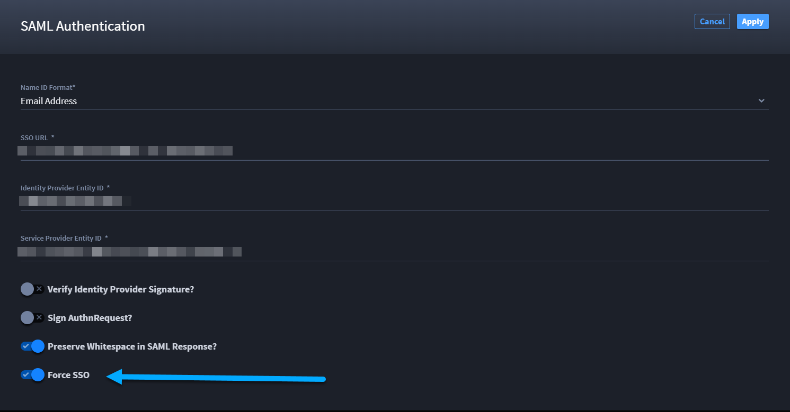

Enable SAML for SSO
===================

SAML is an open standard for web browser single sign-on. Using SAML, a
service provider (Swimlane Turbine) asks an identity provider (a third
party) to authenticate and provide information about a user.

This is initiated in two different ways. In one, Turbine initiates
login. In the other, the identity provider initiates the login. Set up
SAML in Turbine **Settings** and **Sessions & Security**.

Turbine Service Provider SAML Metadata
--------------------------------------

The following table contains the metadata you need to know when
configuring Turbine with an identity provider.

+----------------------------------+----------------------------------+
| Metadata                         | Usage                            |
+==================================+==================================+
| Service Provider (SP) Entity ID: | https://{swimlane-hostna         |
|                                  | me-here}/tenant/api/saml/consume |
+----------------------------------+----------------------------------+
| Identity Provider (IDP) Entity   | Ex                               |
| ID:                              | ample: https://sso.jumpcloud.com |
+----------------------------------+----------------------------------+
| Assertion Consumer Service (ACS) | https://{swimlane-hostna         |
| url:                             | me-here}/tenant/api/saml/consume |
+----------------------------------+----------------------------------+
| ACS binding:                     | ☑ HTTP-POST ☐ HTTP-REDIRECT      |
+----------------------------------+----------------------------------+
| Single Logout Service (SLS) url: | Single Logout is not currently   |
|                                  | supported by Turbine             |
+----------------------------------+----------------------------------+
| SLS binding:                     | N/A                              |
+----------------------------------+----------------------------------+
| NameID format:                   | "emailAddress" if email address  |
|                                  | is selected as NameID format in  |
|                                  | Turbine settings, otherwise      |
|                                  | "unspecified"                    |
+----------------------------------+----------------------------------+
| AuthN request binding:           | ☐ HTTP-POST ☑ HTTP-REDIRECT      |
+----------------------------------+----------------------------------+
| AuthN requests signed:           | Configurable in Turbine SAML     |
|                                  | settings                         |
+----------------------------------+----------------------------------+
| AuthN requests encrypted:        | No                               |
+----------------------------------+----------------------------------+
| Signing certificate:             | Configurable in Turbine SAML     |
|                                  | Settings                         |
+----------------------------------+----------------------------------+
| Assertions encrypted:            | Encrypted assertions are not     |
|                                  | currently supported by Turbine   |
+----------------------------------+----------------------------------+
| SAML Authentication:             | Toggle the Enable button to turn |
|                                  | on SAML authentication.          |
+----------------------------------+----------------------------------+

**Important!** A successful log in with SAML requires a user that
matches the NameID username or email address that already exists in
Turbine. Turbine does not support Just-in-Time (JIT) provisioning. SAML
is available to users added by Directory Services sync as well as those
added manually.

To enable SAML for SSO:

#. From the Sessions and Security tab, click **>** to expand
   **Authentication.**

#. | Under SAML Authentication, toggle the switch **Enable** to enable
     SAML Authentication.
   | |image1|

3. Click **SAML Settings**.

4. On SAML Authentication, identify the **Name ID Format**. Select from
   the drop-down. You have two options for users logging in to Turbine,
   the Turbine username, or email address.

5. Complete the following required fields:

   -  **SSO URL**
   -  **Identity Provider Entity ID**
   -  **Service Provider Entity ID**

6. Specify whether to verify the identity provider signature or whether
   to allow invalid signatures with the **Verify Identity Provider
   Signature** toggle and then upload the certificate.

7. Select whether the SAML request should be signed by Turbine with the
   **Sign AuthnRequest?** toggle and then upload the private key (format
   PKCS #12) and public certificate.

8. If your SSO provider calculates the SAML response signature with
   non-significant whitespace, select the **Preserve whitespace in SAML
   response?** toggle.

9. To enforce a login via a single-sign-on provider, enable the
   **FORCE SSO** toggle.

   To exempt individual users from the enforced global requirement,
   enable the Exempt FORCE SSO toggle on the individual user account
   (under the Groups and Roles tab). NOTE: Account administrators are
   exempt from this forced login by default.

|image2|

.. |image1| image:: ../../Resources/Images/saml-enable-settings.png

