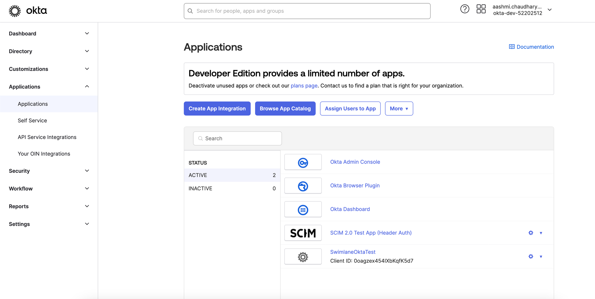
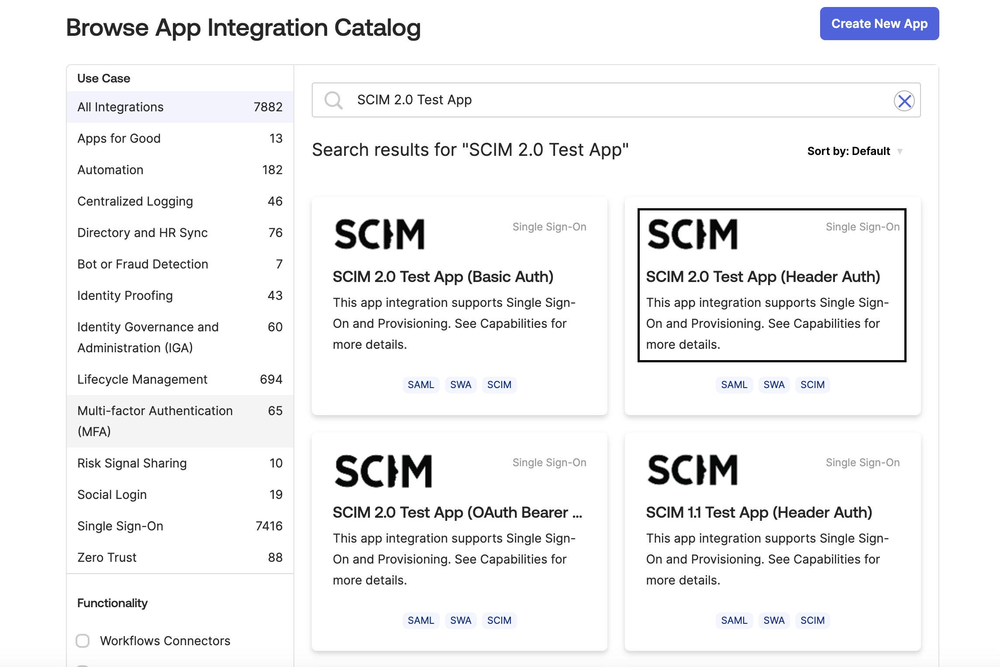
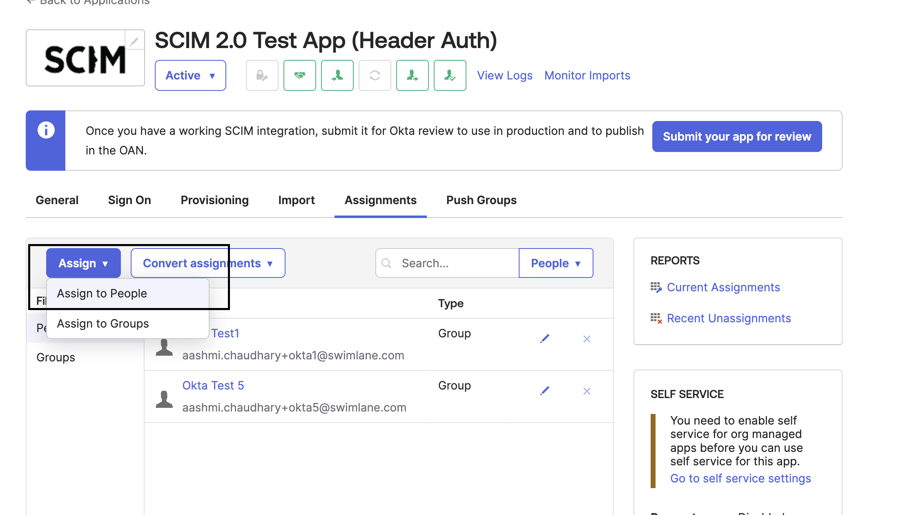
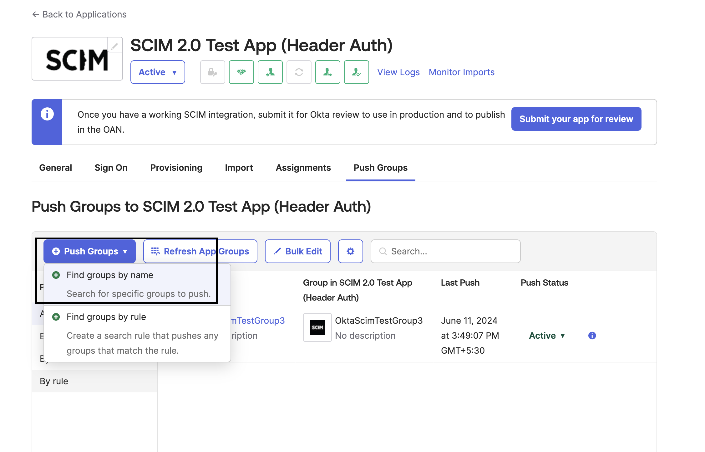
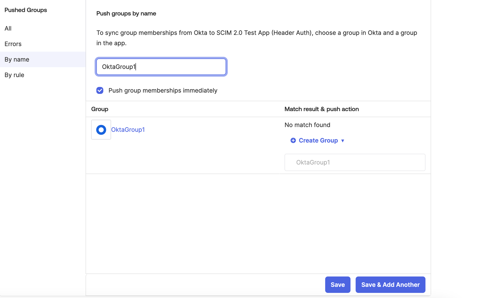

Provisioning with SCIM Integration
==================================

Swimlane Turbine supports integration with System for Cross-domain
Identity Management (SCIM) 2.0. This helps to streamline user management
by automating onboarding and offboarding of users. Managing groups and
the association of users to groups can be handled efficiently without
manual intervention.

With SCIM integration you can:

-  Create a new user with group

-  Create a new user without any group

-  Retrieve a User by Id

-  Create a new user without any group that exists in Swimlane Turbine

-  Delete a user

-  Disable User - delete the user in Turbine and not let them login to
   the application

-  Activating a user in an IDP activates the user in Turbine

-  Update user profile information to update in Swimlane Turbine

-  Create a group with users

-  Create a group without users

-  Update a group

-  Delete a group

Prerequisites for Configuring SCIM
----------------------------------

-  **Supported IdP**: Verify that your Identity Provider (IdP) supports
   SCIM integration.

-  **SCIM-Compatible Configuration**: Ensure Swimlane is configured to
   support SCIM integration and provides the required SCIM endpoints.

-  **Network Configuration**: Confirm that network settings allow
   communication between your IdP and Swimlane over HTTPS.

-  **Authentication Credentials**: Obtain necessary credentials (for
   example, OAuth tokens, API keys) for secure communication.

Configuring SCIM
----------------

Provisioning a SCIM (System for Cross-domain Identity Management)
application in an Identity Provider (IdP) involves configuring the IdP
to communicate with the Service Provider (SP) using the SCIM protocol,
ensuring efficient user identity management and automation.

See your IdP documentation for more information on provisioning SCIM in
your IdP.

**Note:** If you already have SAML and LDAP, you can still enable SCIM.

REST API Endpoints for SCIM
---------------------------

Following are the endpoints as part of the implementation on the tenant
service (swimlane-tenant).

User endpoints:

-  POST - /tenant/api/account/{ACCOUNT_ID}/scim/v2/Users

-  GET - /tenant/api/account/{ACCOUNT_ID}/scim/v2/Users/{userId}

-  DELETE - /tenant/api/account/{ACCOUNT_ID}//scim/v2/Users/{userId}

-  PATCH - /tenant/api/account/{ACCOUNT_ID}/scim/v2/Users/{userId}

-  PUT - /tenant/api/account/{ACCOUNT_ID}//scim/v2/Users/{userId}

Groups endpoints:

-  POST - /tenant/api/account/{ACCOUNT_ID}/scim/v2/Groups

-  GET - /tenant/api/account/{ACCOUNT_ID}/scim/v2/Groups/{groupId}

-  PUT - /tenant/api/account/{ACCOUNT_ID}/scim/v2/Groups/{groupId}

-  DELETE - /tenant/api/account/{ACCOUNT_ID}/scim/v2/Groups/{groupId}

-  PATCH - /tenant/api/account/{ACCOUNT_ID}/scim/v2/Groups/{groupId}

User Endpoint Examples
~~~~~~~~~~~~~~~~~~~~~~

**Get** - Accepts startIndex and count query param. By default items
perPage should be 100. Accepts a filter query string like
filter=userName eq "${email}"

Returns the list of users or empty array

Schema for empty Response:

{ "schemas": ["urn:ietf:params:scim:api:messages:2.0:ListResponse"],
"totalResults": 0, "startIndex": 1, "itemsPerPage": 0, "Resources": [] }

Schema for Response with Users:

{ "schemas": ["urn:ietf:params:scim:api:messages:2.0:ListResponse"],
"totalResults": 0, "startIndex": 1, "itemsPerPage": 0, "Resources": [ {
"schemas": ["urn:ietf:params:scim:schemas:core:2.0:User"], "id":
"23a35c27-23d3-4c03-b4c5-6443c09e7173", "userName":
"test.user@okta.local", "name": { "givenName": "Test", "familyName":
"User" }, "emails": [{ "primary": true, "value": "test.user@okta.local",
"type": "work" }], "displayName": "Test User", "locale": "en-US",
"externalId": "00ujl29u0le5T6Aj10h7", "active": true, "groups": [],
"meta": { "resourceType": "User" } } ] }

**Get a Specific User** - GET Users/userId

Response Schema for getting a user:

{ "schemas": ["urn:ietf:params:scim:schemas:core:2.0:User"], "id":
"23a35c27-23d3-4c03-b4c5-6443c09e7173", "userName":
"test.user@okta.local", "name": { "givenName": "Test", "middleName": "",
"familyName": "User" }, "active": true, "emails": [{ "primary": true,
"value": "test.user@okta.local", "type": "work", "display":
"test.user@okta.local" }], "groups": [], "meta": { "resourceType":
"User" } }

**Create - Post**

It accepts the user details from SCIM and returns the user with
additional fields added by Swimlane.

Request Schema:

{ "schemas": ["urn:ietf:params:scim:schemas:core:2.0:User"], "userName":
"test.user@okta.local", "name": { "givenName": "Test", "familyName":
"User" }, "emails": [{ "primary": true, "value": "test.user@okta.local",
"type": "work" }], "displayName": "Test User", "locale": "en-US",
"externalId": "00ujl29u0le5T6Aj10h7", "groups": [], "active": true }

Response Schema:

{ "schemas": ["urn:ietf:params:scim:schemas:core:2.0:User"], "id":
"23a35c27-23d3-4c03-b4c5-6443c09e7173", "userName":
"test.user@okta.local", "name": { "givenName": "Test", "familyName":
"User" }, "emails": [{ "primary": true, "value": "test.user@okta.local",
"type": "work" }], "displayName": "Test User", "locale": "en-US",
"externalId": "00ujl29u0le5T6Aj10h7", "active": true, "groups": [],
"meta": { "resourceType": "User" } }

If the user already exists then response should be returned in following
schema:

{ "schemas": ["urn:ietf:params:scim:api:messages:2.0:Error"], "detail":
"User already exists in the database.", "status": 409 }

**Update** - PUT /Users/$userID

Request schema to update the user:

{ "schemas": ["urn:ietf:params:scim:schemas:core:2.0:User"], "id":
"23a35c27-23d3-4c03-b4c5-6443c09e7173", "userName":
"test.user@okta.local", "name": { "givenName": "Another", "middleName":
"Excited", "familyName": "User" }, "emails": [{ "primary": true,
"value": "test.user@okta.local", "type": "work", "display":
"test.user@okta.local" }], "active": true, "groups": [], "meta": {
"resourceType": "User" } }

Response should return the updated user.

**PATCH** - PATCH /Users/$userID

To activate/deactivate/password sync the user, Patch is used.

Example request schema for:

{ "schemas": ["urn:ietf:params:scim:api:messages:2.0:PatchOp"],
"Operations": [{ "op": "replace", "value": { "active": false } }] }

Response for patch should be updated user or 204.

**DELETE** - Delete is not directly supported from Okta. Patch is used
for deprovisioning or deactivating the user.

Group Endpoint Examples
~~~~~~~~~~~~~~~~~~~~~~~

**GET** - /Groups - Accepts startIndex and count query param. By default
items perPage should be 100

GET should accept query string filter = displayName eq "${groupName}"

Sample Request:

/scim/v2/Groups?filter=displayName%20eq%20%22Test%20SCIMv2%22&startIndex=1&count=100

Response Schema if group exists:

{ "schemas": [ "urn:ietf:params:scim:api:messages:2.0:ListResponse" ],
"totalResults": 1, "startIndex": 1, "itemsPerPage": 1, "Resources": [ {
"id": "e7d09e9b3faa4888b65cf9e9316cba1c", "meta": { "created":
"2024-05-15T09:21:23", "lastModified": "2024-05-15T09:21:23", "version":
"v1.0" }, "displayName": "Test SCIMv1" }, ] }

Response schema if no group exists:

{ "schemas": ["urn:ietf:params:scim:api:messages:2.0:ListResponse"],
"totalResults": 0, "startIndex": 1, "itemsPerPage": 0, "Resources": [] }

Get a specific group - /Groups/$groupID

Response schema:

{ "schemas": ["urn:ietf:params:scim:schemas:core:2.0:Group"], "id":
"abf4dd94-a4c0-4f67-89c9-76b03340cb9b", "displayName": "Test SCIMv2",
"members": [{ "value": "b1c794f24f4c49f4b5d503a4cb2686ea", "display":
"SCIM 2 Group A" }], "meta": { "resourceType": "Group" } }

**POST** - Request schema, Response should be group object same as Get.

Example:

{ "schemas": [ "urn:ietf:params:scim:schemas:core:2.0:Group" ],
"displayName": "TestGroup", "members": [ { "value":
"584a1e86-5de0-4634-80a6-f357156de9f3", "display":
"aashmi.chaudhary+okta@swimlane.com" } ] }

 

{ "schemas": ["urn:ietf:params:scim:schemas:core:2.0:Group"],
"displayName": "Test SCIMv2", "members": [] }

**PUT**

**PATCH** - /Groups/$groupID

Patch is used to update the group object like name.

Request schema for PATCH to update group name:

{ "schemas": ["urn:ietf:params:scim:api:messages:2.0:PatchOp"],
"Operations": [{ "op": "replace", "value": { "id":
"abf4dd94-a4c0-4f67-89c9-76b03340cb9b", "displayName": "Test SCIMv2" }
}] }

Response for patch could be the updated group object or 204.

Users can be added by PATCH for OIN app.

Request schema :

{ "schemas": ["urn:ietf:params:scim:api:messages:2.0:PatchOp"],
"Operations": [{ "op": "remove", "path": "members[value eq
\\"89bb1940-b905-4575-9e7f-6f887cfb368e\\"]" }, { "op": "add", "path":
"members", "value": [{ "value": "23a35c27-23d3-4c03-b4c5-6443c09e7173",
"display": "test.user@okta.local" }] }] }

Response should the updated group or 204.

**DELETE** - /Groups/$groupID Should return 204.

Authentication
--------------

The SCIM endpoint uses User PAT Token defined for the user at an account
level.

| **Note:** The Base URL will include {AccountID} in the following
  format and will be used as identifier of the account for which users
  and groups are created
| /tenant/api/account/{ACCOUNT_ID}/scim/v2/.

Authorization
-------------

-  User with Account Admin privilege should be able to access the
   endpoints

-  Cross-account access is restricted

-  All the roles assigned in Turbine for the users and groups will not
   be overwritten by the SCIM API Endpoint call

Field Mapping with Swimlane
---------------------------

The following table lists the SCIM field mapping with Swimlane:

.. table:: Field Mapping

   =============== ===========
   SCIM            Swimlane
   =============== ===========
   userName        Email
   name.givenName  firstname
   name.familyName lastname
   displayName     DisplayName
   groups          Groups
   active          disabled
   =============== ===========

Use-Case: Okta SCIM/SSO Application Configuration
-------------------------------------------------

Provisioning SCIM Application in Okta
~~~~~~~~~~~~~~~~~~~~~~~~~~~~~~~~~~~~~

#. Log in to Okta as an administrator.

#. On the left panel, select **Applications** > **Applications**, and
   click **Browse App Catalog**.

   |image1|

#. Search for SCIM 2.0 App in the **Search** field.

   |image2|

#. Click on **Add integration** > **Integrate the app**.

#. Click on **Provisioning** tab and **Configure API Integration**.

#. Enter the base url {baseurl}/tenant/api/scim/v2 in **Base URL** and
   PAT in **API token** and click **save**.

Assigning Users
---------------

To provision Okta users in Swimlane Turbine, create users in Okta,
assign the users to a group, and then assign the provisioning app to the
group.

Create users in Okta:

#. In Okta, on the left panel, select **Directory** > **People**, and
   click **Add person**.

#. In the **Add Person** dialog box, enter the user details.

#. Click **Save** or click **Save and Add Another** to add another user.

#. From the Assignments tab, click **Assign**.

#. From the pop up menu, click **Assign to People**.

   |image3|

Assign any user and verify that the assigned user is added in Swimlane
account. Note that Swimlane Turbine displays only few fields from the
user fields. For example, see `Field Mapping <#Field>`__.

Editing or Removing Users
-------------------------

#. From the Assignments tab, click on **Assign**.

#. Click edit symbol next to the user.

#. Update any user detail such as Mapped fields - givenName, familyName,
   display name, and so on and click **Save**.

#. To delete a user, click delete icon next to the user and click
   **Save**.

Verify that user info is updated in Swimlane

Assigning Groups
----------------

If you do not already have your user groups set up in you IdP, you will
need to create them. These will be the groups that you will later assign
role and account access to in Swimlane. To learn how to create groups,
see your IDP documentation.

Assigning users is done using two different tabs in the app. We
recommend having your users selected on the **Assignments** tab and
their associated groups selected on the **Push groups** tab.

#. In the app, click on the Assignments tab.

#. From the Assignments form, click on **Assign**.

#. From the pop up menu, click on **Assign to Groups**.

#. From the **Assign to groups** form, click on **Assign** for the group
   you wish to assign to the application.

#. Click on **Save and go back**.

#. Repeat the steps to add a group until all desired groups have been
   assigned to the application.

#. Click **Done**.

Pushing Groups
~~~~~~~~~~~~~~

#. In the app, click on the **Push Groups** tab.

#. From the **Push Groups** form, click on **Push Groups**.

#. From the pop up menu, click on **Find groups by name**.

   |image4|

#. From the **Push groups by name** form, in the search field enter the
   first few characters of the name of the group you want to send to
   Swimlane. Leave the **Push group memberships immediately** checkbox
   checked.

#. Click on your group in the pop up search results list.

#. If this is the last group you wish to send to Swimlane, click on
   **Save**. Otherwise, if you have more groups to configure, click on
   **Save & add another** and repeat the steps to add a group.

   |image5|

**Note:** without pushing the group, the group will not sync in Turbine.
Once that is done that group will be syncing until it is deactivated in
Okta.

Verify the group, group members, and user group association is added to
Turbine.

 

 

