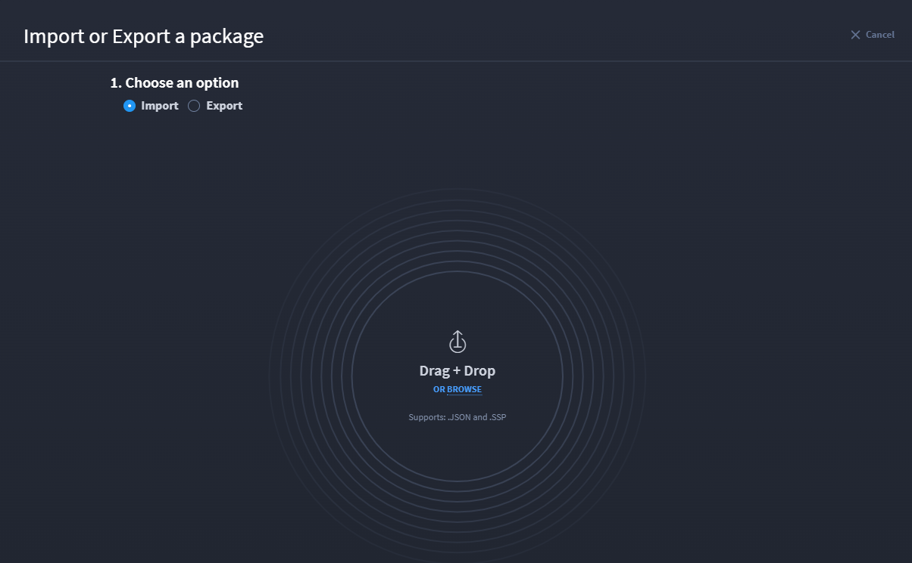
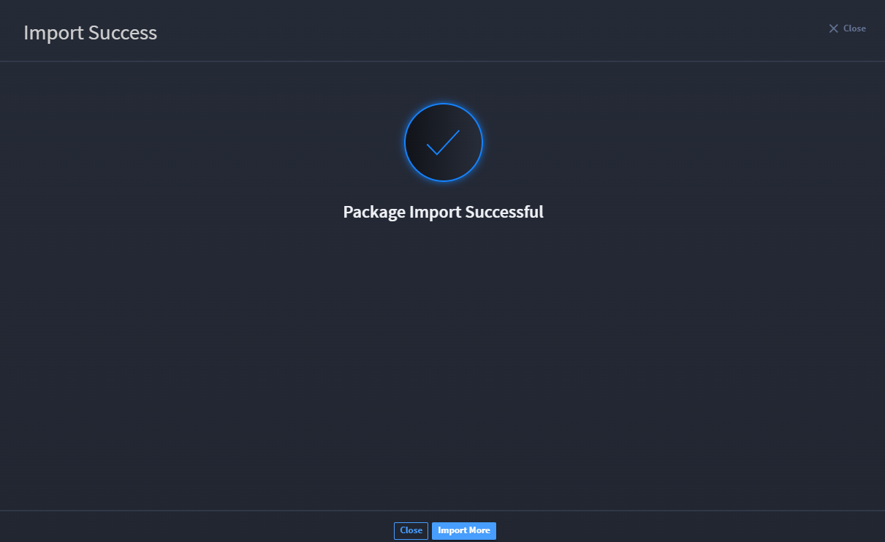
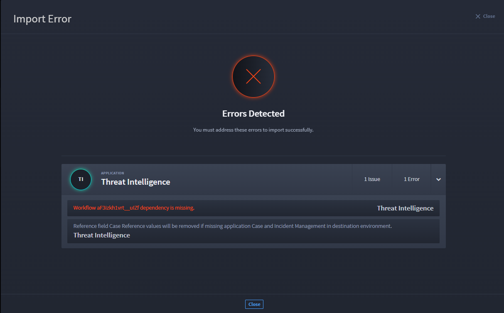

Import Swimlane Solution Packages
=================================

You import Swimlane Solution Packages (SSPs, file extension .ssp) into a
Swimlane Turbine system. The packages contain at least one playbook,
application, or applet, along with all of the associated applications,
assets, webhooks, reports, dashboards, and workspaces that form that
solution.

**Note:** You must maintain your connectors separately from SSPs.
Connectors are not imported with SSPs.

The import process handles some issues for you, either stepping you
through the process or informing you of actions to take once the import
is finished. Also, the process alerts you of critical errors that you
may need to resolve.

For your imported solution to be fully functional, you may need to
address all of the issues and errors that Turbine points out during the
import process.

**Note:** Exporting and importing SSPs can only be done by Swimlane
system administrators.

If you are importing an unzipped SSP, see `Repackage an Unzipped SSP
File <repackage-an-unzipped-ssp.htm>`__ to ensure your SSP imports
successfully.

To import SSPs:

#. From the Applications & Applets main page, click the plus icon, and
   then select **Import or Export a package**.

   You are prompted to drag and drop your .ssp or .JSON file to the open
   dialog, or you can browse locally for the file and select it for
   import.

   |image1|

At this point, Turbine checks for errors and issues. If there are no
issues, your import is successful.

#. To return to the Package Import dialog and import additional, click
   **Import More** or click **Close**.

|image2|

3. Select the components of the package that you want to import and/or
   overwrite.

| If you decide to overwrite the existing components, you will see this
  dialog:
| |image3|

Press and hold the mouse button to complete the overwrite.

#. If you have nothing to overwrite, click **Import**.

On Import Success, you may receive potential issues to review. The
Import Success window alerts you to the applications affected and
provides information on the issues.

#. To address the issues, click **Go to Application,** or click **Import
   More** to leave the issues unresolved.

|image4|

On Import Error, you are notified of detected errors. You must address
these errors to import successfully. The Import Error window alerts you
to the applications affected and provides information on the import
error.

|image5|

Playbooks and webhooks are disabled on import. You can enable them now.

#. Click **IMPORT INVENTORY** to view a complete list of all of the
   components of an SSP.

   SSPs that pre-date Turbine version 11.4.0 will not have an import
   inventory. In addition, the components of these SSPs will not be
   selectable during import since they pre-date 11.4.0. SSPs that were
   exported from a version of Turbine pre-dating 11.6.0 will not have
   validation in their playbooks and will not be importable on versions
   of Turbine >= 11.6.0.

To have a full solution post-import, ensure that all of the issues are
addressed!

.. |image3| image:: ../Resources/Images/overwrite-components.png
.. |image4| image:: ../Resources/Images/import-success-review-potential-issues.png

