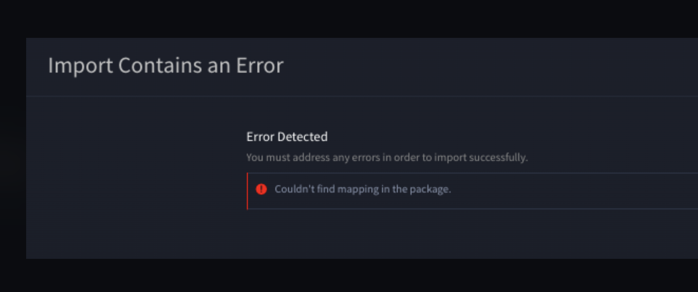

Repackage an Unzipped SSP File
==============================

Swimlane Solution Packages (SSPs) can be exported, unzipped, and edited.
You can then import that edited version of the SSP file into your
Turbine instance.

**Note:** Swimlane recommends that you work with a support
representative if you want to edit an SSP.

To avoid an error when re-importing an edited SSP file, follow the
instructions in this topic. An error upon import might look like this:

|image1|

To repackage an unzipped SSP file:

#. After editing, open a CLI session and cd into the SSP file's content
   directory.

The content directory contains (among other files):

Application, manifest.json, Meta, Report, Workspace, Workflow

2. Next, compress the content back to zip using the CLI, NOT your
   systems OS:zip -r filename.zip . -x "\*/\\.\*"

3. Rename the file to an SSP file extension.

   mv filename.zip filename.ssp

