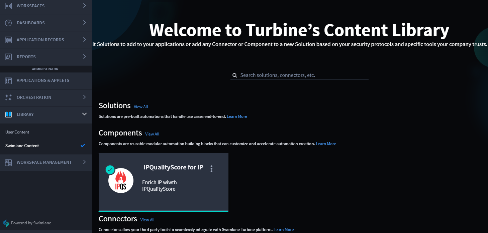

Swimlane Content
================

Turbine hosts solutions, components, and connectors in the Marketplace,
which houses drop-in content to boost your workflow. It's located in the
Turbine platform for easy, manageable access.

As an orchestrator, use the left-hand navigation menu to open
Marketplace. For Turbine users who work with restrictive network
environments (i.e., that block all outgoing traffic from Turbine by
default), ensure that you can reach the following external hosts to
function properly:
`https://marketplace.swimlane.com <https://marketplace.swimlane.com/>`__
and `https://quay.io <https://quay.io/>`__.

Swimlane Content Homepage
-------------------------

To access the Turbine Marketplace, follow these steps:

#. On ORCHESTRATION, click **LIBRARY** and click **Marketplace**.

|image1|

See
`solutions <https://docs.swimlane.com/turbine/marketplace/solutions-and-applications.htm>`__,
`components <https://docs.swimlane.com/turbine/marketplace/components.htm>`__,
or
`connectors <https://docs.swimlane.com/turbine/marketplace/connectors.htm>`__
for additional information for the internal marketplace.

External Marketplace
--------------------

This is currently in progress and information will be provided in the
near future.

