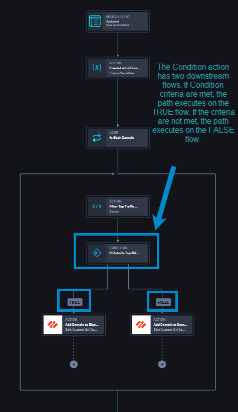

Conditions
==========

+---------------+-------------------------+-------------------------+
| Term          | Definition              | Characteristics         |
+===============+=========================+=========================+
|               |                         | -  Native action        |
|               |                         | -  Playbook building    |
| **Condition** | A condition (or         |    tool                 |
|               | if/else) is a set of    | -  IF = TRUE            |
|               | criteria, that when     | -  ELSE = FALSE         |
|               | met, executes a IF/TRUE | -  No connector needed  |
|               | logic path.             |                         |
+---------------+-------------------------+-------------------------+

 

While the default `flow <orchestration/flows.rst>`__ for all playbook
actions is **On Complete**, the Condition action uses IF and ELSE flows,
which apply conditional logic to a block of actions that is either
TRUE (IF) or FALSE (ELSE). Based on outputs from previous actions, the
conditional statement created executes accordingly. Having an easily
configurable action, with a clear visual representation of the
downstream condition flow, decreases complexity and increases
customization in use cases.

Add and Configure Condition
---------------------------

When you drag-and-drop a Condition native action onto the playbook
canvas, the TRUE and FALSE flows automatically display.

Only configure what you need! How do the TRUE and FALSE conditions
work? 

-  **TRUE (IF):** If **all** conditions are met, then the conditional
   logic applies to downstream actions and executes the TRUE flow.

-  **FALSE (ELSE):** If **none** conditions are met, then the
   conditional logic applies to downstream actions and executes the
   FALSE flow.

**Example:** 

See `Automated
Remediation <use-cases/automated-remediation-use-case.rst>`__ to view
how the following Condition native action is used in a use case. These
steps guide you on how to add and configure a condition.

#. From the Add panel, drag-and-drop a **Condition** action, so that
   it's downstream from the Filter Top Traffic - Script action.

|image1|

The TRUE and FALSE condition flows are automatically available. First
configure the condition, then add desired connectors/actions.

#. Click **Edit Condition**.

Based on the example referred to earlier, let's configure the condition
so if the Script values are **true**, then the flow continues to the
connector that adds the URL to a block list. If the conditions are **not
true**, then the flow continues to the connector that adds the URL to a
decrypt list.

| 

#. From the TRUE flow, add the **Edit Custom Url Category** action and
   enter the title **Add Domain to Block List** to add sites' domains to
   a block list.

#. FROM the FALSE Flow, add the **Edit Custom URL Category** and enter
   the title **Add Domain to Decrypt List** to add sites' domains to a
   decrypt list.

|image2|

You've successfully added and configured a Condition native action.

Examples
~~~~~~~~

-  Click `Automated Remediation Use
   Case <use-cases/automated-remediation-use-case.rst>`__ for an example
   on updating an existing case with remediation actions.

-  Click `If/Else Condition Use
   Case <../use-cases/native-action-use-cases/ifelse-use-case.rst>`__
   for an example to execute if an HTTP request comes back with a
   specific status code.

.. |image1| image:: ../Resources/Images/canvas-condition-add.png

