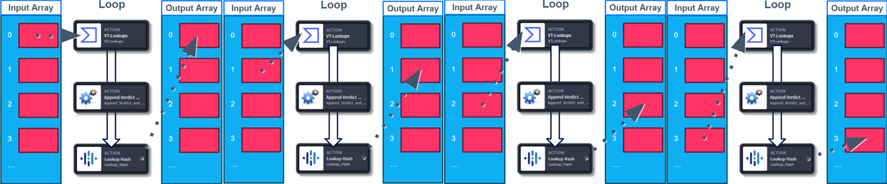
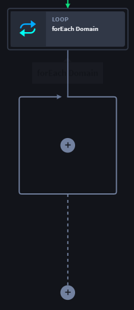
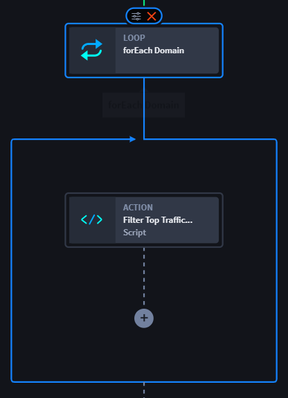

Loops
=====

+----------+----------------------------+---------------------------+
| Term     | Definition                 | Characteristics           |
+==========+============================+===========================+
|          |                            | -  Native action          |
|          |                            | -  Playbook building tool |
| **Loop** | Applies one or more        | -  forEach loops          |
|          | actions to each item in an | -  No connector needed    |
|          | array                      |                           |
+----------+----------------------------+---------------------------+

As orchestrators, sometimes you need to apply one or more actions to
each item in an array to more efficiently process action input arrays.
Use forEach Loops to gain access to the iterative item in an array for
easier configuration.

Use a Loop native action to:

-  Receive an array as an input and process each element separately by
   selecting a playbook property/expression to process.

-  Aggregate Loop action outputs.

-  Process arrays of arrays, aka nesting a loop within a loop.

-  Use action branching, where necessary.

-  Use Loop action output array in downstream actions.

 

**Warning!** Five is the limit of nested loops inside a single playbook.

Loop Types
----------

There are two types of loops:

-  **Parallel** forEach loops are a group of actions are applied to
   items in the array asynchronously, using array inputs from a playbook
   property or expression, process the array in parallel (with a maximum
   concurrency of 10). However, there is no guarantee that the output
   elements maintain the input sequence. This could result in the item
   at index 3 being finished before the item at index 2.

|image1|

-  **Sequential** forEach loops run statements following, or after,
   another forEach loop by using array inputs from a playbook property
   or expression, processing the array in sequence, and output the array
   while maintaining the input sequence.

   | 

|image2|

 

**Tip:** Remember that you can only reference upstream action playbook
properties from the same flow. You cannot use a playbook property in the
same playbook from a different flow.

 

.. _loop-native-action-set-up:

Add and Configure Loops
-----------------------

**Example:** 

See `Automated
Remediation <use-cases/automated-remediation-use-case.htm>`__ to view
how the following forEach Loop native action is used in a use case.
These steps guide you on how to add and configure a loop. The Automated
Remediation playbook already has a record event trigger and a Create
Variables action. Now navigate the steps to configure a loop.

#. From the Add panel, drag-and-drop a **Loop** action, so that it is
   directly downstream from the **Block Exception List** - Create
   Variables native action.

Use a loop to access the iterative item in the array.

#. From the ACTION panel, configure the loop by applying an array input
   with the playbook property selection or expression syntax.

| 

This sequential forEach loop runs statements one directly after the
other. Don't forget, you can use parallel forEach loops to apply a group
of actions to items in an array asynchronously.

| 

**Tip:**\  Click \ **Outputs**\ , then \ **Configure**\  to apply these
outputs outside of the playbook.

 

#. Inside the loop, drag-and-drop the next connector/action to the plus
   icon to add to the flow.

|image3|

The Automated Remediation playbook uses a Script native action to filter
top traffic sites. When you click the Loop native action, a blue border
that indicates the action(s) that the forEach loop iterates.

|image4|

Configure the action(s) inside the loop, or nest up to five loops. If
you delete a loop, it **will** delete the entire loop, including all
actions, connectors, and/or nested loops.

|image5|

You've successfully added and configured a loop. See the Automated
Remediation playbook for the downstream outcomes after loop
configuration.

Example
~~~~~~~

-  Click `Automated Remediation Use
   Case <use-cases/automated-remediation-use-case.htm>`__ for an example
   on updating an existing case with remediation actions.

.. |image1| image:: ../Resources/Images/canvas-loop-parallel-total.png

.. |image5| image:: ../Resources/Images/canvas-loop-delete.png
