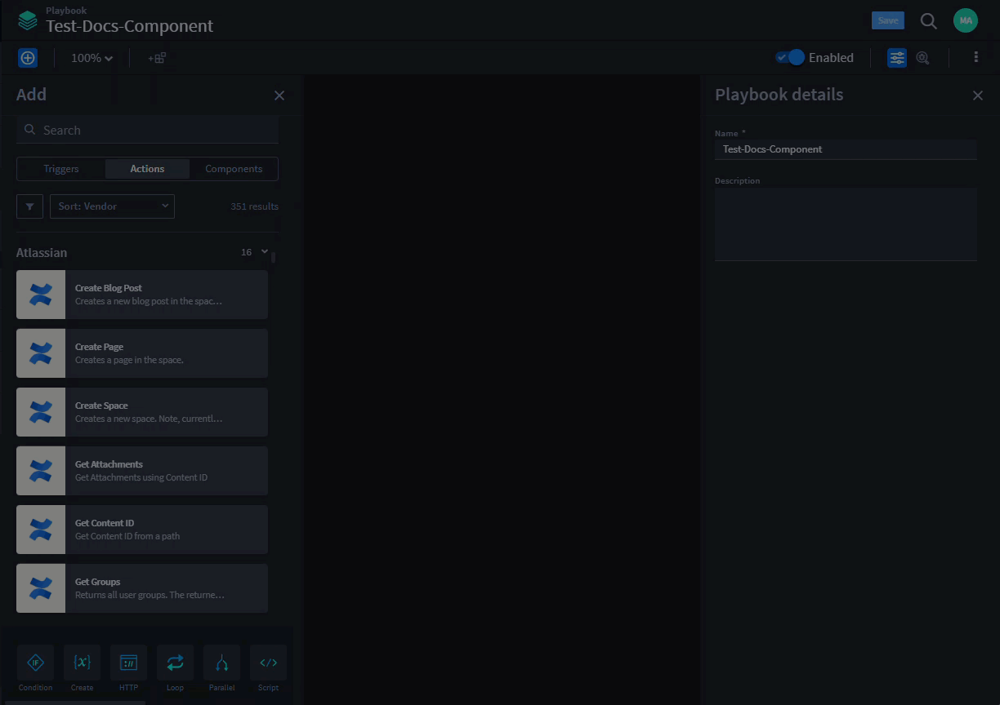
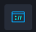
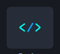
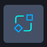
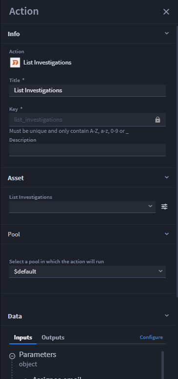
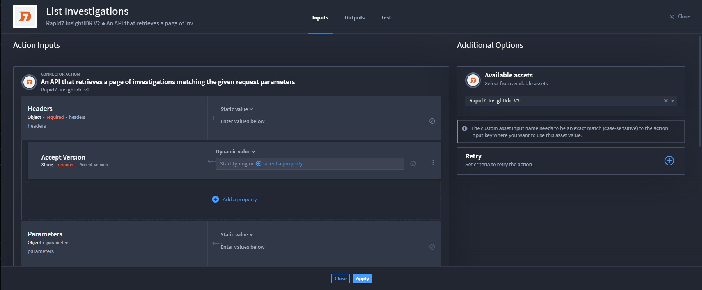
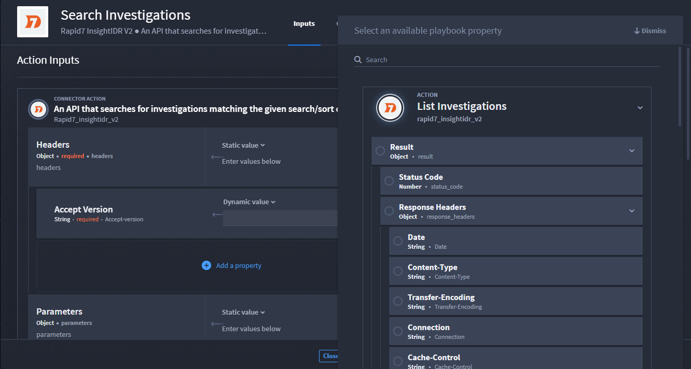
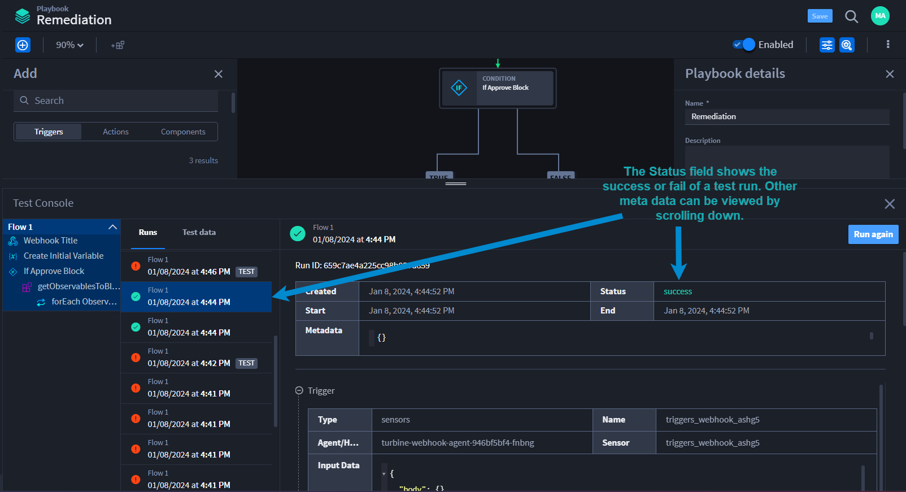
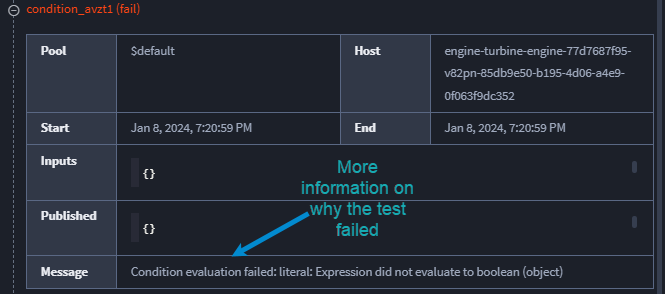
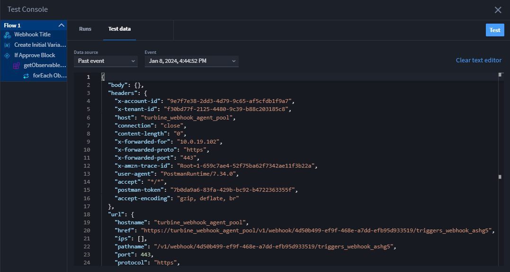

Actions
=======

+------------+---------------------------+---------------------------+
| Term       | Definition                | Characteristics           |
+============+===========================+===========================+
|            |                           | -  Pass/process data      |
|            |                           |    inputs                 |
| **Action** | Individual capabilities   |                           |
|            | of connectors, allowing   | -  Results available in   |
|            | users to create           |    outputs                |
|            | automation that interacts |                           |
|            | with external             | -  Functionality options: |
|            | technologies.             |    Conditions, loops,     |
|            |                           |    retries, repeats,      |
|            |                           |    discovered outputs,    |
|            |                           |    testing, promote items |
|            |                           |    (arrays)               |
+------------+---------------------------+---------------------------+

Add Panel
---------

In Turbine Canvas, the Add panel is where you can view, search, filter,
sort, and/or drag-and-drop actions and components.

**Actions can be**:

-  Filtered by vendor

-  Sorted by Vendor or Use case

The Actions default view is alphabetical by vendor, where you can easily
expand or collapse each vendor list.

Native Actions are:

-  Located at the bottom of the Add panel

-  Turbine-unique actions based on a desired outcome such
   as: HTTP request, conditions, loops, etc.

|image1|

To add an action, click on the desired action, then drag to the plus
icon to the expanding responsive drop zone.

|image2|

**Native Actions in the UI:**

========= ==========================
Icon      Meaning
========= ==========================
|image3|  Condition
|image4|  Create Record
|image5|  Create Variable
|image6|  HTTP Request
|image7|  Loop
|image8|  Parallel
|image9|  Script
|image10| Transform Data
|image11| Create Record
|image12| Delete Record
|image13| Search Record
|image14| | Upsert
          | aka Update/Create Record
========= ==========================

 

For more details, click `Native
Actions <https://docs.swimlane.com/turbine/native-actions/native-actions.htm>`__
to learn more about individual native actions. New Canvas-specific
features for native actions are in draft and coming soon.

Defining Terms and Icons
~~~~~~~~~~~~~~~~~~~~~~~~

The table shows the icon and meaning for the component toolbar.

+-----------+---------------------------------------------------------+
| Icon      | Meaning                                                 |
+===========+=========================================================+
| |image29| | Show/Hide the Add panel                                 |
+-----------+---------------------------------------------------------+
| |image30| | Create a component                                      |
+-----------+---------------------------------------------------------+
| |image31| | Zoom drop-down menu                                     |
+-----------+---------------------------------------------------------+
| |image32| | Enable or disable playbook                              |
+-----------+---------------------------------------------------------+
| |image33| | Show/Hide the Playbook Details panel                    |
+-----------+---------------------------------------------------------+
| |image34| | Open Test Console at the bottom of the window           |
+-----------+---------------------------------------------------------+
| |image35| | Click to access playbook operations like Export,        |
|           | Duplicate, or Delete                                    |
+-----------+---------------------------------------------------------+

Add and Configure Actions
-------------------------

Action Property Types

Actions have the following input property types:

+--------------------+------------------------------------------------+
| **Property Types** | **Description**                                |
+====================+================================================+
| String             | Sequence of alphanumeric characters            |
+--------------------+------------------------------------------------+
| Number             | Floating point and integers                    |
+--------------------+------------------------------------------------+
| Integer            | Real numbers that do not have a floating point |
+--------------------+------------------------------------------------+
| Boolean            | Either of the values ``true`` or ``false``     |
+--------------------+------------------------------------------------+
| Object             | Structure that contains more properties        |
+--------------------+------------------------------------------------+
| Array              | Ordered list of zero or more elements, each of |
|                    | which may be of any type. Arrays use square    |
|                    | bracket notation with comma-separated          |
|                    | elements. Array Types: arrayNumber,            |
|                    | arrayString, and arrayObject                   |
+--------------------+------------------------------------------------+
| Null               | Empty value, using the word ``null``           |
+--------------------+------------------------------------------------+
| Date               | ISO 8601 date string without time information  |
+--------------------+------------------------------------------------+
| Date & Time        | ISO 8601 string with date and time             |
+--------------------+------------------------------------------------+
| Password           | Obfuscated string, the text will not be human  |
|                    | readable within the platform                   |
+--------------------+------------------------------------------------+
| Code               | Formatted code string                          |
+--------------------+------------------------------------------------+

 

Now that you know what an action is, how to add it to the playbook
canvas, and the available native actions, let's configure an action.

First, make sure you have a playbook open and you can see the Add panel.
Then follow these steps:

#. Select an action, drag and drop on the canvas, and then click on the
   action to display the Action panel on the right-hand side of the
   window.

|image36|

With Turbine Canvas, you can configure the action with assets, pools
(the designated location for which the action will run), inputs, and
outputs all from this Action panel to ease and efficiency. The following
example shows a playbook you are building to call an API for alert data.
You want an API to retrieve investigations that match your custom
parameters. Select the Rapid7 List Investigations action, then drag and
drop to your canvas. To configure, click on the action to display the
Action panel.

|image37|

#. Rather than manually mapping an asset, click the **Asset** drop-down.

Select the corresponding asset. Any proprieties that you filled out when
creating the asset automatically map to action inputs on the panel.

**Warning!** If you see |image38| next to a property, it means this is a
required field that was not mapped.

#. To add more or change the configuration, click **Configure**.

|image39|

When configuring an action, the available property types display under
CONNECTOR ACTION. Depending on the property type, there are different
values you can apply. The value options are different for string
property types and all other types. The default value for string
property type is **Dynamic value**. The default value for other property
types is **Static value**.

 

**What's a dynamic value?**

A dynamic value for string property types allows you to add context
and/or repeats to a playbook property or expression.

For details, see the Configure Concatenation for Strings Without Formats
sub-section and/or `Action
Repeats <https://docs.swimlane.com/turbine/playbooks/actions/repeats.htm>`__.

 

**Configure Other Values for Property Types**

The default value for other property types is **Static value**.

For property types other than string, the drop-down menu options are:
*Asset property*, *Static value*, *Playbook property*, or *Expression*,
which allow you to enter a static value, apply a playbook property, or
create a dot notation expression. To configure the connector properties,
click the **property type** drop-down, then select the desired action.
Complete required fields and apply changes.

 

Now configure and save the required fields. The List Investigation
inputs are available downstream to apply within that workflow.

|image40|

Test Console
------------

**Note**: This only applies at the action-level.

Turbine Canvas has a test console inside the playbook canvas, which test
trigger flows end to end, including each automation step to show if a
run succeeds or fails. You can use this to test with test data or real
data. The console shows the flow you're running and the tabs show the
date and time stamp for the run and the test data where you can make
changes to input data directly from the console.

To access, follow these steps:

#. Click the |image41| icon.

The console opens and shows the flow you're running on the far left-hand
side of the console. This provides a clear step-by-step picture of your
automated flow. Next to it are the Runs and Test data tabs. Under the
Runs tab, the |image42| icon shows if the run fails the test, and the
|image43| icon shows if the run is a success.

Let's look at a successful test. In this example, the test console shows
that we are reviewing Flow 1 at January 08, 2024 at 4:44PM (all times
are UTC). To see additional meta data about the flow and individual
steps such as the trigger's data, action data, result, and what was
published, click on the expand/collapse icons. If the run has |image44|
to it, then it is a run completed as a test in the console. If it does
not, then it's a regular run.

|image45|

Let's look at a failed test. In this example, the test console shows
that we are reviewing Flow 1 at January 08, 2024 at 7:20PM (all times
are UTC). To get more details about where and why it failed, review the
flow run information. Scroll down until you see the red fail
notification and expand for details.

|image46|

The Message field provides further text to explain why the fail occurred
and help you to debug faster and easier.

|image47|

#. You have the option to |image48| or click the **Test data** tab to
   view and modify data.

#. Click on **Test data** to see the event date and time stamp, the past
   event and inputs.

The Event tab defaults to the most recent event. Click the drop-down
menu to view past events as well.

|image49|

For an easy debugging experience, you can change the input data directly
inside the console and then click **Test** to run again. There's also
the option to clear the text editor entirely or change the **Data
source** drop-down menu to **Custom** **JSON** that opens a blank text
editor to create your own JSON. If you change data and run the test
again, navigate to the **Runs** tab and the event shows at the top as
the most recent run.

To close out the test console to regain space for your canvas, simply
click the **X** icon.

Additional Action Functions
---------------------------

See the following `Actions
Inputs <https://docs.swimlane.com/turbine/playbooks/actions/inputs.htm>`__
sections for more configuration functions such as:

-  Configure Concatenation for Strings without Formats

-  Add Object Sub-properties

-  Add Array Sub-properties

-  Clear a Sub-Property Entry

-  Delete a Sub-Property Entry

.. |image1| image:: ../../Resources/Images/components-add-panel-actions.png

.. |image3| image:: ../../Resources/Images/canvas-na-condition.png
.. |image4| image:: ../../Resources/Images/canvas-na-create-record.png
.. |image5| image:: ../../Resources/Images/canvas-na-create-variable.png

.. |image7| image:: ../../Resources/Images/canvas-na-loop.png
.. |image8| image:: ../../Resources/Images/canvas-na-parallel-action.png

.. |image11| image:: ../../Resources/Images/canvas-na-create-record.png
.. |image12| image:: ../../Resources/Images/canvas-na-delete-record.png
.. |image13| image:: ../../Resources/Images/canvas-na-search-record.png
.. |image14| image:: ../../Resources/Images/canvas-na-update-record.png
.. |image15| image:: ../../Resources/Images/component-hide-show-add-pane.png
.. |image16| image:: ../../Resources/Images/component-create-component-icon.png
.. |image17| image:: ../../Resources/Images/component-zoom-icon.png
.. |image18| image:: ../../Resources/Images/canvas-playbook-enable-button.png
.. |image19| image:: ../../Resources/Images/component-show-hide-component-details-icon.png
.. |image20| image:: ../../Resources/Images/component-test-console-icon.png
.. |image21| image:: ../../Resources/Images/component-ellipsis-icon.png
.. |image22| image:: ../../Resources/Images/component-hide-show-add-pane.png
.. |image23| image:: ../../Resources/Images/component-create-component-icon.png
.. |image24| image:: ../../Resources/Images/component-zoom-icon.png
.. |image25| image:: ../../Resources/Images/canvas-playbook-enable-button.png
.. |image26| image:: ../../Resources/Images/component-show-hide-component-details-icon.png
.. |image27| image:: ../../Resources/Images/component-test-console-icon.png
.. |image28| image:: ../../Resources/Images/component-ellipsis-icon.png
.. |image29| image:: ../../Resources/Images/component-hide-show-add-pane.png
.. |image30| image:: ../../Resources/Images/component-create-component-icon.png
.. |image31| image:: ../../Resources/Images/component-zoom-icon.png
.. |image32| image:: ../../Resources/Images/canvas-playbook-enable-button.png
.. |image33| image:: ../../Resources/Images/component-show-hide-component-details-icon.png
.. |image34| image:: ../../Resources/Images/component-test-console-icon.png
.. |image35| image:: ../../Resources/Images/component-ellipsis-icon.png
.. |image36| image:: ../../Resources/Images/canvas-actionconfig1.png

.. |image38| image:: ../../Resources/Images/canvas-action-unfulfilled.png

.. |image42| image:: ../../Resources/Images/canvas-testconsole-fail-icon.png
.. |image43| image:: ../../Resources/Images/canvas-testconsole-success-icon.png

.. |image46| image:: ../../Resources/Images/canvas-testconsole-failed-action.png

.. |image48| image:: ../../Resources/Images/canvas-testconsole-run-again.png

.. toctree::
   :titlesonly:
   :caption: Children:

   /Content/playbooks/actions/inputs
   /Content/playbooks/actions/flows-and-conditions
   /Content/playbooks/actions/outputs
   /Content/playbooks/actions/discovered-outputs-and-testing
   /Content/playbooks/actions/retries
   /Content/playbooks/actions/promote-items-of-arrays
