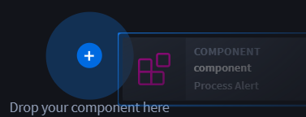
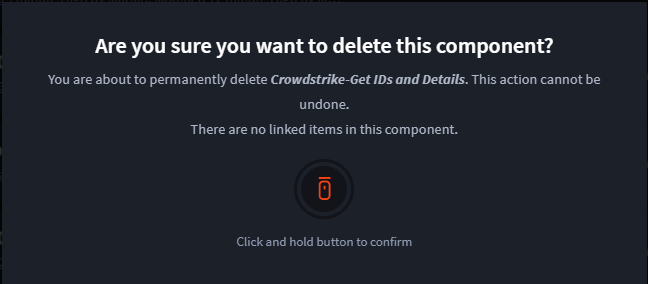
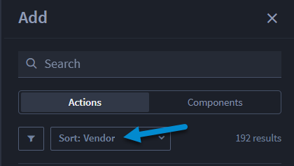
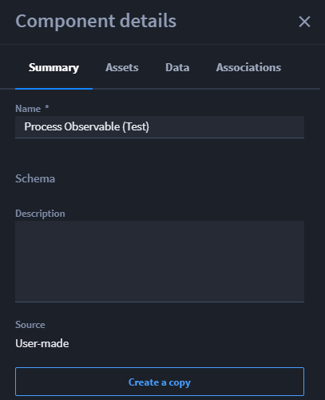
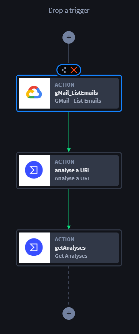
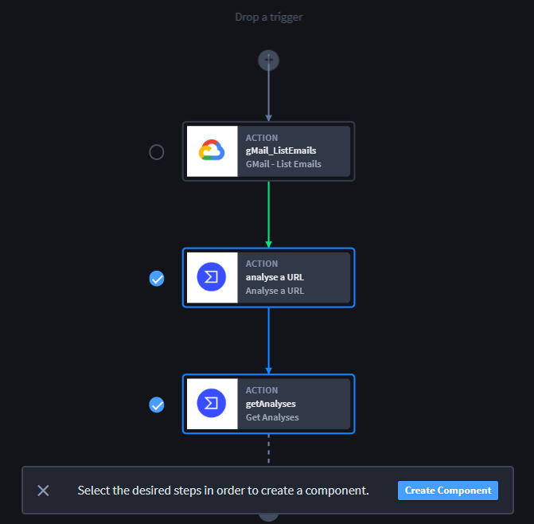
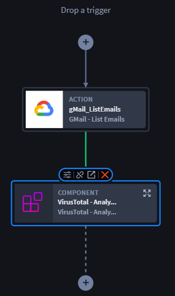
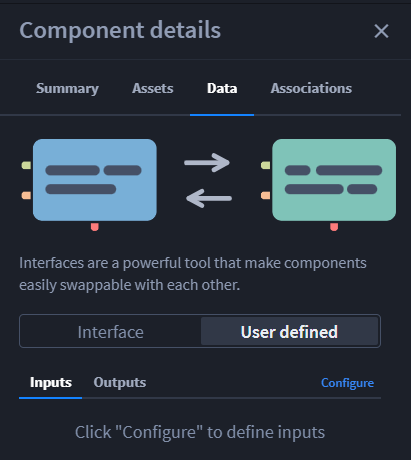
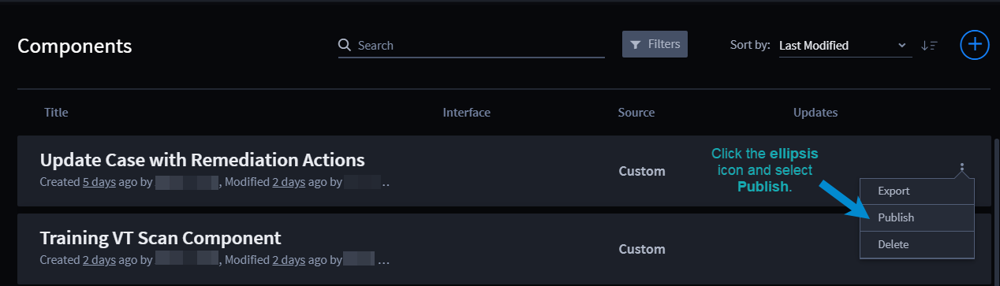
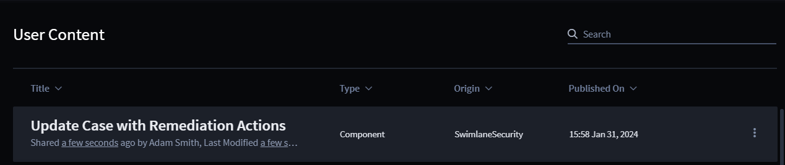

Components
==========

+-----------+---------------------------+---------------------------+
| Term      | Definition                | Characteristics           |
+===========+===========================+===========================+
|           |                           | -  Do not have triggers   |
|           |                           |                           |
| Component | A modular, reusable       | -  May have predefined    |
|           | visual programming        |    inputs                 |
|           | playbook building block   |                           |
|           |                           | -  Requires well-defined  |
|           |                           |    outputs                |
|           |                           |                           |
|           |                           | -  Two component          |
|           |                           |    forms: User-built and  |
|           |                           |    Swimlane-built         |
+-----------+---------------------------+---------------------------+

As an orchestrator, Turbine offers two helpful options for building
components. You can either use a Swimlane-built component, if it meets
your needs, to save time and effort to achieve a desired outcome, or you
can build and customize your own reusable component.

Customizing components that exist in your component library, saves you
time recreating or duplicating work, copying a component and modifying
as needed, and provides desired-outcome flexibility.

Components Homepage
-------------------

To access components, follow these steps:

#. Log in to **Turbine**.

#. From the left-hand navigation pane, click **ORCHESTRATION** and click
   **Components**.

From the Components homepage, you can see:

+---------------+-----------------------------------------------------+
| Feature       | Function                                            |
+===============+=====================================================+
| Title         | The pre-existing Swimlane component, or the         |
|               | user-made component title.                          |
+---------------+-----------------------------------------------------+
| Interface     | Existing interfaces.                                |
+---------------+-----------------------------------------------------+
| Source        | Custom (user-made) or Swimlane Content              |
+---------------+-----------------------------------------------------+
| Updates       | Recent updates made to the component.               |
+---------------+-----------------------------------------------------+
| Search        | Enter keyword(s) to search for a component.         |
+---------------+-----------------------------------------------------+
| Filter        | Use to sort by Source, Interface, or Created By.    |
+---------------+-----------------------------------------------------+
| Sort by       | Use to sort by Last Modified, Last Created, or      |
|               | Alphabetical.                                       |
+---------------+-----------------------------------------------------+
| Arrow icon    | Click to modify view between Ascending results and  |
|               | Descending results.                                 |
+---------------+-----------------------------------------------------+
| Ellipsis icon | Click to Export or Delete.                          |
+---------------+-----------------------------------------------------+
| Plus icon     | Click to open New Component dialog. New and define  |
|               | new component.                                      |
+---------------+-----------------------------------------------------+

Component
---------

There are a few ways to engage with Turbine components. As seen above,
from the Components homepage, you create a new component from a series
of actions in a workflow or use pre-built components from the Turbine
content. Before looking at those, let's review the component canvas user
interface (UI).

The Component canvas operates on a drag-and-drop functionality. To the
left, the Add panel provides a list of Actions and Components (pre-built
and user-made).

The Add panel is where you can view, search, filter, sort, and/or
drag-and-drop actions and components.

|image1|

**Components can be**:

-  Filtered by user-made

-  Sorted by Source or Interface

The Component default view is alphabetical by User-made, where you can
easily expand or collapse the list. To add a component, click on the
desired component, then drag to the plus icon to the expanding
responsive drop zone. Repeat to add additional components.

|image2|

Defining Terms and Icons
~~~~~~~~~~~~~~~~~~~~~~~~

The table shows the icon and meaning for the component toolbar.

======== =========================================================
Icon     Meaning
======== =========================================================
|image3| Show/Hide the Add panel
|image4| Create a component from actions on the canvas
|image5| Zoom drop-down menu
|image6| Show/Hide the Component Details panel
|image7| Open Test Console at the bottom of the window
|image8| Shows options to Export, Duplicate, or Delete a component
======== =========================================================

Create Component from Homepage
------------------------------

To create a new, user-made component, follow these steps:

#. From the Components homepage, click the **plus** icon.

The New Component dialog opens where you must enter a name and can add a
description. The example shows a new component created using two
CrowdStrike vendor-actions: Get IDs and Get Incident Details.

|image9|

#. Click **Save** to create the component and open the Component canvas.

If you do not want a component, you can always use the navigation pane
to click LIBRARY, then Components.

#. From there, you can click the **ellipsis** icon next to the
   component, and click **Delete**.

|image10|

After you click **Delete**, you receive a confirmation dialog. Once you
delete, you cannot undo this step.

|image11|

#. Click the **mouse** icon and hold. The dialog closes once the
   deletion is complete.

Referring back to step 2, now that the component canvas is open, use the
Add panel to find the two CrowdStrike vendor-actions: Get IDs and Get
Incident Details. The example below walks you through the process of
finding and adding the actions to the canvas.

#. From the Add panel, ensure the Actions tab is selected and the Sort
   drop-down has **Vendor**.

|image12|

For a quick search, filter by vendor.

#. Click the **filter** icon and select **CrowdStrike**.

The results show only the CrowdStrike actions, where you can scroll
through and select the desired actions, then click and drag each action
onto the canvas.

|image13|

You've successfully added actions to the component. From here you can
add/delete actions, configure, and/or modify at a later time. Now the
component is always accessible under the User-Made components and in
your content library.

**Tip**: Save your work frequently!

Swimlane Components
-------------------

Components, also known as vendor interaction components (VICs), focus on
the intent of the vendor action. Vendor APIs send data in differing
formats. That data needs to be in common data formats for best
practices. Use components to set an intent, then configure
vendor-specific details.

Turbine components focus on:

-  Ingestion

-  Enrichment

**Why Use Swimlane Content Components**

Turbine ingestion components get data from with Turbine Extendable Data
Schema (TEDS).

Using ingestion components:

-  Provides preconfigured intents for your playbook framework to reduce
   time building

-  Allows mass data ingestion

-  Uses ingested data downstream in the playbook and/or the promoted
   results for use outside the playbook

**Why Use Swimlane Content Components**

Turbine enrichment components ingest data from third-party tools and
transform data into appropriate OCSF/SOS objects to improve incident
response investigations for threat hunting.

To select a preconfigured component:

#. Click on **LIBRARY** and click **Swimlane Content**.

The Swimlane Content homepage opens and you can scroll down to the
**Components** section. Click **Install** to download the desired
component, and then access it by either your User Content library, or
from the Components tab in the Add panel on your playbook canvas.

Component Details
-----------------

When creating a component, anytime you click on the Canvas, the
Component details panel displays in the right-hand side.

|image14|

The table below describes the individual component detail tabs.

+--------------+------------------------------------------------------+
| Tab          | Details                                              |
+==============+======================================================+
| Summary      | Has the component name, schema (if applied),         |
|              | description, source type, and button to create a     |
|              | copy.                                                |
+--------------+------------------------------------------------------+
| Assets       | Shows the connectors that have assets. These         |
|              | drop-downs could be empty. You can use this          |
|              | drop-down to also select and apply an asset to a     |
|              | connector.                                           |
+--------------+------------------------------------------------------+
| Data         | Shows interface image, pre-set or user-defined       |
|              | interface and drop-down menu, inputs/outputs,        |
|              | configure hyperlink.                                 |
+--------------+------------------------------------------------------+
| Associations | Shows the number of dependent playbooks or           |
|              | components.                                          |
+--------------+------------------------------------------------------+

This panel is available whether you get a component from the Swimlane
Content or if you create one yourself.

User-Made Components from Canvas
--------------------------------

From a playbook canvas, you can create a user-made component. Create a
playbook and add the desired use case actions. Let's say that you want
to use the same set of tasks again in the current or another playbook.
The example below walks you through how to group actions into a
component and ungroup the component, as needed.

**Scenario**: You have created a playbook with the purpose retrieving a
list of emails and evaluating and conducting a URL analysis. The
playbook canvas below shows the GMail - List Emails action followed by
two downstream VirusTotal actions. The Analyse a URL action and Get
Analyses action. In the future, you want to use the two VirusTotal
actions to analyze a URL.

|image15|

To create the component:

#. From the canvas toolbar, click the |image16| icon to create the
   component.

Each action now has a circle next to it.

#. Select the desired steps to create your component and click **Create
   Component**.

|image17|

#. Click **Create Component**.

When the New Component window opens, enter the component name. Best
practice is to name the component with the desired outcome/task you
want. In this case, since we want to analyze a URL using only VirusTotal
actions, let's enter: **VirusTotal - Analyze URL** and click **Save**.

|image18|

You've successfully created a component inside a playbook canvas! This
component is available in your Components tab in the Add panel and in
your user content library.

What if you need to change the component? Easy! 

The icons above a component enable once you've selected it. The table
below defines the icons.

========= ================================================
Icon      Meaning
========= ================================================
|image19| Edit component inputs/outputs/additional options
|image20| Ungroup component
|image21| Open in component builder
|image22| Delete component
========= ================================================

 

**Warning!** If you choose to ungroup a component, it detaches it from
the component library. It splits the individual steps on the canvas, and
where applicable, remove interface, inputs, and/or outputs. A warning
dialog opens and you must click Continue.

|image23|

Interfaces
----------

+---------------------+----------------------+----------------------+
| Term                | Definition           | Defining             |
|                     |                      | Characteristics      |
+=====================+======================+======================+
|                     |                      | -  Used with         |
|                     |                      |    components        |
| Component Interface | Interface is the     |                      |
|                     | data shape that can  | -  Makes it so       |
|                     | be applied to        |    components can be |
|                     | Turbine components.  |    easily swapped    |
+---------------------+----------------------+----------------------+

Using the definition above, component interfaces prescribes the schema
of the component and specifies what kind of data the component accepts
as inputs and the kind of data the component can produce as outputs.
Components with the same interface can be easily swapped out for one
another when used on the canvas because they have the same defined
inputs and output. So the data that was already mapped, doesn't need to
be re-mapped.

You can access interfaces via the Component builder.

#. Navigate to **ORCHESTRATION** and click **Components**.

Either create a new component and open the Component builder, or click
on an existing component to access its interface. In this example, let's
reopen the Crowdstrike-Get IDs and Details component in the builder.

#. In the Component details panel, click the **Data** tab.

Immediately, there are two options: pre-built interfaces or user-defined
interfaces. Select one to filter for that option. In the user-defined
interfaces, you can configure inputs/outputs.

|image24|

When you click Configure, the Components Inputs Manager window opens
where inputs pass in and normalize data that you can use as inputs for
playbook actions or customize the configuration as part of an interface.
Just like configure action inputs, simply add and configure your
properties.

|image25|

Once you've applied the changes, your results are available under the
Inputs tab on the Data tab.

|image26|

Publish Components
~~~~~~~~~~~~~~~~~~

To publish a component to the `User
Content <../library/user-content.rst>`__ library, there are two main
options. First, from the Components homepage.

#. Click the ellipsis icon and select **Publish**.

|image27|

The Component Details window opens. The top of the window lists all of
the content type and number that are associated with that component.
Review any listed potential issues.

#. Click **Continue Publish to Library**.

All content is selected by default. Deselect individual content, or
click the Deselect All radio button for entities you want to publish.

|image28|

The Publish Success window opens. It will also highlight any potential
issues for you to review and where you can take action to remediation
that issue.

You can navigate to the User Content library to verify the playbook
published.

|image29|

It is now available to users with component access.

Let us take a quicker look at the second publishing option. You can also
publish a playbook to the User Content library from the playbook canvas.
Watch the following video.

[insert video]

You can navigate to the User Content library to verify the playbook
published.

Limitations and Restrictions
~~~~~~~~~~~~~~~~~~~~~~~~~~~~

When working in the component editor, there are some limitations to be
aware of.

-  **Component nesting is limited to 10**

   You can change assets, some configurations, but you cannot remove an
   action.

-  If you want to delete a task/action inside a component, you have to
   duplicate the component (tailor it as user-made), and then use it
   however you want.

-  Ungrouping a component ungroups that component in that flow, but it
   does not deconstruct the entire component.

-  When select tasks (actions, native actions, etc.), you can only
   select them from the same workflow. You cannot create a component
   across workflows.

-  If there are multiple branches (for example, with parallel actions or
   condition), they must also be within the same branch.

-  Components without an interface will not show in the content library
   and a user only shows up in a filter if they have created or
   installed a component form the Swimlane Content.

| 
| Continue to the next section to review the Webhooks homepage.

.. |image1| image:: ../../Resources/Images/canvas-components.png

.. |image3| image:: ../../Resources/Images/component-hide-show-add-pane.png
.. |image4| image:: ../../Resources/Images/component-create-component-icon.png
.. |image5| image:: ../../Resources/Images/component-zoom-icon.png
.. |image6| image:: ../../Resources/Images/component-show-hide-component-details-icon.png
.. |image7| image:: ../../Resources/Images/component-test-console-icon.png
.. |image8| image:: ../../Resources/Images/component-ellipisis-icon.png
.. |image9| image:: ../../Resources/Images/components-new-comp.png
.. |image10| image:: ../../Resources/Images/components-delete.png

.. |image13| image:: ../../Resources/Images/canvas-create-component-hp.png

.. |image16| image:: ../../Resources/Images/component-create-component-icon.png

.. |image19| image:: ../../Resources/Images/canvas-edit-component-icon.png
.. |image20| image:: ../../Resources/Images/canvas-component-ungroup-icon.png
.. |image21| image:: ../../Resources/Images/canvas-component-editor-icon.png

.. |image23| image:: ../../Resources/Images/canvas-ungroup-warning.png

.. |image25| image:: ../../Resources/Images/canvas-components-inputs-manager.png
.. |image26| image:: ../../Resources/Images/canvas-interface-inputs.png

.. |image28| image:: ../../Resources/Images/canvas-publish-component-content.png

