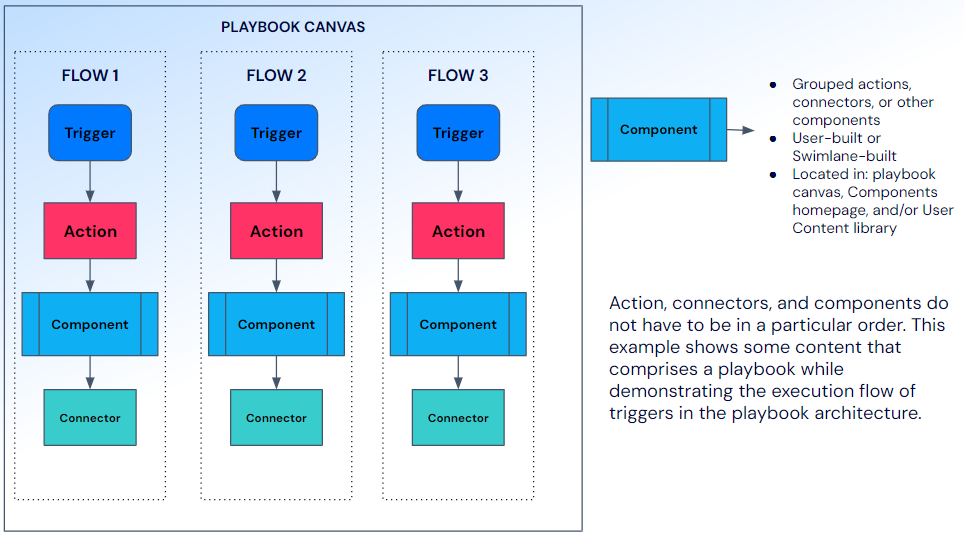
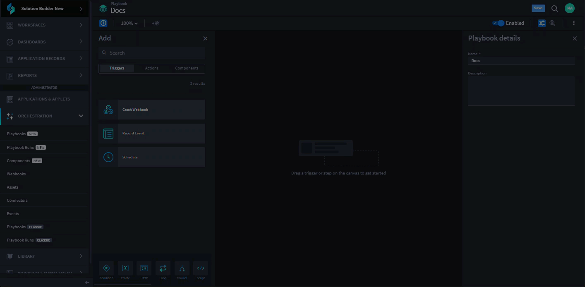
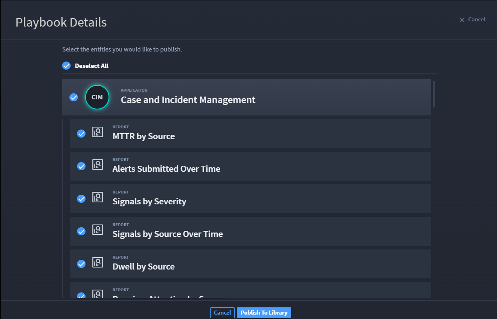

Playbooks
=========

+-----------+---------------------------+---------------------------+
| Term      | Definition                | Characteristics           |
+===========+===========================+===========================+
|           |                           | -  User-friendly canvas   |
|           |                           |    to build playbook      |
| Playbooks | A series of well-defined  |                           |
|           | triggers, logic, and      | -  Can contain triggers,  |
|           | actions that automate a   |    actions, native        |
|           | workflow                  |    actions, components,   |
|           |                           |    assets, inputs,        |
|           |                           |    outputs                |
|           |                           |                           |
|           |                           | -  Automate workflows     |
+-----------+---------------------------+---------------------------+

As an orchestrator, you can use playbooks to help automate processes and
workflows to avoid manual and repetitive configuration for security
events.

Playbook Architecture
---------------------

Playbooks are where automation is built quickly and easily and enriches
data processing. With Swimlane Turbine's playbooks, anyone can create
modular, repeatable automations that process real-time data. Playbooks
ingest, normalize, and/or enrich data by individual workflows.

A playbook can have:

-  One or more trigger, with one or more flows.

-  Any number of actions to achieve an outcome.

-  Components (if desired).

|image1|

Flows
~~~~~

+------+------------------------------+------------------------------+
| Term | Definition                   | Characteristics              |
+======+==============================+==============================+
| Flow | A single execution path      | -  Each flow can only have   |
|      | within a playbook or         |    one trigger               |
|      | component that has one       |                              |
|      | trigger that initiates       | -  There can be multiple     |
|      | subsequent automation.       |    flows in one playbook     |
|      |                              |                              |
|      |                              | -  No cross-talk between     |
|      |                              |    flows                     |
+------+------------------------------+------------------------------+

See `Flows <flows.htm>`__ for more information on how flows work within
a playbook.

Homepage
--------

To access playbooks, follow these steps:

#. Log in to **Turbine**.

#. From the left-hand navigation pane, click **ORCHESTRATION** and click
   **Playbooks**.

|image2|

From the Playbooks homepage, a list of available (disabled or enabled)
playbooks are displayed. You can use the features listed in the
following table to navigate the playbook homepage for a faster and
easier experience.

+---------------+-----------------------------------------------------+
| Feature       | Function                                            |
+===============+=====================================================+
| Title         | The pre-existing Swimlane component, or the         |
|               | user-made component title                           |
+---------------+-----------------------------------------------------+
| Status        | Enabled or disabled status of playbook              |
+---------------+-----------------------------------------------------+
| Search        | Enter keyword(s) to search for a component          |
+---------------+-----------------------------------------------------+
| Filter        | Use to sort by Source, Interface, or Created By     |
+---------------+-----------------------------------------------------+
| Sort by       | Use to sort by Last Modified, Last Created, or      |
|               | Alphabetical                                        |
+---------------+-----------------------------------------------------+
| Arrow icon    | Click to modify view between Ascending results and  |
|               | Descending results                                  |
+---------------+-----------------------------------------------------+
| Ellipsis icon | Click to access playbook operations, such as Export |
|               | and Delete                                          |
+---------------+-----------------------------------------------------+
| Plus icon     | Click to open New Playbooks dialog. New and define  |
|               | new playbook.                                       |
+---------------+-----------------------------------------------------+

 

The homepage is where you can also export, publish to the user content
library, or delete playbooks.

|image3|

Click **Publish** to save your playbook to the content library, which
makes the playbook available across your tenants. Before completing the
publish process, you can see all of the features associated with your
playbook, including applications, reports, workspaces, assets,
playbooks, webhooks, and components. From the Playbook Details window,
you can review potential issues and select/deselect parts of the
playbook to publish.

|image4|

Create New Playbook
~~~~~~~~~~~~~~~~~~~

When it is time to set up an automated workflow, you can create a new
playbook. To create a new playbook:

1. From the Playbooks homepage, click the plus icon to open a window
where you can enter the name and description.

|image5|

Once you click Save, the playbook canvas opens for you to create your
use case.

Playbook Canvas
---------------

Canvas allows you to create a use case in a single location with
drag-and-drop functionality, AI assistance, and other features.

|image6|

Defining Terms and Icons
~~~~~~~~~~~~~~~~~~~~~~~~

The following table shows important user interface (UI) icons and terms
on the canvas toolbar. When you are creating a playbook, use these icons
to create a personally tailored playbook canvas.

+-----------+---------------------------------------------------------+
| Icon      | Meaning                                                 |
+===========+=========================================================+
| |image21| | Show/Hide the Add panel                                 |
+-----------+---------------------------------------------------------+
| |image22| | Create a component                                      |
+-----------+---------------------------------------------------------+
| |image23| | Zoom drop-down menu                                     |
+-----------+---------------------------------------------------------+
| |image24| | Enable or disable playbook                              |
+-----------+---------------------------------------------------------+
| |image25| | Show/Hide the playbook side panel                       |
+-----------+---------------------------------------------------------+
| |image26| | Open Test Console at the bottom of the window           |
+-----------+---------------------------------------------------------+
| |image27| | Click to access playbook operations, such as Export,    |
|           | Duplicate, and/or Delete                                |
+-----------+---------------------------------------------------------+

Add Panel
~~~~~~~~~

The Add panel is where you can view, search, filter, sort, and/or
drag-and-drop actions and components:

-  `Triggers <canvas-triggers.htm>`__

-  `Actions <canvas-actions.htm>`__

-  `Components <components.htm>`__

-  `Native Actions <../canvas-native-actions.htm>`__

On the right-hand side of the canvas, you can see playbook details,
which include the name and description. To have more space to work
within canvas, simply click the **X** icon and the panel closes.

|image28|

Watch the following video for a demo on using some of the features
defined above.

|image29|

Publish Playbooks
~~~~~~~~~~~~~~~~~

To publish a playbook to the `User
Content <../library/user-content.htm>`__ library, there are two main
options. First, let's start from the Playbooks homepage.

#. Click the ellipsis icon and select **Publish**.

|image30|

The Playbook Details window opens. The top of the window lists all of
the content type and number that are associated with that playbook.
Review any listed potential issues.

#. Click **Publish to Library**.

All content is selected by default. Deselect individual content, or
click the Deselect All radio button for entities you want to publish.

|image31|

The Publish Success window opens. It will also highlight any potential
issues for you to review and where you can take action to remediation
that issue.

You can navigate to the User Content library to verify the playbook
published.

|image32|

It is now available to users with playbook access.

 

Take a quicker look at the second publishing option. You can also
publish a playbook to the User Content library from the playbook canvas.
Watch the following video.

You can navigate to the User Content library to verify the playbook
published.

 

 

.. |image2| image:: ../../Resources/Images/canvas-playbook-homepage.png
.. |image3| image:: ../../Resources/Images/canvas-export-delete-publish.png
.. |image4| image:: ../../Resources/Images/canvas-publish-pb.png
.. |image5| image:: ../../Resources/Images/canvas-create-new-playbook.png
.. |image6| image:: ../../Resources/Images/canvas-blank.png
.. |image7| image:: ../../Resources/Images/component-hide-show-add-pane.png
.. |image8| image:: ../../Resources/Images/component-create-component-icon.png
.. |image9| image:: ../../Resources/Images/component-zoom-icon.png
.. |image10| image:: ../../Resources/Images/canvas-playbook-enable-button.png
.. |image11| image:: ../../Resources/Images/component-show-hide-component-details-icon.png
.. |image12| image:: ../../Resources/Images/component-test-console-icon.png

.. |image14| image:: ../../Resources/Images/component-hide-show-add-pane.png
.. |image15| image:: ../../Resources/Images/component-create-component-icon.png
.. |image16| image:: ../../Resources/Images/component-zoom-icon.png
.. |image17| image:: ../../Resources/Images/canvas-playbook-enable-button.png
.. |image18| image:: ../../Resources/Images/component-show-hide-component-details-icon.png
.. |image19| image:: ../../Resources/Images/component-test-console-icon.png

.. |image21| image:: ../../Resources/Images/component-hide-show-add-pane.png
.. |image22| image:: ../../Resources/Images/component-create-component-icon.png
.. |image23| image:: ../../Resources/Images/component-zoom-icon.png
.. |image24| image:: ../../Resources/Images/canvas-playbook-enable-button.png
.. |image25| image:: ../../Resources/Images/component-show-hide-component-details-icon.png
.. |image26| image:: ../../Resources/Images/component-test-console-icon.png

.. |image28| image:: ../../Resources/Images/canvas-pb-details.png

.. |image30| image:: ../../Resources/Images/canvas-publish-playbook.png

.. |image32| image:: ../../Resources/Images/canvas-publish-playbook-verify.png

.. toctree::
   :titlesonly:
   :caption: Children:

   /Content/turbine-canvas/orchestration/flows
   /Content/turbine-canvas/orchestration/canvas-triggers
   /Content/turbine-canvas/orchestration/canvas-actions
   /Content/turbine-canvas/canvas-native-actions
   /Content/use-cases/use-cases
