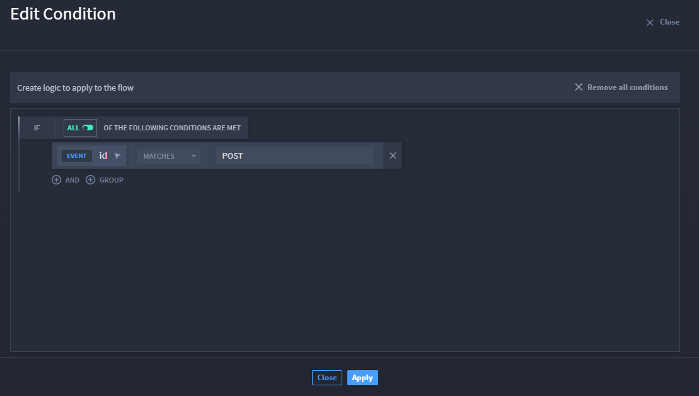

Record Event Triggers
=====================

Record event triggers initiate a playbook whenever a record is created
and/or updated within a specific application.

**Note:** You do not need to select a trigger before adding and
configuring actions and conditions.

.. _record-event-triggers-1:

Record Event Triggers
---------------------

For this example, select the Case and Incident Management (CIM)
application and ensure the record event is created when the application
is created and/or updated.

#. In a playbook, from the Add panel, click and drag **Record Event** to
   the canvas.

Hover over the plus icon to add it to the canvas. The Trigger panel
displays to the right of the canvas. From here, you configure your
Record Event trigger.

#. In the Application drop-down menu, select the desired application.
   The example has **Case and Incident Management**.

-  Select the **Record Created** check box to trigger the playbook
   whenever a record is *created* in the specified application.

-  Select the **Record Updated** check box to trigger the playbook
   whenever a record is *updated* in the specified application.

-  Select both check boxes to trigger the playbook whenever a record is
   *created* and/or *updated* in the specified application.

|image1|

#. Click **Configure** to open the **Edit Condition** window which
   allows you to create a condition for you flow.

#. Click **CREATE YOUR FIRST CONDITION** select the property type from
   the **Record Event Trigger**.

#. Select the type of condition from the drop-down next to **MATCHES**.

#. Enter the property type or select a property.

#. Click **Apply**.

   |image2|

 

.. |image1| image:: ../../Resources/Images/canvas-record-event-trigger.png

