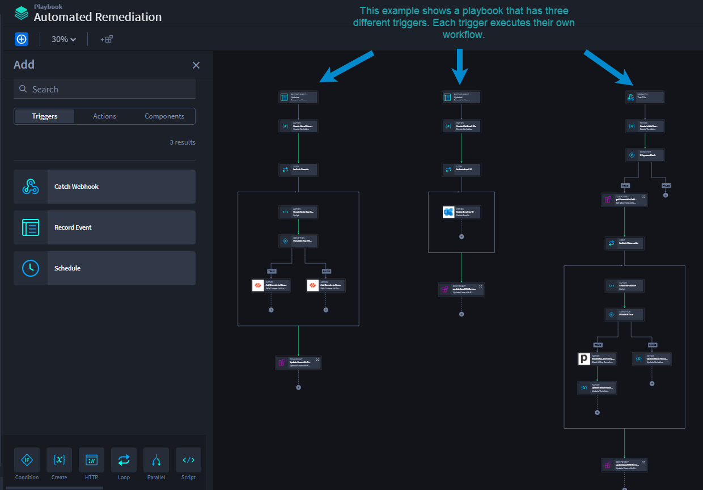
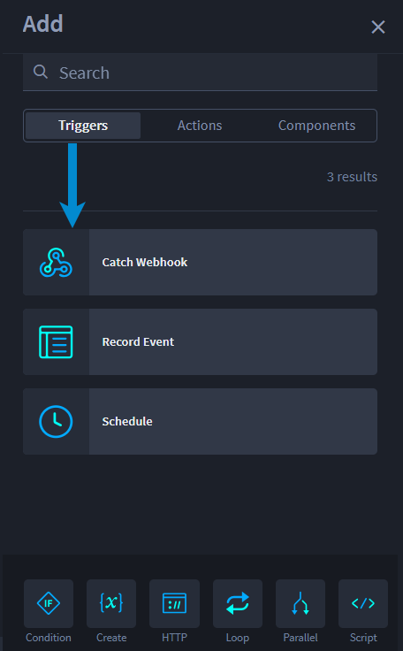

Triggers
========

A trigger initiates playbook processes. While a playbook can only have
one trigger per flow, it can have more than one trigger and/or trigger
type. Turbine currently uses several types of triggers to retrieve
and/or ingest data.

|image1|

Turbine has four trigger types:

-  Webhooks

-  Record Events

-  Schedules

-  Playbook Button

Access triggers from the Playbook Canvas Add panel, where you can select
one of the four types of triggers, then drag-and-drop to the canvas.

 

**Note**: The `Playbook Button <canvas-playbook-button-trigger.htm>`__
trigger is available via applications.

 

|image2|

Continue to the following sections for details and configuration of each
type of trigger.

 

.. toctree::
   :titlesonly:
   :caption: Children:

   /Content/turbine-canvas/orchestration/canvas-webhook-triggers
   /Content/turbine-canvas/orchestration/canvas-schedule-triggers
   /Content/turbine-canvas/orchestration/canvas-record-event-triggers
   /Content/turbine-canvas/orchestration/canvas-playbook-button-trigger
