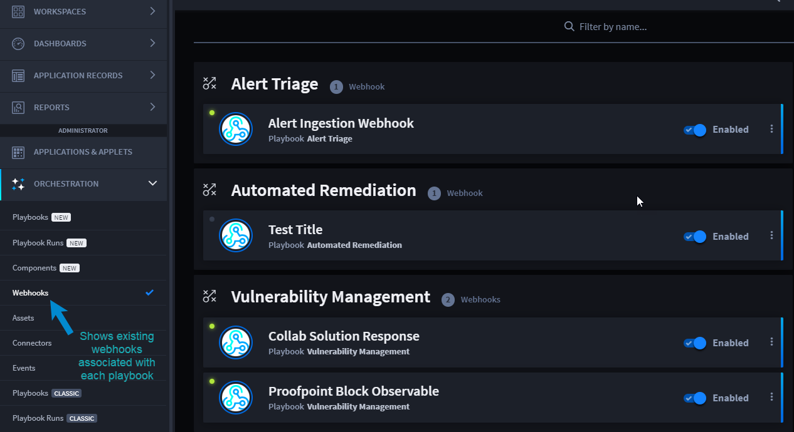
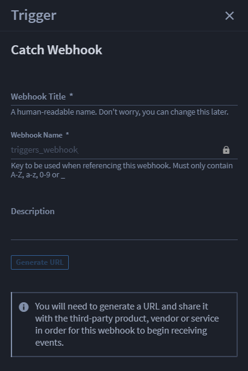
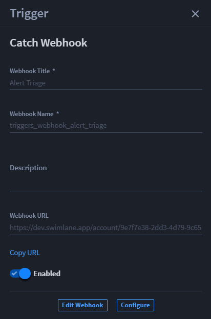
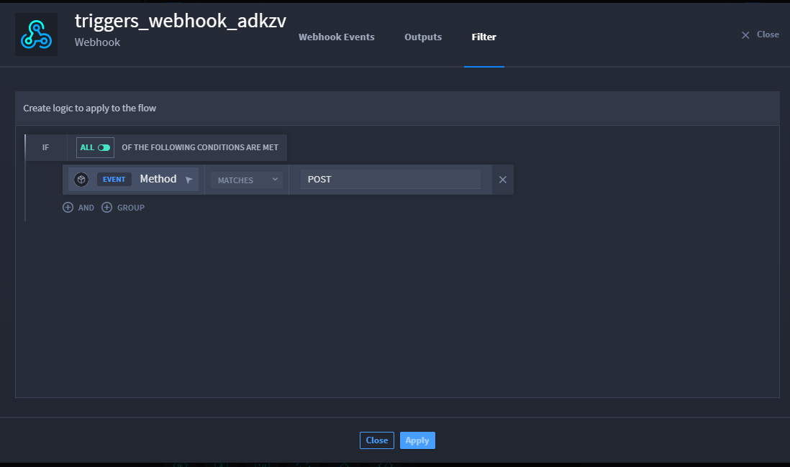
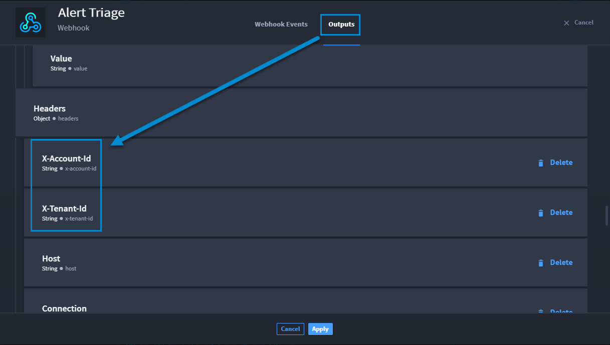
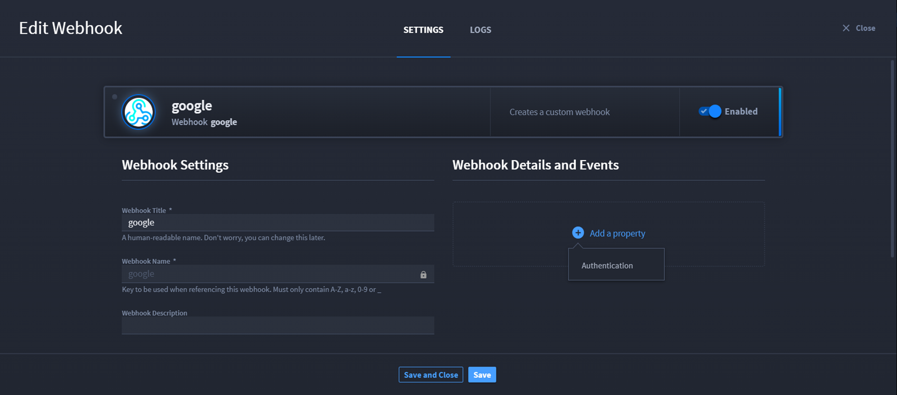

Webhook Triggers
================

Webhooks in Turbine empower products, vendors, or services to facilitate
real-time communication. They play a pivotal role in processing and
enhancing data sent from third-party services and platforms to Turbine
records. Essentially, a Turbine webhook functions like an API callback.
As an orchestrator, you can configure a webhook, generating a unique URL
that seamlessly integrates a playbook with various web applications.
Leveraging a webhook is a straightforward method to effortlessly
incorporate real-time data into Turbine, bypassing more intricate
procedures such as polling and parsing web data.

Let's take a look at how to create and configure webhooks in Turbine.

**Note:** You do not need to select a trigger before adding and
configuring actions and/or components.

View Existing Webhooks
----------------------

To view existing webhooks:

#. Navigate to **ORCHESTRATION**.

#. Click **Webhooks**.

|image1|

From here you can toggle the Disabled button to enable or disable the
webhook, or click the desired webhook to view settings and log
information. Additionally, the **Filter by name** option allows you to
search and find a webhook quickly.

Create Webhook Triggers
-----------------------

A common use for webhooks is to push or pull data, such as ingesting
alerts into your playbook. To retrieve and/or ingest data:

#. In a playbook, from the Add panel, click and drag **Catch Webhook**
   to the canvas.

Hover over the plus icon to add it to the canvas. The Trigger panel
displays to the right of the canvas. From here, you configure your
webhook trigger.

|image2|

#. Fill the following fields based on descriptions.

+------------------------+--------------------------------------------+
| Webhook Trigger Fields | Field Information                          |
+========================+============================================+
| Webhook Title          | \*Required field                           |
|                        |                                            |
|                        | Enter a human-readable name. This can be   |
|                        | changed at a later time.                   |
+------------------------+--------------------------------------------+
| Webhook Name           | \*Required field                           |
|                        |                                            |
|                        | Key to be used when referencing this       |
|                        | webhook. Must only contain A-Z, a-z, 0-9   |
|                        | or \_. Click the lock icon to enable the   |
|                        | field to make any changes to the name.     |
+------------------------+--------------------------------------------+
| Description            | If desired, enter a description for the    |
|                        | webhook.                                   |
+------------------------+--------------------------------------------+
| Generate URL           | **Note**: You will need to generate a URL  |
|                        | and share it with the third-party product, |
|                        | vendor or service in order for this        |
|                        | webhook to begin receiving events.         |
|                        |                                            |
|                        | Click this button to generate the webhook  |
|                        | URL                                        |
+------------------------+--------------------------------------------+

It is recommended to name the trigger that identifies the action of the
webhook. For example, let's say you want to pull in alerts to triage. A
good title would be **Alert Triage**. After adding the descriptors, be
sure to click **Generate URL** so the webhook URL is generated for you
to edit and/or configure.

|image3|

Edit Webhook
~~~~~~~~~~~~

The next steps are to add the necessary proprieties to authenticate a
webhook trigger request. You may not need to add any additional
proprieties to the webhook, but you can still access the webhook
settings and log information from the Edit Webhook button.

To change webhook settings:

#. From the Trigger panel, click **Edit Webhook**.

   On the SETTINGS tab, you can: update the webhook title, change the
   webhook name (click the lock icon to enable the field), provide a
   webhook description, copy the webhook URL, and/or enable/disable the
   webhook. Additionally, this is where you add properties to
   authenticate the webhook requests.

   **Note**: If a webhook has not yet received an event, navigate to
   your third-party product, vendor or service to trigger an event. Once
   that event has been triggered, return here to continue configuring
   the webhook.

   |image4|

   On the LOGS tab, you can view the webhook logs that show you the
   ingest information by date and allow you to enable and/or disable the
   webhook.

|image5|

#. Click **Save and Close**.

If you do not need to edit your webhook, go straight to configuring.

Configure Webhooks
~~~~~~~~~~~~~~~~~~

When you click Configure on the webhook trigger panel, a pop-up window
shows two tabs: Webhook Events and Outputs. The Events tab shows
event-type data for the webhook. The Outputs tab shows all the outputs
provided from the webhook. Take a look at the table below for more
information.

To configure a webhook:

#. From the Trigger panel, click **Configure Webhook**.

**Webhook Events tab details:**

+---------------------+-----------------------------------------------+
| Webhook Events Tab  | Information                                   |
+=====================+===============================================+
| Event Type          | Drop-down arrow, which shows you the webhook  |
|                     | details, the result, and discovered outputs   |
+---------------------+-----------------------------------------------+
| Agent/Host          | Name of the agent/host for that webhook       |
+---------------------+-----------------------------------------------+
| Time Received       | Time the webhook was last received            |
+---------------------+-----------------------------------------------+
| Triggered Playbooks | Numbered of triggered playbooks related to    |
|                     | that webhook                                  |
+---------------------+-----------------------------------------------+

 

**Webhook Outputs tab details:**

+--------------------+------------------------------------------------+
| Outputs Tab        | Information                                    |
+====================+================================================+
| **Property types** | All outputs provided by the webhook based on   |
|                    | default property types. If you added any       |
|                    | discovered outputs, then they show up with the |
|                    | **Delete** hyperlink. Any property types       |
|                    | without that Delete hyperlink are part of the  |
|                    | originally returned inputs from the webhook.   |
+--------------------+------------------------------------------------+

|image6|

**Webhook Filter Tab**

The **Filter** tab allows you to apply a condition on event triggers
allowing you to prevent the playbook execution unless the criteria is
met. You can select a condition type from the drop-down next to
**MATCHES**.

|image7|

Discovered Webhook Outputs
~~~~~~~~~~~~~~~~~~~~~~~~~~

After reviewing the default webhook outputs, you may want to know if
there are any other property outputs that you can apply and use
downstream in your workflow. To find and add discovered outputs to your
Outputs tab:

#. From the Webhook Events tab, click the **expand/collapse** arrow for
   a specific event type.

Proprieties that are selected are part of the default output properties.

#. Scroll through the proprieties and click the radio button next to the
   enabled property types to select them, then click **Add selected to
   outputs** to add them to the webhook outputs that can be available
   for that workflow in a playbook.

|image8|

Now those selected properties show in the webhook Outputs tab.

|image9|

#. Click **Apply** to save the changes.

Navigate to `Discovered Outputs and
Testing <../../playbooks/actions/discovered-outputs-and-testing.htm>`__
for additional details on how to view and/or add discovered outputs from
the playbook action level.

Authenticate Webhooks
~~~~~~~~~~~~~~~~~~~~~

To configure webhook authentication settings:

#. On the Trigger panel, click **Edit Webhook**.

#. On the SETTINGS tab, click **Add a property**, then click
   **Authentication**.

|image10|

Additional **Add a property** icons become available as sub-properities.

#. Click **Add a property** and select either **Basic Authentication**
   or **Shared Secret Authentication**.

|image11|

**Basic Authentication**

Basic authentication specifies the credentials to be sent and verified
from the **Authorization** header using the basic authentication scheme.

After selecting **Basic Authentication**, complete the **Username** and
**Password** fields, and click **Save**.

Mirror the username and password with your third-party system.

|image12|

**Important!** Mismatched credentials will result in a 401 Unauthorized
response code to the webhook requests but will not generate an error
message within Turbine.

#. To remove the basic authentication, click the vertical ellipsis, then
   click **Remove**.

**Shared Secret Authentication**

Shared secret authentication specifies the credentials to be sent and
verified from one of the following locations in the webhook requests:
header, body, or query parameter.

After selecting **Shared Secret Authentication**, complete the
**Secret**, **Secret Format**, and **Secret Location** fields.

|image13|

#. From the drop-down menu, select the **Request Body**, **Request
   Header**, or **Request Query Parameter** property to:

-  Extract the secret (Password) from the request body.

-  Extract the secret (Password) from the request header.

-  Extract the secret (Password) from a query parameter.

To remove the properties, click the vertical ellipsis, then click
**Remove**.

View Webhook Logs
~~~~~~~~~~~~~~~~~

There are a few features you can access through the webhook LOGS tab.
Webhook logs provide specific details about each instance the webhook
runs.

#. To view webhook logs on TRIGGER, click **Edit Webhook** and click the
   **Logs** tab.

You can use the following steps to view log information, enable/disable
a webhook, and view logs from a specific date.

#. Select the **Word Wrap** check box to wrap long text for a cleaner
   and easier view of the logs. Deselect to view more details.

#. Click the **Enable** toggle to enable or disable the webhook.

#. Click **Jump to date** to show the calendar, where you can select a
   specific date to view the webhook runs.

|image14|

If you want to remain on the window, click **Save** and continue viewing
the LOGS tab. When you're finished, simply click **Save and Close** to
exit the window.

.. |image4| image:: ../../Resources/Images/canvas-edit-webhook-trigger.png
.. |image5| image:: ../../Resources/Images/canvas-logs-webhook-trigger.png
.. |image6| image:: ../../Resources/Images/webhook-outputs.png

.. |image8| image:: ../../Resources/Images/webhook-discovered-outputs.png

.. |image11| image:: ../../Resources/Images/webhook-subproperties.png
.. |image12| image:: ../../Resources/Images/webhook-basic-auth.png
.. |image13| image:: ../../Resources/Images/webhook-shared-secret-auth-property.png
.. |image14| image:: ../../Resources/Images/canvas-webhook-logs.png
