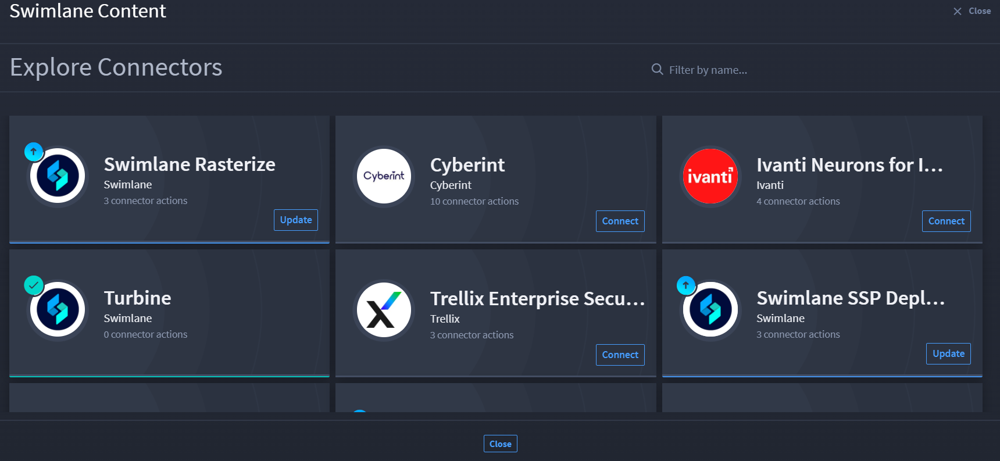
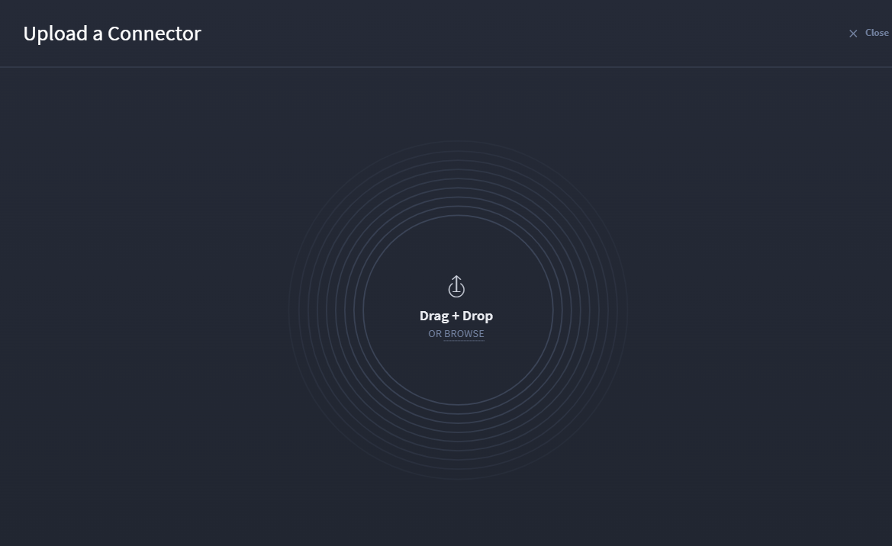

Connectors
==========

+------------+---------------------------+---------------------------+
| Term       | Definition                | Characteristics           |
+============+===========================+===========================+
|            |                           | -  You can install        |
|            |                           |    defined capabilities   |
| Connectors | Connectors are            |    from third-party       |
|            | distributable packages    |    services/platforms for |
|            | that provide simplistic   |    use in playbooks, and  |
|            | integration functionality |    then use input/output  |
|            | for an                    |    configuration with     |
|            | application/service and   |    APIs without using     |
|            | connect to third-party    |    code.                  |
|            | tools.                    |                           |
+------------+---------------------------+---------------------------+

Homepage
--------

To access playbooks, follow these steps:

#. Log in to **Turbine**.

#. From the left-hand navigation pane, click **ORCHESTRATION** and click
   **Connectors**.

|image1|

From the Connectors homepage, a list of existing connectors and their
associated actions show sorted alphabetically. You can use the features
listed in the table to navigate the assets homepage for a faster and
easier experience.

============== ======================================
Feature        Function
============== ======================================
Filter by name Use to filter by asset name
Plus icon      Find a connector or Upload a connector
Ellipsis icon  Click to delete a connector
============== ======================================

Also, each connector shows if there is an update available or if it's up
to date. If there is an update, click the Update Available hyperlink,
then the Swimlane Content opens for that connector. Click the Update
button to download.

Find a Connector
----------------

To see all available connectors from the Swimlane Content:

#. Click the **plus** icon.

#. Click **Find a connector**.

The Swimlane Content Explore Connectors window opens.

|image2|

#. Choose your desired connector and click **Connect**.

You should receive a confirmation dialog, and now that connector is
available on the Connectors homepage and in the Add panel in your
playbook canvas.

Upload a Connector
------------------

Need to add a connector to Turbine? You can also do this from the
Connectors homepage.

#. Click the **plus** icon.

#. Click **Upload a connector**.

The Upload a Connector window opens.

|image3|

#. Click **BROWSE** or click and drag a connector to the window.

|image4|

Now the connector is available from the Connectors homepage.

Continue to the next section for Event homepage information.

 

 

.. |image1| image:: ../../Resources/Images/canvas-connectors-hp.png

.. |image4| image:: ../../Resources/Images/canvas-connector-upload.png
