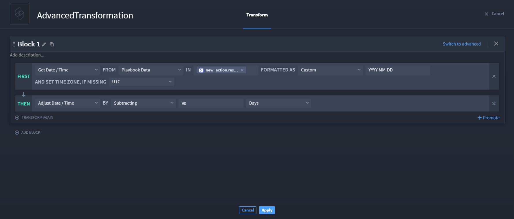

.. _basic-transformations:

Advanced Transformations
========================

Let's take a look at what happens when Avery has a configured basic
transformation block, and then switches to advanced mode.

Scenario
--------

Avery works in the SOC and wants to convert date/time from a VirusTotal
(VT) action that searches IOCs and comments. After configuring the VT
action, Avery clicks the **On Success** action flow, and then adds the
**Transform Data** action. Avery then adds a **Get Date / Time**
function followed by an **Adjust Date / Time** function to adjust the VT
date/time to 90 days prior.

Let's take a look!

|image1|

This transformation returned successful data.

