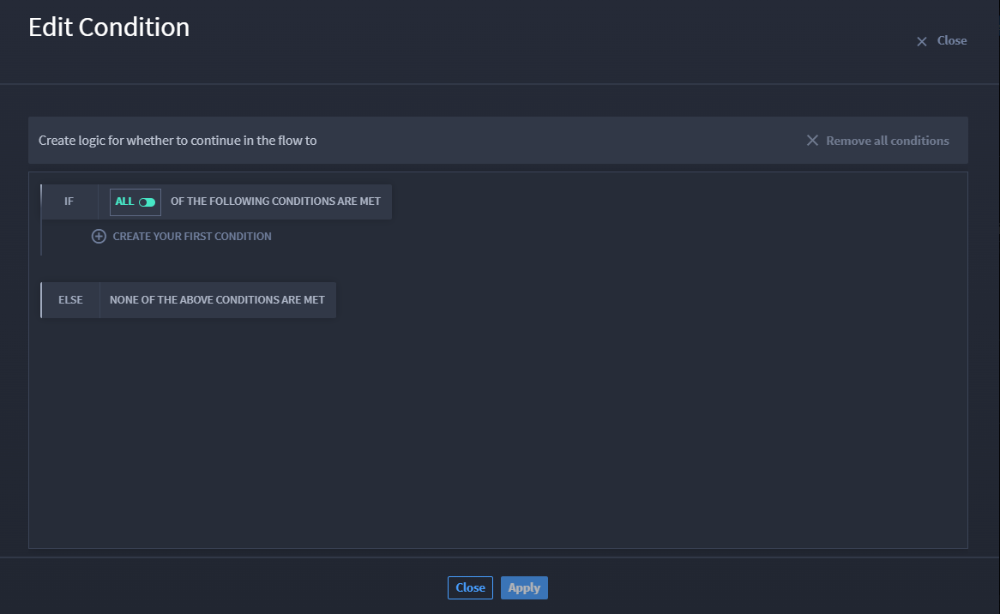

If/Else Use Case
================

Decrease complexity and increase customizability in your playbook by
using IF and ELSE conditional statements with the Turbine Condition
native action.

Scenario
--------

Aaliyah is an Orchestrator who wants her playbook to execute if the HTTP
request comes back with a specific status code. To accomplish this,
Aaliyah needs to use the Condition native action to build IF and ELSE
conditional statements.

Let's take a look!

As an orchestrator, Aaliyah already knows how to create and configure
her `playbook <../../playbooks/playbooks.rst>`__ and add an
`action <../../playbooks/actions/actions.rst>`__. So she's ready to jump
right in!

#. First, select the **HTTP Request** native action and choose an **On
   Success** action flow.

   Now that Aaliyah has her first action, she's ready for the native
   action.

#. In the playbook, click **Add an action**.

#. In the ACTION drop-down menu, select the native action **Condition**.

#. Click **Edit Condition**.

   |image1|

Aaliyah needs to set up a conditional logic. She adds her first
condition by opening the condition configuration builder.

5. Select **Status Code** value.

6. In the drop-down menu, select **IS EQUAL TO**.

7. Enter **100**.

This status code allows information to continue processing. If the
status code is not equal to 100, the criteria is not met, which means
that the conditional statement is FALSE.

Conclusion
----------

Aaliyah has the beginning of her playbook set up to ensure that if the
http request processes successfully she can continue building out the
playbook's actions.

