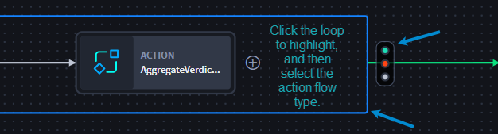

Loop Use Cases
==============

forEach Loops iterates through a list by repeating an array across one
or more action.

Scenario: Filter Phishing Emails, Loop, Parse, Enrich, and Aggregate Results
----------------------------------------------------------------------------

Zareen is an orchestrator who needs to send a slack message to her team
with the list of IOCs from phishing emails. There are a few ways to
accomplish this, but Zareen wants to use the forEach loop feature to
iterate through the list by repeating an array across several actions.
Zareen uses the **GMail - List Emails** action and **Google_Workspace**
asset to ingest emails. Then she creates the loop action. Zareen gives
the forEach loop a title and configures her actions. She filters for
emails with “phishing” in the body of the email, parses the IOCs from
those emails, and enriches the data using a VirusTotal action. After,
she’ll aggregate the verdict within the forEach loop and pass the
results to the final action and broadcast a message via Slack.

Let’s take a look!

First, Zareen refers to the `Get GMail Emails
List <get-gmail-emails-list-use-case.htm>`__ use case on how to install
and configure the Google Workspace connector. Next, she needs to use the
Swimlane Content to install a VIC for later use in the playbook. She
searches and installs the **Get Enrichment from VirusTotal** VIC from
the Swimlane Content.

#. From the playbook, add the **Get Emails** gmail action and configure
   with your Microsoft Gmail asset to add credentials, delegate account,
   and userID information.
   |image1|

After applying the changes, Zareen wants to create her forEach loop.

2. Click the **On Success** action flow and add the **Loop** action.

Zareen's ready to configure the forEach loop with downstream actions. To
return emails with **Phishing** in the body, she adds the IOC Parser
action and configures another property.

3. Scroll through the properties, and click the **+ Include** icon for
   **Text Body** property.

It moves to the top of the inputs.

4. In the **Text Body** field, click **select a property**, then click
   **Expression**.

5. | Enter ``$actions.Filter_Emails_Phishing.result.text_body`` and
     click **Apply**.
   | |image2|

To get an observable array, Zareen needs to use Python to retrieve
complex data. She selects the Transform Data action, then switches to
advanced mode, and changes the title to reflect the block action: Find
IOC results.

6. Enter the following code and apply changes:

|image3|

7. Add the **Get Enrichment from VT** VIC.

To configure the VIC, open the Get Enrichment from VirusTotal playbook,
then:

8. Click the **Search** action. Verify the URL and API key are
   configured in the VT asset.

Now for the final in-loop action. Zareen wants to publish the enriched
aggregated results into a Slack message. She uses the Transform Data
action and switches to the advanced mode. She changes the title to
reflect the block action: Aggregate verdict.

9. Enter the following code and apply changes:

The last action takes place outside the forEach loop. Zareen is ready to
send the aggregated results as a message via Slack.

10. Click the forEach loop box to highlight.
    |image4|

The action flow icon displays. Zareen selects the On Success action
flow, then adds her final action.

11. Add the **Broadcast Message** action.

The aggregated forEach loop results only come from the last action in
forEach loop, so Zareen is finished. The message of IOCs from phishing
emails will be sent in a Slack message.

Conclusion
----------

Zareen successfully used loops, transform data actions, and an
enrichment VIC to save time ingesting, filtering, and enriching data to
identify and reduce MTTR for phishing emails.

.. |image1| image:: ../../Resources/Images/get-email-action-configured.png
.. |image2| image:: ../../Resources/Images/loop-ioc-parser.png
.. |image3| image:: ../../Resources/Images/loop-find-ioc-results-python.png

