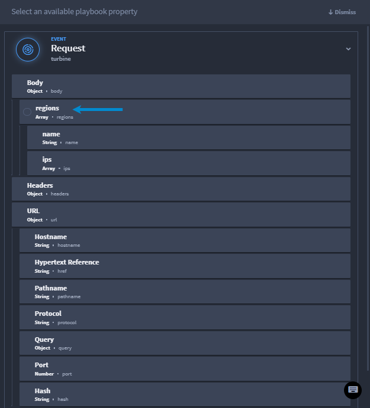

Nesting, Branching, and Conditions Loops Use Case
=================================================

Loops are a great way to iterate data inside a playbook without having
to nest another playbook. Let's take a look at a use case.

Scenario
--------

Mei is an orchestrator who wants to get a count of IP addresses that are
considered malicious. She wants to get the list of IP addresses from
specific regions, iterate the data, get a threat score for each IP
address, then create conditions that filter out benign IP addresses but
return a verdict of malicious IP addresses, then have an action that
provide that list. Let's watch as she creates her playbook.

Mei starts by creating a playbook with a webhook trigger.

#. Configure your webhook with the desired data.

2. Click **Add an action** and select **Loop**.

Mei names her action **loop over regions**, ensures the Process of the
loop is **Sequential**, and is ready to configure.

3. Next, under **Configuration**, click **Select a property or
   expression**.

4. To get the region data, from the playbook properties, click
   **regions**.

   |image1|

Now Mei has her first loop and is ready to add her first nested loop.

5. Click **Add an action** and select **Loop**.

Mei names her action **Loop Over IPs**, ensures the Process of the loop
is **Sequential**, and is ready to configure.

6. Next, under **Configuration**, click **Select a property or
   expression**.

This time, she will select a different playbook property.

7. To get the IP values, from the playbook properties, click the Loop
   Over Regions actions, then selects **Value**.

The next step is to retrieve IP scores for those regions. Mei adds a
**Script** native action called **Get IP Score**. From the Script tab,
under Inputs, she completes the following steps:

8. Click **Add property**, selects **String**, and clicks **Select a
   property**.

Mei names the text field **IP**. When the playbook property drawer
opens, she selects the same property as step 7: Loop Over Regions
action, then select **Value**.

9. From the Script tab, under Script, enter the following code:

If Mei wants to test this before continuing to build her playbook, she
can click the Test tab, enter the same values and click the **Test**
button. For more information on testing scripts, Mei reviews `Discovered
Outputs and
Testing <../../playbooks/actions/discovered-outputs-and-testing.htm>`__.
It's time to filter those IP scores using the **Condition** native
action. Mei wants to filter any IP scores higher than 50 to be marked as
malicious. Anything below 50 should be marked as benign.

10. Add an on success **Condition** native action.

11. Click **CREATE YOUR FIRST CONDITION** and from the playbook
    properties, select the Script action's **result**.

12. Set the operator to **IS GREATER THAN** and the value to **50**.

    |image2|

Mei saves her changes and now her IF/ELSE condition is configured and
she's ready to add the last two actions within her nested loop.

13. From the TRUE condition, click **Add an action** and select
    **Script**.

Mei titles the action **Mark as Malicious** so that it's easy to
identify if the IP score is over 50.

14. Click **Add property**, selects **Number**, and clicks **Select a
    property**.

Mei names the text field **score**. When the playbook property drawer
opens, she selects the Get IP Score result.

15. From the Script tab, under Script, enter the following code:

16. From the FALSE condition, click **Add an action** and select
    **Script**.

Mei titles the action **Mark as Benign** so that it's easy to identify
if the IP score is below 50.

14. Click **Add property**, selects **Number**, and clicks **Select a
    property**.

Mei names the text field **score**. When the playbook property drawer
opens, she selects the Get IP Score result.

15. From the Script tab, under Script, enter the following code:

16. From the Script tab, under Inputs, click **Add property**, selects
    **Object**, and clicks **Select a property**.

17. From the playbook property drawer, click the Loop Over Regions
    action and select result.

18. From the Script tab, under Scripts, enter the following code:

Conclusion
----------

Mei successfully used Turbine nested loops, conditions, and other native
actions to get a count of IP addresses that are considered malicious.

.. |image2| image:: ../../Resources/Images/nesting-branching-conditions-use-case3.png
