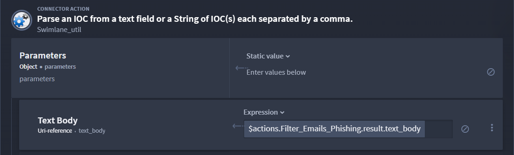

Script Use Case
===============

The Script native action allows you to write python code, increase
productivity, and transform logic. You can use a python native action in
playbooks to manipulate data with no network or filesystem access.

Scenario: Write Python Code to Return Only the Phishing Emails
--------------------------------------------------------------

Owen is an orchestrator who needs to transform data that requires more
complex logic than a basic transformation. His Get Emails action returns
data, which is an array of email objects. Owen wants the text body from
all emails with the subject “Phishing”. He uses the Script native action
to write python code to return only the phishing emails and data that he
needs to identify the IOCs. After he has that information, adds a
vendor-interaction-component (VIC), and publishes the results.

Let's take a look! First, Owen refers to the `Get GMail Emails
List <get-gmail-emails-list-use-case.htm>`__ use case on how to install
and configure the Google Workspace connector. Next, he needs to use the
Swimlane Content to install a VIC for later use in the playbook. He
searches and installs the **Get Enrichment from VirusTotal** VIC from
the Swimlane Content.

**Tip:** Once you install the VIC, verify that the VirusTotal asset has
the URL and API Key correctly entered.

#. From the playbook, add the **Get Emails** gmail action and configure
   with your Microsoft Gmail asset to add credentials, delegate account,
   and userID information.

#. Click the **On Success** action flow and add the **Script** action.

Owen's ready to configure the Script action. He adds Python to filter
the ingested email data to only return emails with **Phishing** in the
subject line.

4. Enter the Python:

   import json # Loads emails from Get Emails action emails =
   json.loads(r'{$:ref: $actions.Get_Emails.result}') phishing_emails =
   [] for email in emails: if email['subject'] = 'Phishing':
   phishing_emails.append(email) # Set action_outputs variable with
   result data. action_outputs = { "phishing_emails": phishing_emails }

5. Click the **On Success** action flow and add the **IOC Parser**
   action.

Owen wants to find the IOCs from the Phishing emails to take next steps.
To do this, he needs to configure the IOC Parser action.

6. From the IOC Parser Inputs, enter
   ``$actions.Filter_Emails_Phishing.result.text_body``.

|image1|

Next, Owen needs to convert the IOC results into an observable array. To
do this, uses a Transform Data action.

7. Click the **On Success** action flow, add the **Transform** action,
   and click **Switch advanced mode**.

8. Enter the JSONata:

Owen can now use the previously installed VIC.

9. Click the **On Success** action flow and add the **Get Enrichment
   from VT** VIC.

To configure the VIC, open the Get Enrichment from VirusTotal playbook,
then:

10. Click the **Search** action. Verify the URL and API key are
    configured in the VT asset.

Now, Owen's ready to finish the playbook with the final action to
publish the aggregated results.

11. Click the **On Success** action flow and add the **Transform Data**
    action.

12. Click **Switch to advanced** and enter:
    ``actions.Enrichment_from_VT.published``

The final step is for Owen to run the playbook.

Conclusion
----------

Owen now has a playbook that will help mitigate threats by ingesting
data, using the Script native action and other Turbine components, to
identify phishing emails.

