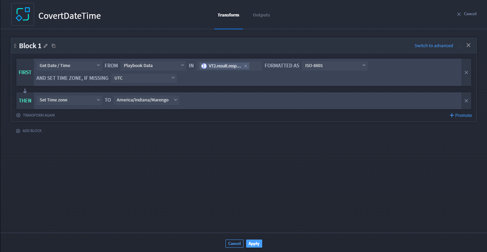
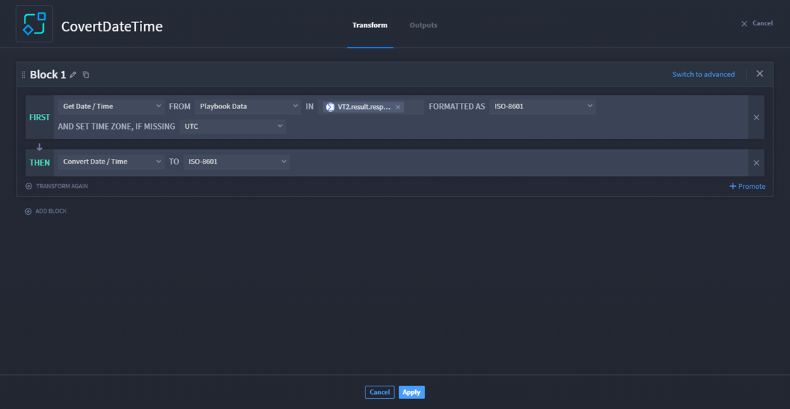
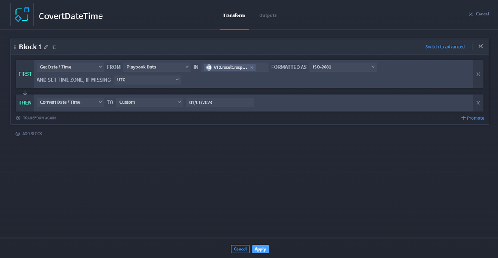

Transform Data Action - Date and Time Use Cases
===============================================

The Turbine Transform Data native action can create a myriad of
transformations. Making changes to date and time in a playbook is often
used, and this page provides use cases for different actions for
transforming date and time using the Transform Data action.

Get Date and Time
-----------------

**Warning!** Using **Get Date/Time** in the THEN row of a block is not
advised. There are very few use cases where this would be needed.

**Tip:** Best practice would be to use the Get Date/Time in the FIRST
row.

However, if you were to configure the FIRST row, click TRANSFORM AGAIN,
and select Get Date/Time, there are new configuration options.

|image1|

Transform Block Options - Get/Date Time
~~~~~~~~~~~~~~~~~~~~~~~~~~~~~~~~~~~~~~~

The Get Date/Time options are:

+-------------------------------+-------------------------------------+
| Drop-Down Menu                | Information                         |
+===============================+=====================================+
| FORMATTED AS                  | The format of the date/time.        |
|                               | **Options:** ISO-8601 (default),    |
|                               | Unix (seconds), Unix                |
|                               | (milliseconds), SQL, Custom         |
+-------------------------------+-------------------------------------+
| AND SET TIME ZONE, IF MISSING | The originating time zone of the    |
|                               | playbook property date/time.        |
|                               | **Options:** UTC or standard time   |
|                               | zone regions                        |
+-------------------------------+-------------------------------------+

Adjust Date and Time
--------------------

Common date and time data transformation methods are supported in
playbooks, which can be run against playbook inputs, in-scope action
output properties, or static values, including to and from:

-  ISO-8601
-  Unix (seconds)
-  Unix (milliseconds)
-  SQL
-  `Custom
   formatting <https://moment.github.io/luxon/#/parsing?id=table-of-tokens>`__

Now that you have configured the FIRST row and clicked TRANSFORM AGAIN,
select Adjust Date/Time. New fields and options are available on the
THEN row.

|image2|

Transform Block Options - Adjust/Date Time
~~~~~~~~~~~~~~~~~~~~~~~~~~~~~~~~~~~~~~~~~~

The Adjust Date/Time options are:

+-------------------------+-------------------------------------------+
| Drop-Down Menu or Field | Information                               |
+=========================+===========================================+
| BY                      | If amount should be added or subtracted.  |
|                         | **Options:** Adding and Subtracting       |
+-------------------------+-------------------------------------------+
| Amount                  | The amount of time that should be added   |
|                         | or subtracted. **Options:** Use the up    |
|                         | and down arrows to enter a number or      |
|                         | manually enter a number                   |
+-------------------------+-------------------------------------------+
| Unit of measure         | The unit of measurement of amount.        |
|                         | **Options:** Milliseconds, Seconds,       |
|                         | Minutes, Hours, Days, Weeks, Months,      |
|                         | Years                                     |
+-------------------------+-------------------------------------------+

 

From the THEN row, you can adjust the time by adding or subtracting a
number of milliseconds, seconds, minutes, hours, days, weeks, months,
and years.

**Note:** You can click **ADD BLOCK** to add more than one get date/time
conversion.

**Warning!** Wait until you have completely configured the entire block
(the FIRST and THEN rows) before adding a new Block to configure.

Let's check out a scenario!

Scenario
^^^^^^^^

After identifying malicious URLs, you want to scan your environment for
any other IOCs that may have been seen 90 days before the first
sighting. With the Transform Data action, you can automate this task to
get a date/time and subtract 90 days.

First, ensure you complete `Basic
Transformations <../../native-actions/basic-transformations/transform-data.htm>`__
instructions, as they are the same regardless of the option selected.

#. On the THEN row, select **Adjust Date/Time**.

#. From the BY drop-down menu, select **Subtracting**.

#. Enter **90** in the amount field.

#. From the unit of measure drop-down menu, select **Days**.

   |image3|

   .. rubric:: Set Time Zone
      :name: set-time-zone

   Now that you have configured the FIRST row and clicked TRANSFORM
   AGAIN, select Set Time zone. New fields and options are available on
   the THEN row.

   |image4|

   .. rubric:: Transform Block Options - Set/Date Time
      :name: transform-block-options---setdate-time

   The Set Date/Time options are:

   +----------------+----------------------------------------------------+
   | Drop-Down Menu | Information                                        |
   +================+====================================================+
   | Time zone      | Converts the timestamp to the specified time zone. |
   |                | Options: UTC or standard time zone regions         |
   +----------------+----------------------------------------------------+

    

   **Note:** You can click **ADD BLOCK** to add more than one date/time
   conversion.

   **Warning!** Wait until you have completely configured the entire
   block (the FIRST and THEN rows) before adding a new Block to
   configure.

   .. rubric:: Scenario
      :name: scenario-1

   Let's walk through an example. After identifying malicious URLs, you
   want to scan your environment for any other IOCs that may be in a
   specific time zone.

   First, ensure you complete `Basic
   Transformations <../../native-actions/basic-transformations/transform-data.htm>`__
   instructions, as they are the same regardless of the option selected.

   #. On the THEN row, select **Set Date/Time**.

   #. From TO drop-down menu, select the desired time zone.

      |image5|

Convert Date and Time
---------------------

Now that you have configured the FIRST row and clicked TRANSFORM AGAIN,
select Convert Date/Time. New fields and options are available on the
THEN row.

|image6|

Transform Block Options - Covert/Date Time
~~~~~~~~~~~~~~~~~~~~~~~~~~~~~~~~~~~~~~~~~~

The Convert Date/Time options are:

+----------------+----------------------------------------------------+
| Drop-Down Menu | Information                                        |
+================+====================================================+
| TO             | The format in which the converted date/time should |
|                | be returned. Default = ISO-8601. **Options:**      |
|                | ISO-8601, Unix (seconds), Unix (milliseconds),     |
|                | SQL, and Custom                                    |
+----------------+----------------------------------------------------+

**Important!** If you select **Custom**, the Output Format String field
shows. Click the **plus** icon to select a playbook property or manually
enter a custom format that follows `luxon table of
tokens <https://moment.github.io/luxon/#/parsing?id=table-of-tokens>`__.
For example: MM/dd/yyyy.

**Note:** You can click **ADD BLOCK** to add more than one date/time
conversion.

**Warning!** Wait until you have completely configured the entire block
(the FIRST and THEN rows) before adding a new Block to configure.

.. _scenario-2:

Scenario
^^^^^^^^

Let's walk through an example. After identifying malicious URLs, you
want to scan your environment for any other IOC's that may have been
seen starting on a particular month, date, and year before the first
sighting. With the Transform Data action, you can automate this task to
get a date/time and enter a custom format.

First, ensure you complete `Basic
Transformations <../../native-actions/basic-transformations/transform-data.htm>`__
instructions, as they are the same regardless of the option selected.

#. On the THEN row, select **Convert Date/Time**.

#. From TO drop-down, select **Custom**.

#. To enter a custom format for this scenario, enter a date in the
   **MM/DD/YYYY** format.

   | |image7|

.. |image1| image:: ../../Resources/Images/transform-row-2-get-date-time.png
.. |image2| image:: ../../Resources/Images/transform-adjust-date-time.png
.. |image3| image:: ../../Resources/Images/transform-adjust-date-time-2.png
.. |image4| image:: ../../Resources/Images/transform-set-date-time.png

