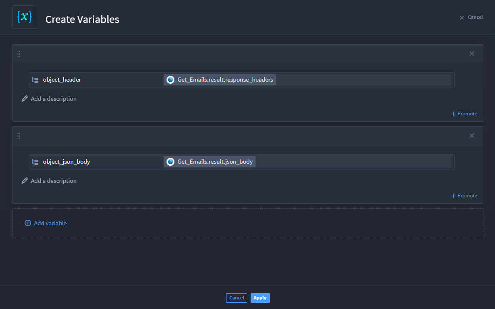

Variables Use Case
==================

Variables support Turbine orchestrators by allowing them to collect
data, store it, and use it in downstream actions. Using the Create
Variables and Update Variables native actions allow orchestrators to
create and/or update variables without writing code, add the variable,
and apply properties from the playbook.

Scenario
--------

Vanessa is an analyst who wants to use the Get Emails action in Turbine
to retrieve email data. Her co-worker Max has also created a playbook to
get email results; however, Max had more time and used JSONata in the
Transform Data native action, under the Advanced Transformation feature,
to get the results he wanted. Vanessa needs a faster, simpler way to get
Microsoft emails to pass downstream into her playbook. Using the Create
Variables native action gives Vanessa the ability to produce the same
outcome but easier and quicker.

Vanessa starts by creating a minutely cron trigger in her playbook. Next
she visits the Swimlane Content to use the **Microsoft GraphAPI Get
Emails** component for the fastest configuration.

#. From the Swimlane Content home page Search bar, enter **Microsoft
   GraphAPI Get Emails**.

   The component opens with an overview. Vanessa clicks the **Install**
   button, and the component begins the import process. A window
   displays with a breakdown of the component's playbooks, connectors,
   and assets. But wait! Vanessa sees that for the component to work,
   she needs to import three connectors first: Microsoft GraphAPI, SOS
   Network Activity Events P1, and JSONata.

#. Click **Install**.

   Vanessa needs to create the **Microsoft Graph API** asset, then add
   the **Get Emails** action.

#. From the Inputs tab, enter your email address.

   From Outputs, Vanessa promotes the entire object result. Now she can
   use the Create Variables native action to fetch specific raw data
   email. She adds an on success action flow.

#. Add the **Create Variables** native action and click **Configure**.

   Vanessa needs to add variables. On this window, she clicks **Add
   variable** and selects a property type. The block forms and she can
   click **Add variable** again, if she wants to have more variables.

   In this case, Vanessa adds an object and titles it **object_header**,
   then clicks the **+** icon to add a playbook property value. Knowing
   she wants to pass along the response headers and the JSON body data
   to be forwarded, she takes the following steps:

#. From the property drawer, select **Response Headers** to pass that
   data from the Get Emails action through the Create Variables native
   action for further use in the playbook.

   If Vanessa wants to use that data outside the playbook, she clicks
   **Promote**.

#. Click **Add variable** and from the property drawer, then select
   **JSON body**.

   |image1|

   She adds an on success action flow and the **Forward Email** action.
   Once she configures the action with the Graph API asset and the
   required fields, Vanessa can apply to save. But wait!

   Vanessa realizes that she needs to change her variables, so she adds
   an on success action flow, then selects the **Update Variables**
   native action.

#. Click **Select variable to update**, then from the property drawer,
   select **object_header**.

   The action window shows a block for Vanessa to change
   **object_header** to a new property type. She clicks the **+** icon
   and from the property drawer selects the **Get Emails** action and
   chooses just the **Date** sub-property value from the Response
   Headers input.

#. Click **Apply** to save the update.

   For her final steps, Vanessa wants to send the results of these data
   to broadcast a message in Slack. She adds the **Broadcast Message**
   action and configures it by adding the Channel name.

Conclusion
----------

Her work is complete! The playbook executes by getting emails and
forwarding the Response Header Dates and JSON body from the retrieved
emails and forwards them to the Slack Channel that she provided. Quick
and easy, Vanessa did not have to spend extra time entering complex JSON
expressions to get the data she needed.

