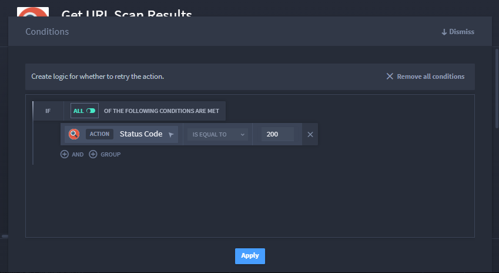
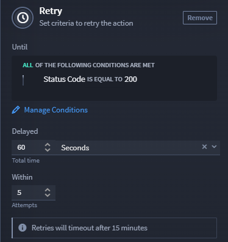

Action Retries
==============

Scenario
--------

Alex works in a Security Operations Center (SOC). She is responsible for
discovering and reporting malicious URLs. She receives a report of URLs
each morning. She looks up each of the URLs, and then uses the resulting
scans to report which URLs are most severe. This takes up most of Alex's
morning each work day.

Alex wants to use Turbine to simplify and automate this process. She has
already ensured that her version of Turbine has downloaded and
configured the Urlscan connector from Swimlane Content and created/saved
a Scan URLs playbook, and reviewed the report to determine which data
she wants to use to feed her Swimlane application(s) and playbook.

Alex can resolve this scenario with the following solution:

#. Build an application that includes data fields and a playbook button
   that serves as a record action trigger.
   |image1|

Alex created the **Scanning URLs** application with the following data
fields: **URL**, **Date & Time**, and **Description**, and added the
**Playbook Button** to link her **Scan URLs** playbook that she already
created.

With the application complete, Alex can return to the **Scan URLs**
playbook to configure her data.

2. Add the **Submit** connector that will submit URLs for analysis.

Alex is ready to configure the connector by adding the URLscan asset,
which she preconfigured with the needed URL and API Key data.

#. | Click the plus icon for **Select from available assets** and add
     **URLscan**.
   | |image2|

Alex promotes the **Result** in Outputs. Now, she is ready to get the
results.

|image3|

#. | Click **On success** action flow and add the **Get Results**
     connector.

Alex is ready to configure the action retry parameters. This ensures the
action retries until the parameter criteria is met.

#. Click **Configure** for the **Get Result** connector, and then set up
   the parameters under **Retry**. You will see default seconds and
   retry attempts; however, you will need to set the conditions.

   |image4|

Alex clicks **Manage Conditions** and creates the first condition by
selecting **Status Code** from the available playbook properties. Then,
sets the status code to **200** and clicks **Apply**.

|image5|

#. Next, enter the desired seconds and retry attempts that you want.

   Alex wants to retry this action for 60 seconds or 5 attempts until
   the status code is equal to 200.

   **Important!** Retries will timeout after 15 minutes.

|image6|

Alex applies the parameters and returns to the playbook. She confirms
the retry is set by seeing the Retry icon around the action. To verify
the playbook, action, and retry parameters are correct, she tests the
playbook.

|image7|

Conclusion
----------

Alex now starts her day knowing that she has automated searching and
reporting malicious URLs.

.. |image1| image:: ../../Resources/Images/scan-url-application.png
.. |image2| image:: ../../Resources/Images/scan-url-connector-config.png
.. |image3| image:: ../../Resources/Images/url-scan-promote-result.png
.. |image4| image:: ../../Resources/Images/url-scan-get-result-retry.png

.. |image7| image:: ../../Resources/Images/url-scan-confirm-retry.png
