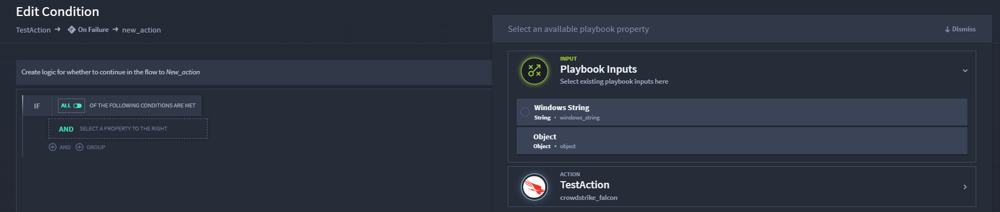
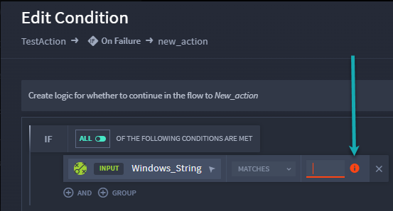

Configure Inputs in Condition Expressions
=========================================

Turbine allows users to configure conditions between two actions by
utilizing playbook inputs and/or action outputs.

Scenario
--------

Alex wants to configure a conditional expression using playbook property
inputs. Alex already has created a playbook and selected an action. She
can now configure the action input by adding a condition.

#. To add a condition, from an action, click the **Add condition** icon.

Once Alex clicks the action flow, it turns blue and the FLOW panel
displays to the right.

The Edit Condition window opens.

#. | Click **CREATE YOUR FIRST CONDITION**.
   | |image1|

| The available action/playbook properties display.
| |image2|

3. Select the desired input.

| Complete any remaining fields/data for the expression. Any required
  fields left blank, display in red information icon.
| |image3|

4. Enter a value.
   |image4|

**Tip:** Should you want to change a selected property, simply click
property to open the playbook property panel. To delete a condition,
click the **X** on the condition line. To leave the condition builder,
click **Close** at the bottom or top of the **Edit Condition** window.

5. Click **AND** or **GROUP** or **APPLY** to further configure the
   condition expression.

6. Click **Apply** to save changes.

**Note:** You can only add and configure one condition at a time.

**Tip:** To configure an **On Failure** or **On Complete** action flow,
start from the **Action Flow Condition Control**, and click the **On
Failure** or **On Complete** action. Follow the steps above.

Conclusion
----------

Alex has completed configuring his playbook inputs on a condition
between two actions!

.. |image1| image:: ../../Resources/Images/create-your-first-condition.png

.. |image4| image:: ../../Resources/Images/playbook-input-condition-field.png
