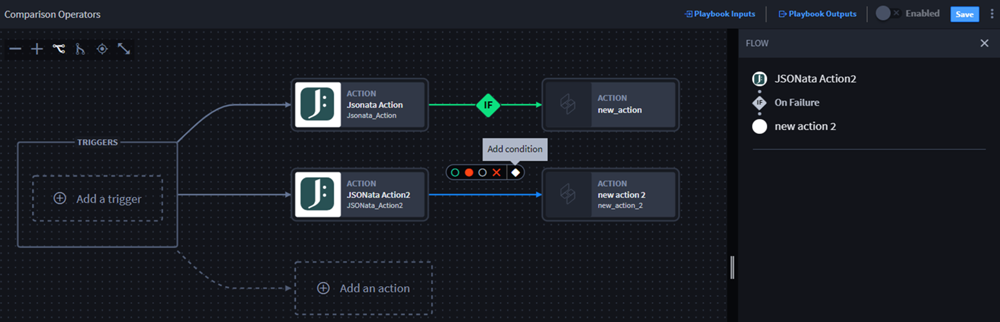
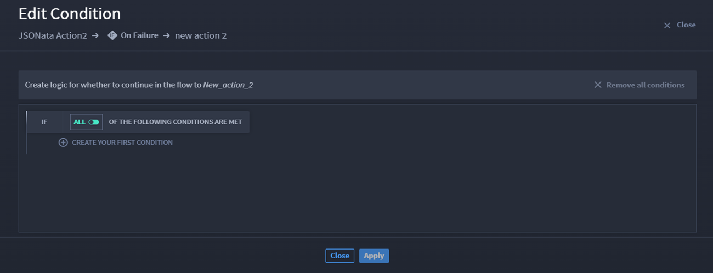
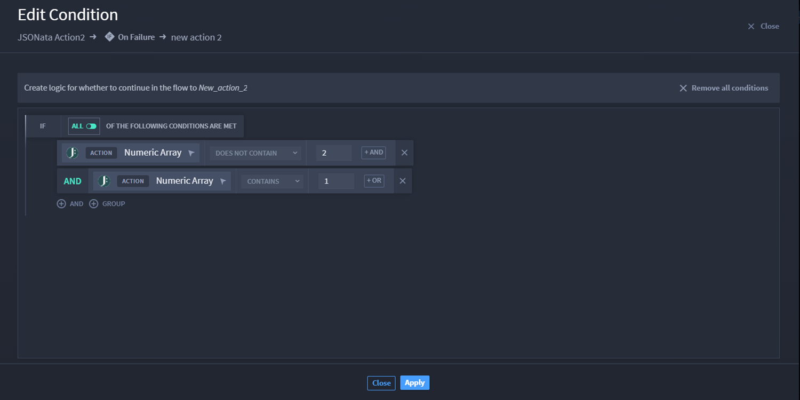

Configure Numeric Array Condition Expressions
=============================================

Turbine allows users to configure conditions between two actions by
utilizing playbook inputs and/or action outputs.

Scenario
--------

Alex wants to configure a numeric array in a conditional expression
using the output of a JSONata action. Alex is ready to begin. She starts
by adding and configuring a JSONata connector with an **On Success**
action flow, and now she wants to add a numeric array conditional
expression.

#. To add a condition, click the **Add condition** icon.

   **Note:** Once you click the action flow, it turns blue and the FLOW
   panel displays to the right.

   | 
   | |image1|

   The Edit Condition window opens.

#. | Click **CREATE YOUR FIRST CONDITION**.
   | |image2|

The available action/playbook properties displays. Click the property to
expand the available input types.

#. Click the **Numeric Array** property.

4. Select the comparison operator from the drop-down menu.

5. | After the operator drop-down, enter a value.
   | |image3|

#. Click **Apply**.

| The window closes and the FLOW action panel shows.
| |image4|

| To add more conditions, click **Edit Configuration** to launch the
  Edit Condition window. You can always use the **OR**, **AND**, or
  **GROUP** buttons to further modify the condition flow.
| |image5|

Conclusion
----------

Alex has created a numeric array conditional expression!

.. |image3| image:: ../../Resources/Images/numeric-array-add-condition.png

