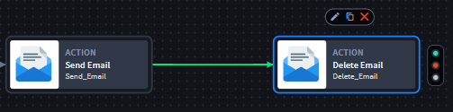

Configure On Success Action Flow
================================

Turbine allows users to configure conditions between two actions by
applying playbook/action inputs.

Scenario
--------

Alex wants to create an On Success action flow between two actions.

**Important!** From the **Action Flow Condition Control**, you must have
clicked the **On Success** action flow.

|image1|

An **On Success** action flow displays.

|image2|

Now, you can configure the condition expression.

#. Click the **On Success** action flow to display the **Action Flow
   Condition Control**.

   **Note:** The filled-in circle indicates the *current* type of action
   flow. In the example above, the condition builder reflects an On
   Success action flow type.

Conclusion
----------

Alex has started her On Success action flow. She's ready to configure
the condition expression.

To add and configure a condition expression, Alex refers to `Configure
Inputs in Condition Expressions use
case <configure-inputs-in-condition-expressions.htm>`__.

.. |image1| image:: ../../Resources/Images/add-on-success-action-flow.png

