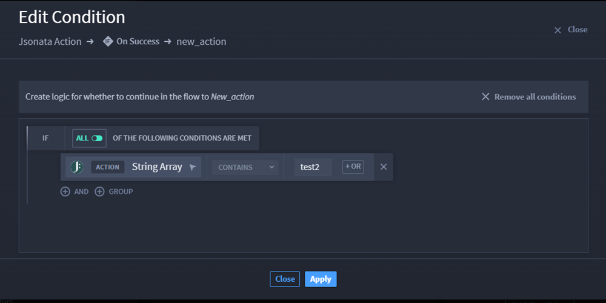

Configure String Array Condition Expressions
============================================

Turbine allows users to configure conditions between two actions by
utilizing playbook inputs and/or action outputs.

Scenario
--------

Alex wants to configure a string array in a conditional expression using
the output of a JSONata action. Alex is ready to begin. He starts by
adding and configuring a JSONata connector with an **On Success** action
flow, and now he wants to add a string array conditional expression.

#. To add a condition, click the **Add condition** icon.

#. | Click **CREATE YOUR FIRST CONDITION**.
   | |image1|

The available action/playbook properties displays. Click the property to
expand the available input types.

3. Click **String Array** property.

4. Select the comparison operator from the drop-down menu.

5. | After the operator drop-down, enter a value.
   | |image2|

6. Click **Apply**.

Conclusion
----------

Alex has created a string array conditional expression!

.. |image1| image:: ../../Resources/Images/create-your-first-condition.png

