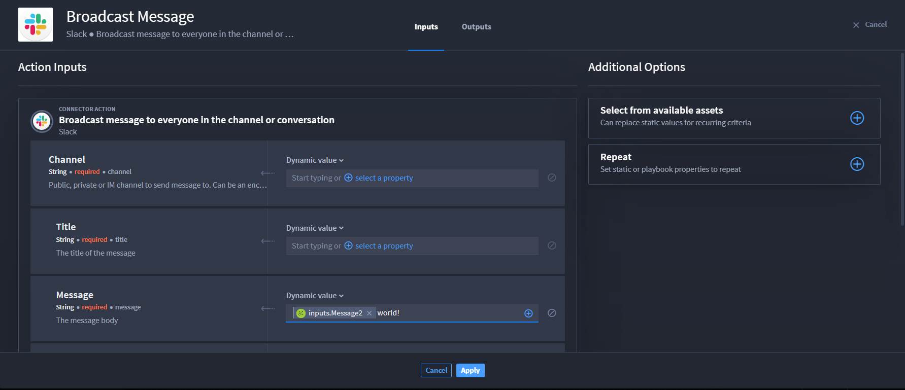
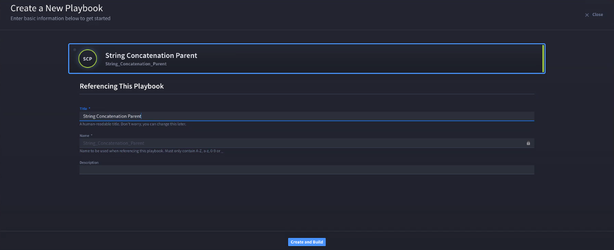
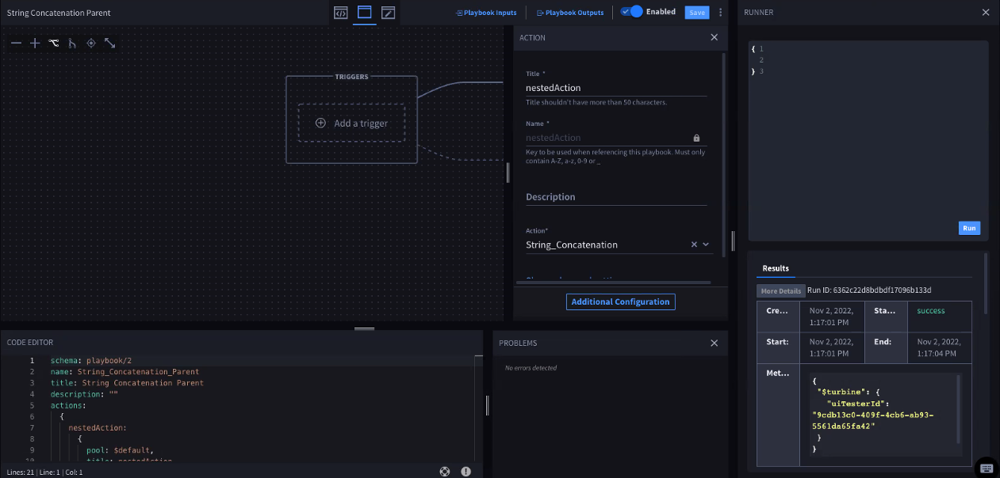

String Concatenation
====================

Scenario
--------

Max is a Turbine orchestrator. He needs to automate a message to users.
However, Max already knows he needs the ability to add context to a
playbook input property. Therefore, the property will need to be
dynamic, not static.

Max wants to use Turbine parent and nested playbooks to create the
automated message that has an action containing a string concatenation
to broadcast a message to Slack. He already has integrated the slack
connector into his playbook, now let's watch how he does automates a
message using string concatenation!

Max is configuring the Slack connector and will create the playbook
input from the action.

#. From Action Inputs, in the **Message** property field, click **+
   select a property**.
   |image1|

#. Click **Playbook Inputs**.

   **Note:** If Max has added playbook inputs, the inputs display. Then,
   Max can select an existing input.

   **Warning:** If Max has not added any playbook inputs yet, he will
   need to click **Add a playbook input**.

To configure a playbook input from the Action Input window, Max enters
the title: **Message3
**

#. Click **Done**, then select the configured playbook input.

| The input displays as a token in the Message field.
| |image2|

#. Next to the token, enter text, i.e., **world!**

| The token and static value text display as string concatenation.
| |image3|

#. Click **Apply**.

Max already has the playbook with the configured string concatenation.
Now he wants to create a parent playbook that will execute that nested
playbook and broadcast the message to Slack.

#. Create a new playbook.

   For this scenario, Max calls the parent playbook **String
   Concatenation Parent**.

   | 
   | |image4|\ Once he creates the playbook, he adds an action.

#. | From the Action drop-down, select the **String Concatenation**
     playbook and title it **nestedAction**.
   | |image5|\ Max clicks **Configure**. The playbook input from
     **nestedAction** displays.

#. | In the **Static value** field, enter **Hello**.
   | |image6|

#. Click **Apply**.

   This combines the static value text, **Hello**, with the
   nestedAction's message token **world!** that broadcasts to Slack.

..

   Now, Max wants to confirm that the he can execute the playbook and
   receive the broadcast in Slack.

#. From **String Concatenation Parent**, click the vertical ellipsis
   icon.

#. Click **Test**.

#. | From RUNNER, click **Run**.
   | |image7|

   Max's test is successful!

..

   Now, he goes to Slack to verify the broadcast was received.

#. Navigate to Slack.

| The message **Hello world!** displays! Max successfully ran the string
  concatenation.
| |image8|

Conclusion
----------

Max can now use this knowledge to apply concatenation for string
property types without formats in the future.

.. |image1| image:: ../../Resources/Images/broadcast-message-input.png
.. |image2| image:: ../../Resources/Images/concatenate-token.png

.. |image5| image:: ../../Resources/Images/sc-use-case-2.png
.. |image6| image:: ../../Resources/Images/sc-use-case-3.png

.. |image8| image:: ../../Resources/Images/sc-use-case-5.png
