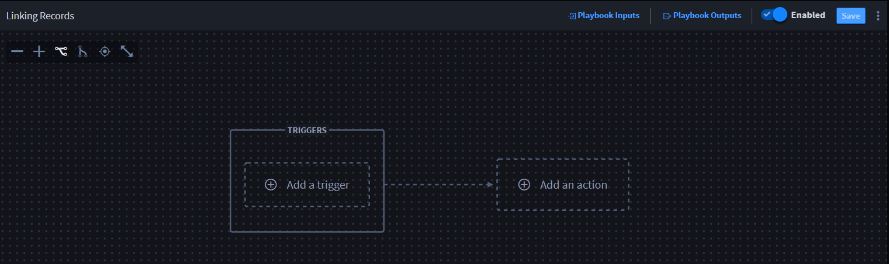
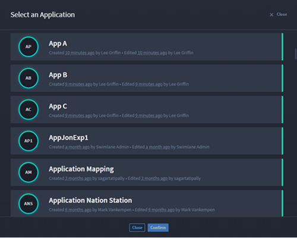
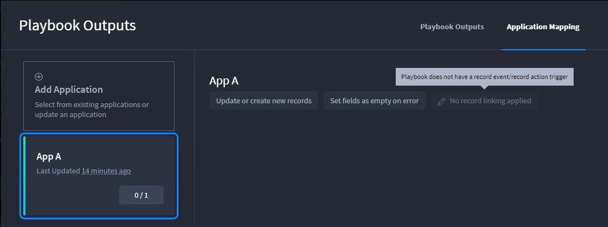
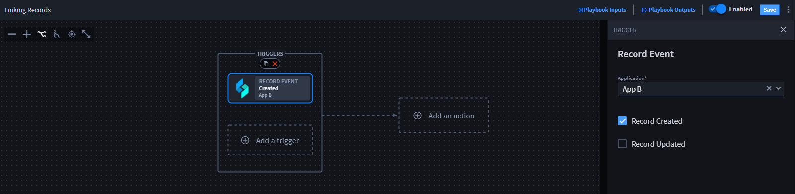
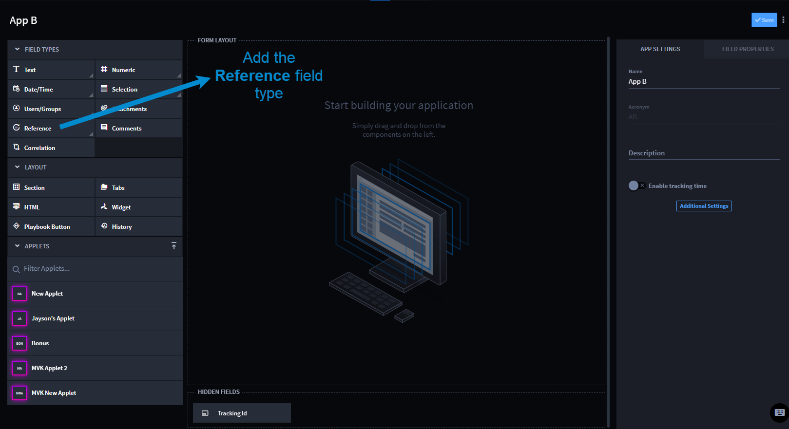

No Record Linking Applied Button Disabled Use Cases
===================================================

Scenarios
---------

Max is a Turbine orchestrator (Level 2 or 3) and wants his playbook to
parse URL output results from the VirusTotal connector to a record
Incident application. He wants to use Turbine's application record
integration to link records through playbook outputs.

For this use case, there are two issues that could keep Max from
successfully linking records. Let's see what happens when Max runs
across both issues when the **No record linking applied** button is
disabled and how to resolve them before successfully linking records.

First, he creates a playbook and names it **Linking Records**.

**Note:** This playbook name is for the sake of the use case example.
You can name the playbook according to whatever outcome/action you are
trying to create.

|image1|

Use Case 1
~~~~~~~~~~

   **Issue:** The **No record linking applied** button is disabled

..

   **Cause:** There is no record event/record action trigger

Max has created the Linking Records playbook and is now ready to link
App A to the playbook via playbook outputs.

#. In the Linking Records playbook, click **Playbook Outputs**.

#. On Playbook Outputs, click the **Application Mapping** tab.

   If Max has not promoted any playbook outputs, he sees the **There are
   no mappings yet** message.

#. To map the promoted playbook outputs to an application, click
   **Select Existing Application**.

#. | On Select an Application, click the application to which you want
     to map the playbook outputs, and then click **Confirm**.
   | |image2|

| From Playbook Outputs, the **No record linking applied** button is
  *disabled*.
| |image3|

5. Hover over the **No record linking applied** button.

   | Max sees the **Playbook does not have a record event/record action
     trigger** tooltip.
   | |image4|

Oh no! Max needs to resolve this issue by enabling record linking. To do
this, he closes the window and returns to the playbook to a record event
trigger.

#. From the **Application** drop-down, select the application whose
   records should trigger the playbook (App B in this example) and to
   which created/updated records in the mapped application(s) (only App
   A in this example) should be linked.
   |image5|

**Important** The selected application must already have a **Reference**
field type. In this example, Max selects App B, which already has a
reference field that is mapped to App A.

#. Click **Playbook Outputs**.

#. On Playbook Outputs, click the **Application Mapping** tab.

Because Max has added the record event trigger, he now has the ability
to select which application to map to the promoted playbook outputs.

#. To map the promoted playbook outputs to an application, click
   **Select Existing Application**.

#. On Select an Application, click the application to which you want to
   map the playbook outputs, and then click **Confirm**.

| Max selects App A.
| |image6|

From Playbook Outputs, the **No record linking applied button** is
*enabled*.

Conclusion
----------

Max successfully enabled the record linking button. Now, he needs to
link the records. To do this, he navigates to `Linking Records use
case <linking-records.htm>`__.

Use Case 2
~~~~~~~~~~

   **Issue:** The **No recording linking applied** is disabled

..

   **Cause:** The triggering application does not have a reference field
   for the application to which the playbook outputs are being mapped

Max created the Linking Records playbook. Ready to link App A to the
playbook via playbook outputs. He's verified that he already has a
record event trigger. He's already mapped App A to the playbook outputs,
just like Use Case 1. However, the **No record linking applied** button
is still disabled.

Let's see why and how to resolve it!

| Max selects App A.
| |image7|

From Playbook Outputs, the **No record linking applied** button is
*disabled*.

#. Hover over the **No record linking applied** button.

| Max sees the **No applications exist that have reference fields linked
  to the App A application** tooltip.
| |image8|

In this scenario, App B has a reference field; however, it does not
reference App A. Therefore, Max cannot link the records in application
mapping. Oh no! Max needs enable record linking by updating the
reference fields in the selected application.

#. Navigate to **APPLICATIONS & APPLETS**

#. Open **App B**.

| Max notices that the FORM LAYOUT section does not contain a Reference
  field type.
| |image9|

#. Click and drag the **Reference** field type to the FORM LAYOUT
   section.

#. Add a name.

#. | In the **Reference Application** drop-down, select **App A**.
   | |image10|

Now App B has a reference field type and is mapped to App A.

Max navigates back to the playbook.

7. On Playbook Outputs, click the **Application Mapping** tab.

If Max has not promoted any playbook outputs, he sees the **There are no
mappings yet** message.

8. To map the promoted playbook outputs to an application, click
   **Select Existing Application**.

9. On Select an Application, click the application to which you want to
   map the playbook outputs and then click **Confirm**.

| Max selects App A.
| |image11|

From Playbook Outputs, the **No record linking applied** button is now
*enabled*.

.. _conclusion-1:

Conclusion
----------

Max successfully enabled the record linking button. Now, he needs to
link the records. To do this, he navigates to `Linking Records use
case <linking-records.htm>`__.

.. |image8| image:: ../../Resources/Images/no-reference-fields-to-link.png

.. |image10| image:: ../../Resources/Images/add-name-add-ref-app-a.png

