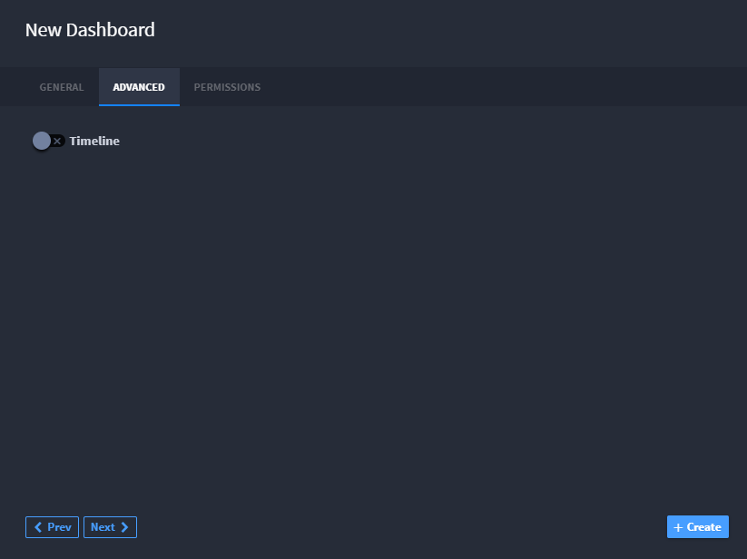

Creating a New User Dashboard
=============================

To create a new dashboard:

#. From the Dashboard taskbar menu, select **New**.
   |image1|
   Alternatively, you can create new dashboards from within **WORKSPACE
   MANAGEMENT** from the global navigation menu.
   |image2|

2. On **New Dashboard**, enter the name, description and associated
   workspaces. The current workspace is selected by default.
   |image3|

3. Click the ADVANCED tab. To indicate whether you want the dashboard to
   record a timeline, enable or disable the timeline switch.
   |image4|

4. Click the PERMISSIONS tab. Specify whether the dashboard is a
   personal dashboard, or to specify other role-based permissions.
   |image5|

.. |image1| image:: ../Resources/Images/edit_delete_dashboards.png
.. |image2| image:: ../Resources/Images/create-dashboard-menu.png
.. |image3| image:: ../Resources/Images/new-dashboard.png

.. |image5| image:: ../Resources/Images/personal-dashboard.png
