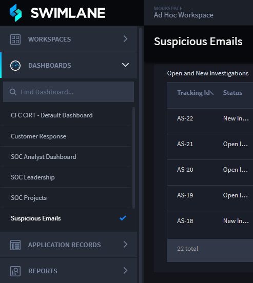

Navigate Workspaces and Dashboards
==================================

Navigate between workspaces to find their associated dashboards and
applications. Hover over the workspace icon, then select the workspace
you need. A checkmark is displayed next to the current workspace. You
can also search for your workspace from this menu.

Once you load a workspace, from the global navigation menu, select the
DASHBOARD icon. Swimlane Turbine lists the dashboards available to you.
A checkmark indicates the dashboard that you are currently viewing.

|image1|

**Note:** Users can only access the workspaces, dashboards, and cards
that they have permissions to view or work with.

You can also edit, delete, share, and create new workspaces and
dashboards from the Dashboard taskbar menu.

|image2|

.. |image2| image:: ../Resources/Images/dash-work-edit-menu.png
