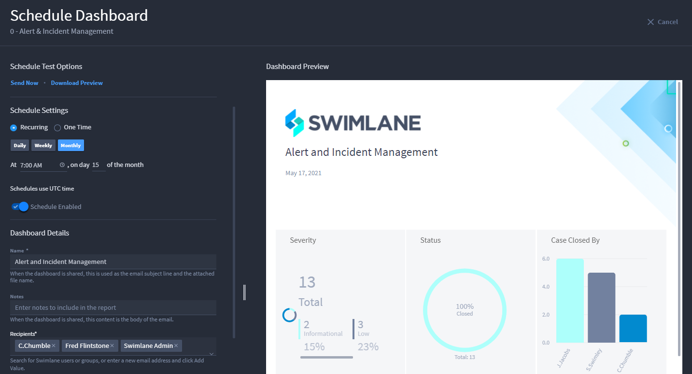
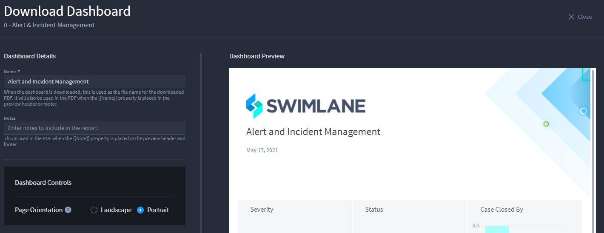

Share Dashboards
================

A dashboard report can be shared by scheduling an email to be sent,
sending an email now, or downloading a PDF of the dashboard report. To
find these sharing options, while in the dashboard, click the ellipsis
on the dashboard header and select **Schedule**, **Email**, or
**Download** under Sharing Options.

|image1|

**Note:** After you have saved your first scheduled dashboard report,
the **New** icon next to Schedule will disappear.

Schedule Dashboard
------------------

Schedule Dashboard allows you to schedule when an email of a dashboard
report is sent to recipients. In addition to scheduling the email, you
can choose to send the email now as well as later and choose to download
a preview of the dashboard report.

#. Once in **Schedule Dashboard**, under **Schedule Settings**, select
   either **Recurring** or **One Time** for the frequency of dashboard
   reports being sent. For **Recurring**, select how often you would
   like the dashboard report to send. This can be scheduled daily,
   weekly, or monthly at a specified time. For **One Time**, select the
   day and time you would like the schedule to send.

#. Click the toggle button next to **Schedule Disabled** to enable the
   schedule. If the schedule is not enabled, it will not send.

#. Under **Dashboard Details**, under **Name**, type a name for your
   dashboard report. This name is visible in the Dashboard Preview once
   you click out of the **Name** text box.

#. Under **Notes**, type notes you would like to include on the
   dashboard report. These notes are visible in the Dashboard Preview
   once you click out of the **Notes** text box.

#. | Under **Recipients**, search for and select the name of the Turbine
     users or groups you would like to add or enter an email address and
     then select **Add Value**.
   | |image2|
   | **Note:** The Name and Recipients fields are required to send a
     dashboard report.

6. Under **Dashboard Controls**, you can chose to include a link to the
   dashboard report in Turbine and select the page orientation.

7. | Under **Available Dashboard Report Cards**, you can select the
     dashboard cards you would like displayed on the dashboard.
   | |image3|

**Note:** **Unavailable Widget Cards** appears if there is a dashboard
card containing a widget. This lets you know that the card will not be
including the dashboard report since widgets are not supported in a
shared dashboard report.

|image4|

8. In the **Dashboard Preview**, you can rearrange the cards displayed
   by dragging and dropping the cards where you would like them to be
   placed. You can also resize a card by clicking and dragging the edge
   of the card to the desired size.

9. Click the drop-down arrow next to **Header and Footer Formatting**.
   This is where you format the header and footer for your dashboard
   report.

10. Once you have finished editing the dashboard report, click **Save
    Schedule**. A dialog box appears confirming the email has been
    scheduled. Once the schedule is saved, click **Close** to exit.
    |image5|
    To view all scheduled dashboard reports, click the ellipsis on the
    dashboard header and select **Settings and Schedules**.
    Additionally, any dashboard reports that have all enabled schedules
    will show a blue clock to the right of the dashboard report name
    under **DASHBOARDS** and any dashboard report that has a disabled
    schedule will show a grey clock.
    |image6|\ |image7|

Email Dashboard
---------------

Email Dashboard allows you to email a dashboard report to recipients.
Unlike Schedule Dashboard, the emails sent in Email Dashboard are sent
automatically and cannot be scheduled to send multiple times or at a
later time.

#. Once in **Email Dashboard**, under **Name**, type a name for the
   dashboard report. This name is visible in the Dashboard Preview once
   you click out of the **Name** text box.

#. Under **Notes**, type notes you would like to include in the
   dashboard report. These notes are visible in the Dashboard Preview
   once you click out of the **Notes** text box.

#. Under **Recipients**, search for and select the name of the Turbine
   users or groups you would like to add or enter an email address and
   then select **Add Value**.

4. Under **Dashboard Controls**, you can chose to include a link to the
   dashboard in Turbine and select the page orientation.

5. Under **Available Dashboard Report Cards**, you can select the
   dashboard cards you would like displayed on the dashboard.

6. In the **Dashboard Preview**, you can rearrange the cards displayed
   by dragging and dropping the cards where you would like them to be
   placed. You can also resize a card by clicking and dragging the edge
   of the card to the desired size.

7. Click the drop-down arrow next to **Header and Footer Formatting**.
   This is where you format the header and footer for your dashboard
   report.

8. Once you have finished editing your dashboard, click **Send Now**. A
   dialog appears confirming the email will be sent momentarily. Once
   the dashboard is sent, click **Close** to exit.

Download Dashboard
------------------

Download Dashboard allows you to download the dashboard PDF.

#. Once in **Download Dashboard**, under **Name**, type a name the
   dashboard report. This name is visible in the Dashboard Preview once
   you click out of the **Name** text box.

2. Under **Notes**, type notes you would like to include in the
   dashboard report. These notes are visible in the Dashboard Preview
   once you click out of the **Notes** text box.

3. | Under **Dashboard Controls**, you can select the page orientation
     of the dashboard report.
   | |image8|

4. Under **Available Dashboard Report Cards**, you can select the
   dashboard cards you would like displayed on the dashboard.

5. In the **Dashboard Preview**, you can rearrange the cards displayed
   by dragging and dropping the cards where you would like them to be
   placed. You can also resize a card by clicking and dragging the edge
   of the card to the desired size.

6. | Click the drop-down arrow next to **Header and Footer Formatting**.
     This is where you format the header and footer for your dashboard
     report.
   | |image9|

7. Once you have finished editing your dashboard, click **Download**. A
   green check appears on the **Download** button once your dashboard is
   downloaded. Click **Close** to exit.

.. |image1| image:: ../Resources/Images/edit_delete_dashboards.png

.. |image3| image:: ../Resources/Images/schedule-dashboard-available-report-cards.png
.. |image4| image:: ../Resources/Images/schedule-dashboard-widget-card-unavailable.png
.. |image5| image:: ../Resources/Images/schedule-dashboard-header-footer.png
.. |image6| image:: ../Resources/Images/enabled-dashboards.png
.. |image7| image:: ../Resources/Images/disabled-dashboards.png

.. |image9| image:: ../Resources/Images/download-dashboard-header-footer.png
