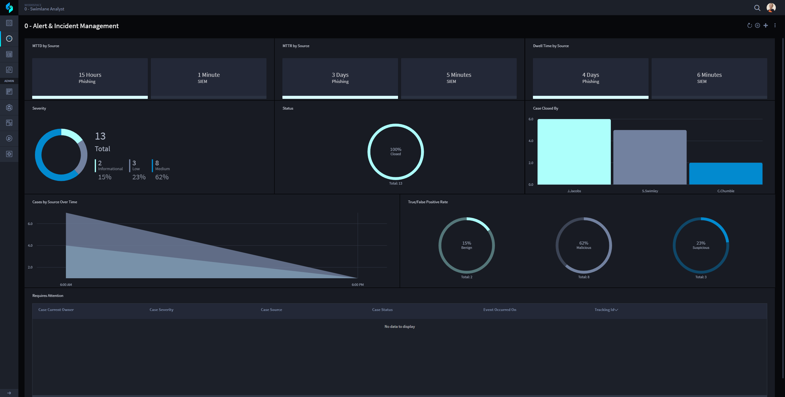

.. _workspaces-and-dashboards:

Workspaces Management
=====================

You can manage Swimlane Turbine Workspaces, Dashboards, and Reports from
**WORKSPACE MANAGEMENT**..

Workspaces
----------

Workspaces are customizable areas within the Turbine platform where you
can organize and access the Turbine tools and features that you use on a
regular basis. Workspaces can include applications, dashboards, records,
reports, and charts. Administrators can change the default workspace and
dashboards for users. All users can switch to different workspaces and
dashboards according to the permissions that they have set.

|image1|

Dashboards
----------

Dashboards are a visual display of records, reports, and charts
associated with the applications in the workspace. A workspace can have
multiple dashboards, and users can view different dashboards by
selecting the DASHBOARD or WORKSPACE navigation menu icon and choosing
another dashboard from the list. Users only have access to see
workspaces, dashboards, records, and reports if they are given access by
an administrator. If an existing dashboard or report is not visible, an
administrator should check that the user has been assigned proper
permissions.

|image2|

.. _cards:

Reports
-------

Reports are collections of records collected from a Swimlane Turbine
application. These reports can be customized through keyword searching
and filtering and then saved to show the selected information. These
saved reports can also be shared with other users. The topics in this
section provide information on how to create, filter, and share reports
within Turbine. For more information, see
`Reports <../reports/reports.htm>`__.

.. |image2| image:: ../Resources/Images/dashboards_workspace.png

.. toctree::
   :titlesonly:
   :caption: Children:

   /Content/workspaces-and-dashboards/navigate-workspaces-and-dashboards
