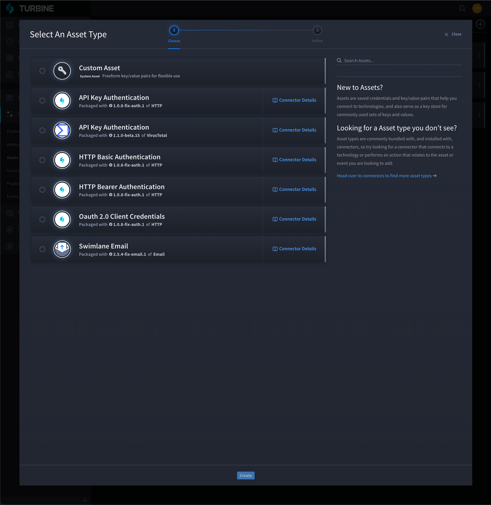

Create Custom Assets
====================

Creating custom assets allows you to map static data and
product-specific values that can be referenced across multiple playbooks
and multiple actions.

To create assets:

#. On ORCHESTRATION, click **Assets**.

2. Click the plus icon to add and/or configure an asset.

3. | On Select An Asset Type, click the radio button next to the
     **Custom Asset** connector.
   | |image1|

4. On Edit Asset, update the required fields with custom data: **Title**
   and **Name**.

5. Click **Add a property** to add asset inputs.

#. From Action Inputs, click the **Available assets** drop-down menu to
   view all available assets.

#. Select the custom asset.

#. To apply a custom asset to the playbook, click the **Asset property**
   drop-down menu and select the custom asset.

4. Click **Save**.

