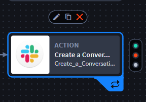
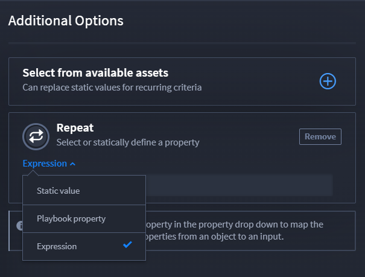
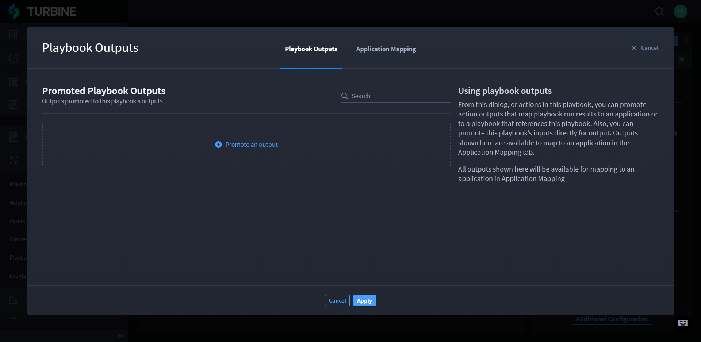

Action Repeats
==============

Playbooks allow you to repeat actions. Arrays are the only repeatable
property types.

Add Repeats to an Action
------------------------

Repeat actions can be static, or dynamic. Dynamic actions are reserved
for string inputs, however!

To add a repeat to an action:

#. Add an action.

#. From ACTION, click **Configure**.

From here, decide which fields you need to complete.

3. If you want to repeat a static value, click the **Repeat** plus icon.
   |image1|

4. Click the drop-down menu and select *Static value*.
   |image2|

5. Click **Configure Static Values**.

6. Click **Add an item** to add an item to your array and select the
   value type.

7. | Once you have selected and entered any values, click **Apply**.
   | |image3|

| The action will repeat as many times as items on the array.
| |image4|

Dynamic Value Repeats
---------------------

Dynamic values contain string inputs only. You cannot repeat a dynamic
value.

Playbook Property Repeats
-------------------------

To add a playbook property repeat to an action:

#. Add an action.

#. From ACTION, click **Configure**.

The available mapped playbook inputs show under **Action Inputs**. From
here, decide which fields you need to complete.

3. If you want to repeat a playbook property, click the **Repeat** plus
   icon.
   |image5|

4. Click the drop-down menu and select *Playbook property*.
   |image6|

5. You can only select playbook inputs that are the array property type.
   |image7|

The input displays in the Repeat section.

| Now, from the inputs, select a property that has a **Static value**
  drop-down menu. Then, select **Repeat property**.

6. Enter the required fields and click **Apply**.

| The repeat shows in the playbook action.
| |image8|

Expression Repeats
------------------

To add an expression repeat to an action:

#. Add an action.

#. From ACTION, click **Configure**.

   From here, decide which fields you need to complete.

3. If you want to repeat an expression, click the **Repeat** plus icon.
   |image9|

4. Click the drop-down menu and select *Expression*.
   |image10|

5. Enter an expression using JavaScript notation.
   |image11|

6. From the action, click **Apply**.

Repeat Outputs
--------------

Repeats only provide output results for a single action. By using action
repeats, you can retrieve aggregated output results over a list of
values, configure repeats that have a list of values in nested
playbooks, and better troubleshoot by reviewing an action through the
playbook run results.

**Note:** Arrays are the only repeatable property types.

Before promoting any action repeat outputs, ensure that you:

#. Add an action.

#. Add one of the following repeat types: static value, playbook
   property repeats, expression repeats.

#. Navigate to **Playbook Outputs**.

#. | Click **Promote an output**.
   | |image12|

5. From Select an available playbook property, click the desired repeat
   action.
   |image13|

The repeat action displays.

#. Select the repeat.

| The repeat is promoted.
| |image14|

.. |image1| image:: ../../Resources/Images/repeats-plus-icon.png
.. |image2| image:: ../../Resources/Images/repeats-static-value.png
.. |image3| image:: ../../Resources/Images/repeats-configure-static-value.png
.. |image4| image:: ../../Resources/Images/repeats-completed-static-value.png
.. |image5| image:: ../../Resources/Images/repeats-plus-icon.png
.. |image6| image:: ../../Resources/Images/repeats-playbook-property.png
.. |image7| image:: ../../Resources/Images/repeats-pb-array-inputs.png

.. |image9| image:: ../../Resources/Images/repeats-plus-icon.png

.. |image11| image:: ../../Resources/Images/repeats-completed-expression.png

.. |image13| image:: ../../Resources/Images/select-playbook-property.png
.. |image14| image:: ../../Resources/Images/promoted-repeat.png
