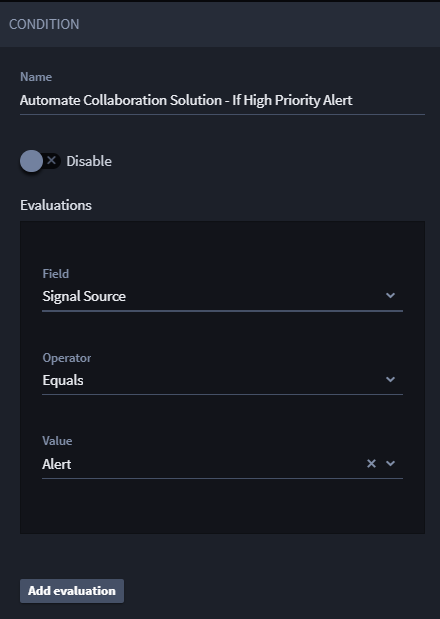
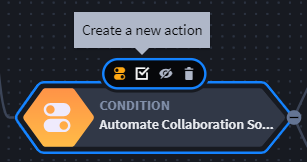
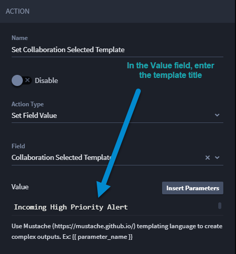
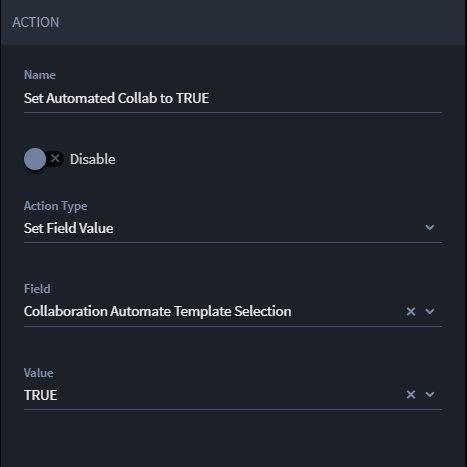

Install and Configure Collaboration Solution
============================================

**Important!** The Collaboration Solution integrates and works well with
the Turbine SOC Solution and the Case and Incident Management (CIM)
application. This user guide uses the SOC Solution and CIM application
in examples to instruct how to utilize the Collaboration Solution.

**Tip**: To best understand the documentation and examples, you can
install and configure the SOC Solution and the CIM application. For
assistance in SOC Solution Installation and Setup, contact your Swimlane
professional services point of contact.

The Collaboration Solution is a collection of bundled components to
create context-aware messages from predefined templates to send to
external messaging systems, such as email, Slack, and/or Microsoft Teams
for processing by Swimlane, or non-Swimlane, users. For an additional
information, navigate to `Collaboration
Solution <collaboration-solution.rst>`__.

Start by installing the solution.

Go to Swimlane Content
======================

Navigate to the Turbine Content. Follow these steps:

#. Log in to **Turbine**.

#. In the navigation pane, click **LIBRARY**.

#. Select the desired tenant.

#. In the navigation pane, click **Swimlane Content**.

The content home page opens.

Install
-------

Now, you can install the Collaboration Solution:

#. From the content, under **Solutions**, click **Collaboration
   Solution**.

#. Click **Install** on the right-bottom of the solution.

The Collaboration Solution details open.

-  The **Overview** tab shows each individual solution that composes the
   Collaboration Solution and their capabilities.

-  The **Content** tab shows how many and which workspaces,
   applications, dashboards, and/or reports are included in the
   Collaboration Solution.

-  The **Documentation** tab has a link to the Collaboration Solution
   topic in this user guide.

#. On the right-hand side of the window, click **+Install** again.

#. From the Install Collaboration Solution window, choose which content
   you’d like to install.

**Note**: All content is pre-selected as a default. Click check marks to
deselect any content.

 

| **Warning!** You may see the following warning, if content already
  exists in your environment.
| |image1|
| You can avoid overwriting content by deselecting the items you do not
  wish to overwrite, and it will still work. But if you deselect too
  many items that are not being overwritten, you will not import the
  full solution.

#. If prompted to overwrite existing content, click and hold the mouse
   icon until the circle is complete and the dialog box disappears.

|image2|

You will see **Importing**\ …

If there are no issues, the Import Success window opens. You can import
successfully and still have potential issues. If that's the case, the
**Review Potential Issues** window opens. Review the potential issues
by:

#. Clicking **Import More** to import more SSPs;

-OR-

#. Clicking **Go to Application** to address issues, if the issues are
   in your application. If the issues are with assets or playbooks,
   navigate to their respective locations in Turbine to edit;

-OR-

#. Clicking **Close** to close the window.

If there are issues, you see the Import Error window. You must address
the errors to import successfully.

**Important!** You *cannot* continue installation without resolving the
errors. You **must** start over and re-install from the Collaboration
Solution from the Integrated content, or import as an .ssp file.

Configure Custom Assets
-----------------------

Configuring the Collaboration Solution is a one-time task. You need to
configure two assets. The first is a mostly pre-defined Collaboration
Solution asset where you can figure certain inputs. The second is the
email provider asset that you choose.

Configure Collaboration Solution Asset
~~~~~~~~~~~~~~~~~~~~~~~~~~~~~~~~~~~~~~

To configure custom assets, follow these steps:

#. In the navigation pane, click **ORCHESTRATION** and click **Assets**.

#. Search for and click **Collaboration Solution Configuration**.

#. Fill the following fields based on descriptions

+------------------------------+--------------------------------------+
| Asset Input                  | Field Information                    |
+------------------------------+--------------------------------------+
| Email_Medium                 | Options: **Gmail**, **O365**, or     |
|                              | **SMTP**                             |
|                              |                                      |
|                              | Enter one of the email options. The  |
|                              | field is not case sensitive.         |
+------------------------------+--------------------------------------+
| Post_Interaction_Webhook_URL | Grab the webhook URL from the **CSP  |
|                              | - Post Interaction** playbook and    |
|                              | paste it here.                       |
+------------------------------+--------------------------------------+
| Slack_Webhook_URL            | This field defaults as empty. Only   |
|                              | configure if you want to use Slack.  |
+------------------------------+--------------------------------------+
| Success_Response             | Default text: "Thank you for your    |
|                              | response!"                           |
+------------------------------+--------------------------------------+
| Reject_Response              | Default text: "A previous response   |
|                              | has been recorded for this message.  |
|                              | Your response has not been applied.  |
|                              | Please contact your administrator if |
|                              | you feel this is in error."          |
+------------------------------+--------------------------------------+

Configure Email Provider
~~~~~~~~~~~~~~~~~~~~~~~~

Based on the chosen **Email_Medium** in the previous step, the
appropriate email provider configuration asset must be set. Use the
table below to determine which asset should be configured.

 

============ ============================================
Email_Medium Email Provider Configuration Asset Name
Gmail         Collaboration - Google Settings
O365          Collaboration - Microsoft Exchange Settings
SMTP          Collaboration - SMTP Settings
============ ============================================

Each of the assets above must be provided with their own unique
configuration parameters to facilitate communication with the email
provider.

Configure Applet
----------------

The example in this guide uses the Case and Incident Management (CIM)
application that was installed during the **SOC Solution** configuration
process. However, you can use the following steps within your desired
application. To configure for the Collaboration applet, follow these
steps:

#. In the navigation pane, click **APPLICATIONS & APPLETS**.

#. Click \ **Case and Incident Management**\ .

The CIM application opens.

#. Drag the **Collaboration Solution Applet** into the application at a
   desired location.

A confirmation dialog opens: **Add Collaboration Solution Applet Here?**

#. Click **Add**.

#. Under SELECT TEMPLATE SECTION, create a new playbook button and enter
   the title: **Load** **Template**.

#. Map the playbook button to the **CSP_Load_Template** playbook.

#. In the right-hand pane, click **Configure** to map playbook inputs.

You can use the table below to map the other playbook inputs.

======================= =======================================
Playbook Input          Choose This Field to Map Your Inputs To
======================= =======================================
Selected Template       Collaboration Selected Template
Tracking ID             Tracking ID
Applet Application Name Applet Application Name
======================= =======================================

#. Under COLLABORATION TEMPLATE SELECTED, create a new playbook button
   and enter the title: **Send Message**.

#. Make sure the playbook button maps to the playbook
   **CSP_Create_Record_In_Message_Sender**.

#. In the right-hand pane, click **Configure** to map playbook inputs.

The **Map to Playbook Inputs** window opens. The Tracking ID input has
been mapped already. If not, in Tracking ID, click the drop-down menu
and select **Tracking ID**.

You can use the table below to map the other playbook inputs.

+-----------------------------------+-----------------------------------------+
| Playbook Input                    | Choose This Field to Map Your Inputs To |
+-----------------------------------+-----------------------------------------+
| Email To                          | Collaboration Email To                  |
+-----------------------------------+-----------------------------------------+
| Email CC                          | Collaboration Email CC                  |
+-----------------------------------+-----------------------------------------+
| Email BCC                         | Collaboration Email BCC                 |
+-----------------------------------+-----------------------------------------+
| Email Subject                     | Collaboration Email Subject             |
+-----------------------------------+-----------------------------------------+
| Slack Message Body                | Slack Message Body                      |
+-----------------------------------+-----------------------------------------+
| Action List                       | Collaboration Action List               |
+-----------------------------------+-----------------------------------------+
| Trading ID                        | Tracking Id                             |
+-----------------------------------+-----------------------------------------+
| Communication Channel             | Collaboration Communication Channel     |
+-----------------------------------+-----------------------------------------+
| Teams Message Body                | Teams Message Body                      |
+-----------------------------------+-----------------------------------------+
| Post Interaction Webhook URL      | Post Interaction Webhook URL            |
+-----------------------------------+-----------------------------------------+
| Message Sender's Application Name | Message Sender's Application Name       |
+-----------------------------------+-----------------------------------------+
| Applet Application Name           | Applet Application Name                 |
+-----------------------------------+-----------------------------------------+
| Slack Channel IDs                 | Slack Channel IDs                       |
+-----------------------------------+-----------------------------------------+
| Teams Webhooks                    | Teams Webhooks                          |
+-----------------------------------+-----------------------------------------+
| Slack Webhook URL                 | Slack Webhook URL                       |
+-----------------------------------+-----------------------------------------+

#. Click **Apply** and click **Save**.

To finish configuring the applet, let's enable some of the application
workflow actions.

#. From the application toolbar, click the **WORKFLOW** icon.

|image3|

The application workflow opens.

#. Click the **Collaboration** **Hide Default Sections** action and from
   the ACTION panel, toggle the status to **Enable**.

#. Click the **Collaboration** **Set Application Name** action and
   replace the value with the name of the application in which the
   applet was installed and from the ACTION panel, toggle the status to
   **Enable**.

#. Click the **If Collaboration Selected Template Not Blank** action and
   from the ACTION panel, toggle the status to **Enable**.

#. Click **Save**.

Configure Automated Loading and Sending
---------------------------------------

You can configure templates to automatically load and send without any
practitioner interaction. To do this, create a new application workflow
condition and two actions and configure them to the scenario you desire
to initiate the automation. For this example, let's use the scenario
**If Signal Source equals Alert**.

#. From the Collaboration Solution Applet's workflow, click on the
   **Case and Incident Management** condition and click **Create a new
   condition**.

|image4|

The best practice is to name the condition after the scenario. Since we
are using the **If Signal Source equals Alert** scenario, follow the
steps to configure the condition:

#. In the Name field, enter **Automate Collaboration Solution - If High
   Priority Alert**.

#. In the Field Type drop-down menu, select **Signal Source**.

#. In the Operator drop-down menu, select **Equals**.

#. In the Value drop-down menu, select **Alert**.

The condition is enabled by default.

|image5|

#. Click the **Automate Collaboration Solution - If High Priority
   Alert** condition to show the condition icons and click the **create
   a new action** icon.

|image6|

The ACTION panel opens. Configure the new action.

#. In the Name field, enter **Set Collaboration Selected Template**.

#. In the Action Type drop-down menu, select **Set Field Value**.

#. From the Field drop-down menu, select **Collaboration Selected
   Template**.

#. In the Value field, enter the name of the template title that you
   want to load and automate sending.

This example has Incoming **High Priority Alert**.

|image7|

#. Repeat step 6 to create another new action from the **Automate
   Collaboration Solution - If High Priority Alert** condition.

#. In the Name field, enter **Set Automated Collab to TRUE**.

#. In the Action Type drop-down menu, select **Set Field Value**.

#. In the Field drop-down menu, select **Collaboration Automate Template
   Selection**.

#. In the Value drop-down menu, select **TRUE**.

|image8|

#. Click **Save**.

Multiple conditions can be created to automate the loading and sending
of different templates based on your desired use case.

Set the Application Trigger
---------------------------

For the application to initiate, you need to set up the application
trigger. To set up the trigger, follow these steps:

#. From the navigation pane, click **ORCHESTRATION** and click
   **Playbooks**.

#. Search for and open the **CSP - Check for Automated Loading**
   playbook.

#. Click **Add a trigger** and select **Record Event**.

#. From the TRIGGER panel, select **Record Created** (preferred) and/or
   **Record Updated** check box(es).

**Note**: If you select Record Update, this may result in duplicate
messages being sent if there are many record actions taking place in a
short period of time. Only use this option if record updates are
infrequent at the point where an automated message should be sent using
Collaboration Solution.

#. From the **Application** drop-down menu, select the application name
   in which the Collaboration Solution Applet was installed.

#. Click **Save**.

.. |image1| image:: ../Resources/Images/soc-solution-existing-content-warning.png
.. |image2| image:: ../Resources/Images/overwrite-components.png
.. |image3| image:: ../Resources/Images/collab-app-workflow-icon.png
.. |image4| image:: ../Resources/Images/collab-solution-create-new-condition.png

