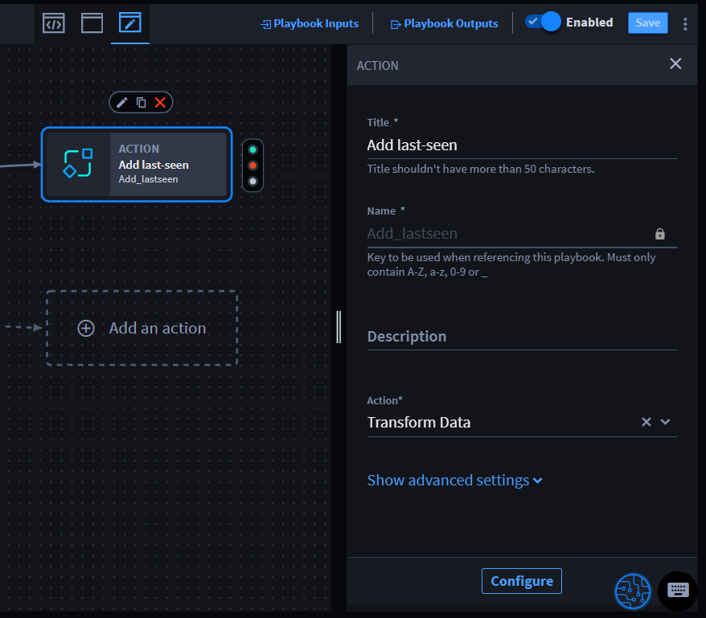
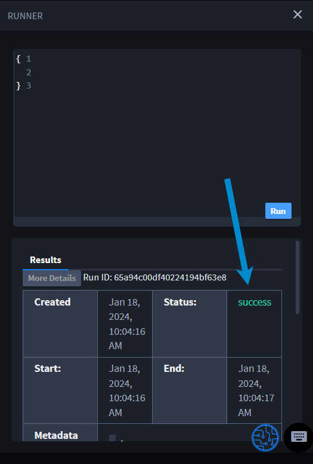

Advanced Transformations
========================

You can use advanced transformations to write complex JSONata
expressions, which gives you significant flexibility to transform data
according to your needs. As a result, there are many potential scenarios
which you can create.

Let's look at a playbook that takes an observable (consisting at least
of a type and a value), gets the current time, then adds it to the
observable as a “last-seen” attribute. For this, we are using the
Transform Data native action to create basic and advanced
transformations.

 

#. From ORCHESTRATION and click **Playbooks**.

Before you can continue, ensure that you have the following
properties: observable, type, and value. If they are not present from a
previous upstream action, then you can add them by clicking Playbook
Inputs and adding the property types there. Then, they are available
when you're ready to refer to them in the advanced block.

#. Click **Add an action** to open the ACTION panel.

Since we know the desired outcome is to get the last seen attribute,
mirror that in naming the action.

#. In the Title field, enter **Add last-seen**.

#. From the Action drop-down menu, select **Transform Data**.

|image1|

#. Click **Configure** to open the Transform window.

The name of the action shows at the top of the window. Now configure the
first basic transform block by renaming it and setting it to get the
current time.

#. Click the **pencil** icon and rename the block to **Last-Seen** to
   indicate the time that is used in the observable later.

#. In the FIRST drop-down menu, select **Get Date/Time** and in the FROM
   drop-down menu, select **Current Time**.

You configured your basic transformation block. Next, switch to advanced
mode and enter the code needed to update an observable.

#. Click **ADD BLOCK** and click **Switch to advanced**, so you can
   enter the code snippet for updating the observable.

#. Click the **pencil** icon and rename the block to **Update
   Observable**.

#. Enter the following code:

inputs.observable ~> \| $ \| { "last-seen":
$$.actions.Add_lastseen.result.transformation1 } \|

#. Click **Apply**.

The playbook is ready to test.

#. In the top right of the playbook builder, click the |image2| icon and
   click **Test**.

#. Click **Run**.

The playbook runner shows the run is successful.

|image3|

The results are also visible by clicking More Details under Results.

|image4|

You've successfully used the Transform Data native action to configure a
basic and advanced transformation in a Turbine playbook.

Continue to the next section for tables of advanced transformation
options and example syntax.

.. |image4| image:: ../../Resources/Images/runner-more-details.png
