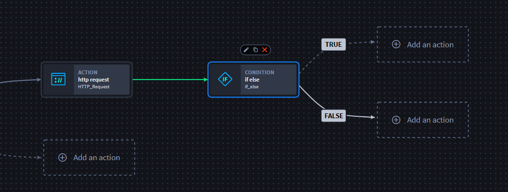
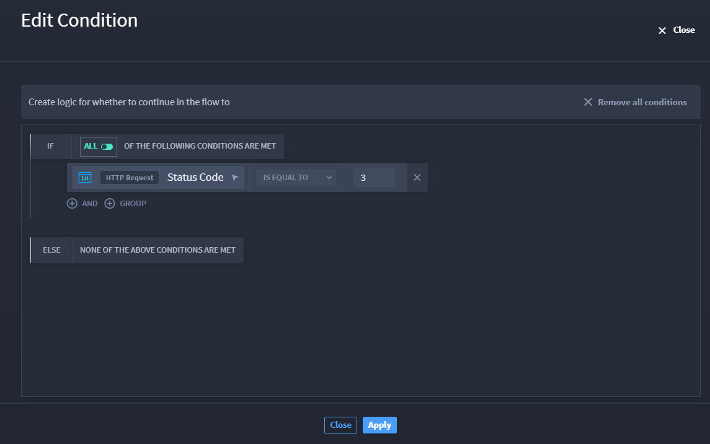

If/Else Conditions
==================

All conditions are **On Complete** action flows. Now, you can configure
actions to perform differently by using the Condition native action to
have an IF condition and ELSE condition, which applies conditional logic
to a block of actions that is either true or false. Based on outputs
from previous actions, the conditional statement you create executes
accordingly.

This benefits you by decreasing complexity in playbooks and increasing
customization in use cases.

Set Up If/Else Conditional Statement
------------------------------------

Just like other native actions, you do not need to add the action
manually to customize it. Do you want to write a true condition? Then
configure the IF logic. The logic requires that all of the conditions
you enter are met for the data to pass to the downstream actions. If you
do not configure the TRUE condition, they display with dotted lines
instead of solid lines.

|image1|

Let's create an if/else conditional statement.

#. From the playbook, click **Add an action** and select the
   **Condition** native action.

   To make configuration simpler, the TRUE and FALSE logic paths display
   immediately. To the right, the Condition pane shows the title,
   description, and advanced settings drop-down.

#. Click **Edit Condition** to open the window that allows you to enter
   the logic for your conditional statement.

   |image2|

#. Click **Apply** to save changes.

