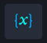

Native Actions
==============

Native actions are actions that you do not need to add manually and that
provide a customized experience for easy configuration and optimal
performance in Turbine.

This section covers features including native actions and python chat.
The table below lists the current native actions.

========= ==========================
Icon      Meaning
========= ==========================
|image1|  Condition
|image2|  Create Variable
|image3|  HTTP Request
|image4|  Loop
|image5|  Parallel
|image6|  Script
|image7|  Transform Data
|image8|  Create Record
|image9|  Delete Record
|image10| Search Record
|image11| | Upsert
          | aka Update/Create Record
========= ==========================

.. |image3| image:: ../Resources/Images/canvas-na-http.png

.. |image6| image:: ../Resources/Images/canvas-na-script.png
.. |image7| image:: ../Resources/Images/canvas-na-transform.png

.. |image11| image:: ../Resources/Images/canvas-na-update-record.png

.. toctree::
   :titlesonly:
   

   /Content/native-actions/basic-transformations/transform-data
   /Content/native-actions/advanced-transformations/advanced-transformations-old
   /Content/native-actions/http-request
   /Content/native-actions/loops
   /Content/native-actions/ifelse-conditions
   /Content/native-actions/scripts
   /Content/native-actions/variables

