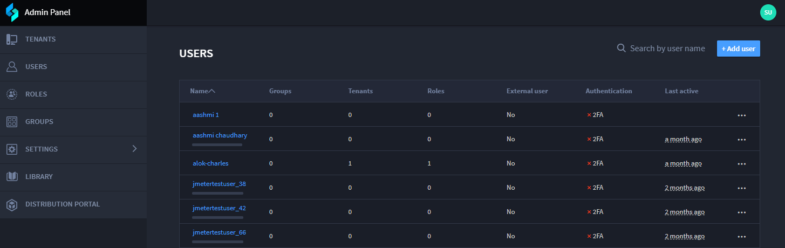

.. _user-permissions:

Users
=====

Administrators manage Swimlane Turbine users. To access the User page,
access the Admin panel and then select **USERS**.\ |image1|

The USERS page displays the following tabs:

-  **Name**: List the all the users with their names. You can filter the
   list in alphabetical order by clicking **Name**.

-  **Groups**: Lists the number of groups the user is associated with.

-  **Tenants**: Lists the number of tenants the user is associated with.

-  **Roles**: Lists the number of roles the user is associated with.

-  **External user**: Determines if the user is an external user or if
   any user outside from your organization logs in.

-  **Authentication**: Determines if the two-factor authentication is
   enabled or not.

-  **Last active**: Determines the last active time of the user.

Adding a User
-------------

To create a new user:

#. Click **Add user**.

|image2|

#. On **Add User**, set up the new user's profile by completing the
   required fields:

   -  Enter the **First name**, **Last name**, **Username**, **Display
      name**, and **Email**.

   -  Only one character is allowed as an initial in the **Initial**
      field.

   -  If no password is provided, it is automatically generated.

   -  Username cannot be used to login. You must login using your email.

   -  You can make the user as account admin by clicking the **Account
      Admin** toggle.

   -  At the user level, admin can exempt the user from forced SSO by
      clicking the **Exempt Force SSO** toggle.

   -  Check the **Notify via email** checkbox to get notified.

#. Select the **Groups & Roles** tab.\\

#. Use the drop-down menus to assign groups and roles to the user.

#. Click **Save**.

Managing User Permissions
-------------------------

To manage an existing user permissions, on the User page, click their
name or by click the ellipsis button and click **Edit**.

The User Profile page has the following tabs:

-  **General**: Allows you to edit all the general properties of the
   user.

-  | **Groups and Roles**: Access the **Groups & Roles** tab to assign
     that user to specific groups and roles. You **must** associate the
     user with a role and a tenant in order for the user to be able to
     access Turbine.
   | **Note:** Users who do not have permissions set on any
     applications, but have global permissions set in all other areas of
     Turbine, are able to view and access applications and applets from
     the global menu. If you have global permissions for applets, you
     are able to edit applets. However, since you do not have any
     permissions set for applications, you will see applications listed,
     but are unable to edit them or otherwise modify them.

-  | **Password**: Allows the turbine administrator to create new
     password.
   | Individual users are locked out of Turbine after the number of
     failed attempts specified (3 - 10) in Sessions & Security,
     Password.

   |image3| |image4|

   The Turbine administrator is responsible for unlocking the user
   profile and prompting the user to reset their password. The locked
   out user and the Turbine administrator indicated in Turbine Settings,
   Sessions and Security, Passwords both receive email notifications of
   the lockout.

   |image5|

   Turbine recommends that the Turbine administrator click the user's
   PASSWORD tab, select **Autogenerate new password** and then click
   **Send Message.**

   |image6|

-  **Authentication**: Allows you to enable two **Two-Factor
   Authentication.** by clicking **Enable 2FA**.

-  **Personal access token**: You can create a personal token by
   clicking **Generate token**. Make sure to copy the personal access
   token after you generate as it is encrypted once you close the tab.
   The token can be created only once. You can delete the token by
   clicking **Delete**.

-  **Session**: You can override the user session timeout by clicking
   the **Override this user's session timeout** toggle. You can
   configure timeout in either **Minute(s)** or **Hour(s)** from the
   **Session Unit** drop-down. You can mention the time in the **Session
   Timeout** field.

   **Note:** This override is effected immediately when you click Save.

Disabling a User
----------------

You can disable a user using the following methods:

-  Click on the user, from the user's profile page, click the **Disable
   Account** toggle.

-  Click the ellipsis button next to the user and click **Suspend**.

You can enable the user back from the user's profile page.

Deleting a User
---------------

To delete a user:

#. Click the ellipsis button next to the user and click **Delete**.

#. The Delete Confirmation window appears. Click **Ok** to delete.

.. |image2| image:: ../Resources/Images/users-groups-icons.png
.. |image3| image:: ../Resources/Images/fourthFailedAttempt.png
.. |image4| image:: ../Resources/Images/lockedOut.png
.. |image5| image:: ../Resources/Images/userLockOut.png
.. |image6| image:: ../Resources/Images/resetPassword.png
