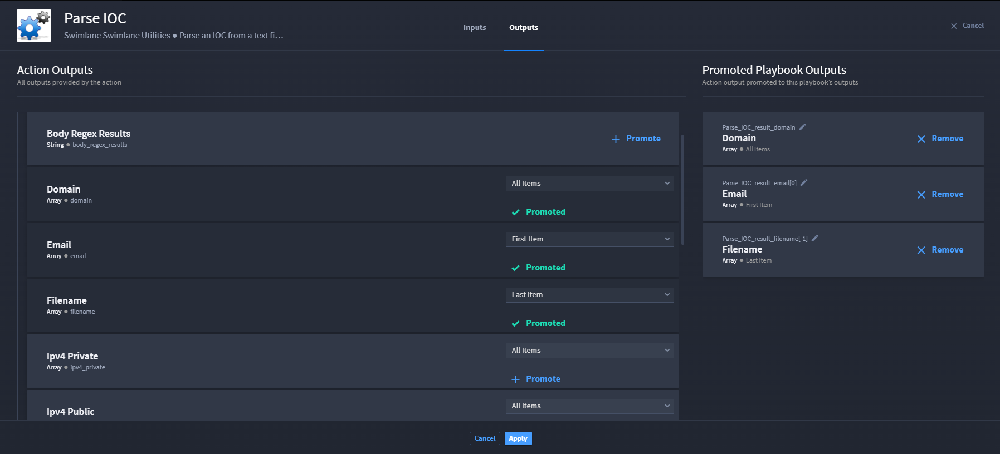
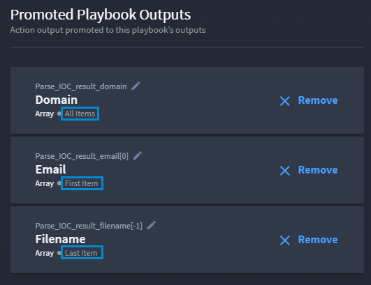

Promote Items of Arrays
=======================

Arrays are an ordered collection of values of the same data type. Values
vary based on the action connector and/or assets, and may include, but
are not limited to: IP addresses, file names, URLs, etc.

You may want items of array properties without having to use JSONata
transformations to select certain properties out of action results.
Turbine allows you to promote specific items of array action outputs.

Turbine allows you to select **All** (default), **First**, or **Last**
level array properties.

+----------------------+----------------------------------------------+
| Array Level Property | Action Taken                                 |
+======================+==============================================+
| All                  | This is the default option. This promotes    |
|                      | all items for the selected array property.   |
+----------------------+----------------------------------------------+
| First                | This option promotes the first value in an   |
|                      | array property.                              |
+----------------------+----------------------------------------------+
| Last                 | This option promotes the last value in an    |
|                      | array property.                              |
+----------------------+----------------------------------------------+

To select specific items to promote from an array, you need to use a
connector that has at least one array property value. If not, you will
not see the drop-down option to select all, first, or last.

| On Action Outputs, options vary depending on the connector and
  configuration. However, next to Array property types, the promotion
  level drop-down menu defaults to **All Items**. The Promoted Playbook
  Outputs pane is empty until you promote action outputs.
| |image1|

You have a few options. Let's start with promoting all items on an
array.

Promote All Items
-----------------

In the example, there are three visible array properties: **Domain**,
**Email**, and **Filename**. For this example, let's focus on the Domain
array.

To promote all of the items in the **Domain** array:

#. Next to the Domain array, leave the promotion-level drop-down menu in
   its default state: All Items.

#. | Click **+Promote** to see the array property in the Promoted
     Playbook Outputs.
   | |image2|

From Promoted Playbook Outputs, the Domain array outputs all values for
that array.

Promote First Value
-------------------

In the example, there are three visible array properties: **Domain**,
**Email**, and **Filename**. For this example, let's focus on the Email
array.

To promote the first value of the items in the **Email** array:

#. Next to the Email array, click the promotion-level drop-down menu and
   select *First*.

#. | Click **+Promote** to see the array property in the Promoted
     Playbook Outputs.
   | |image3|

#. From Promoted Playbook Outputs, the Email array outputs only the
   first item for that array.

Promote Last Value
------------------

In the example, there are three visible array properties: **Domain**,
**Email**, and **Filename**. For this example, let's focus on the
Filename array.

To promote the last value of the items in the **Filename** array:

#. Next to the Filename array, click the promotion-level drop-down menu
   and select *Last*.

#. | Click **+Promote** to see the array property in the Promoted
     Playbook Outputs.
   | |image4|

From Promoted Playbook Outputs, the Filename array outputs only the last
item for that array.

Tips and Things
---------------

**Tip:** Notice the difference in the promoted outputs among the three
examples. Domain outputs **All Items**; Email outputs **First Item**;
Filename outputs **Last Item**.

| 
| |image5|

**Important!** To remove a promoted action item, you must click **X
Remove**.

| You can rename the key of a promoted output. Click the **edit** icon
  next to the output key name, and then rename as desired. Then, click
  **OK** to return to Action Outputs.
| |image6|

.. |image1| image:: ../../Resources/Images/promotion-level-drop-down.png
.. |image2| image:: ../../Resources/Images/all-items-promoted.png
.. |image3| image:: ../../Resources/Images/first-item-promoted.png

.. |image6| image:: ../../Resources/Images/rename-promoted-output-key.gif
