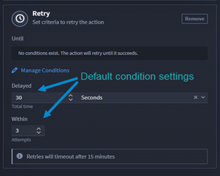

.. _action-retries:

Retries
=======

Playbooks allow you to set action conditions that automate retrying
actions based on conditions, time limits, and retry count attempts.
Retries allow you to set up the following criteria for an action:

-  Interval
-  Frequency
-  Number of attempts/tries

After you set the criteria, you can manage the parameters of that retry
by adding conditions. The retry condition settings are similar to how
you `Create Action Flows and Conditions <flows-and-conditions.rst>`__.

**Important!** Conditions are **not** required.

Apply Action Retries
--------------------

To retry an action:

#. | Add and configure an action.
   | |image1|

#. From ACTION, click **Configure**.

   | Here is where you will configure the action inputs, and then set up
     the action retry by entering appropriate data in the input fields
     to set your parameters.
   | |image2|

#. Next to **Retry**, click the **plus icon** to expand the section.

   | The default conditions are already set. A message states that **No
     conditions exist. The action will retry until it succeeds**. That
     message displays until you update and apply your criteria.
   | |image3|

The following table explains the retry parameters and additional
information to help you set the criteria.

+----------------------------------+----------------------------------+
| **Retry Parameters**             | **Additional Information**       |
+==================================+==================================+
| Until                            | Start of the conditional         |
|                                  | expression parameters            |
+----------------------------------+----------------------------------+
| Delayed                          | Seconds or minutes before retry  |
|                                  | executes                         |
+----------------------------------+----------------------------------+
| Within                           | Number of attempts               |
+----------------------------------+----------------------------------+
| Retries will timeout after 15    | Number of minutes before the     |
| minutes                          | retry times out. This is not     |
|                                  | configurable and matches the     |
|                                  | timeout of the playbook.         |
+----------------------------------+----------------------------------+

|image4|

Once you configure the retry criteria, you can click **Apply**. The
action runs until the retry criteria is met.

Use Case
--------

View the `Action Retries use
case <../../use-cases/playbook-use-cases/action-retries.rst>`__ use case
for an example.

.. |image1| image:: ../../Resources/Images/retry-add-action.png
.. |image2| image:: ../../Resources/Images/retry-parameters.png
.. |image3| image:: ../../Resources/Images/retry-no-conditions-set.png

