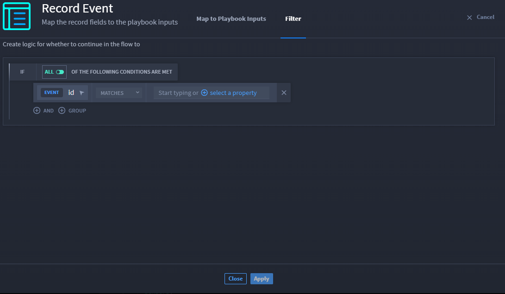

Record Event Triggers
=====================

A record event trigger initiates a playbook whenever a record is created
and/or updated within a specific application.

**Note:** You do not need to select a trigger before adding and
configuring actions and conditions.

.. _record-event-triggers-1:

Record Event Triggers
---------------------

Create a new playbook or upload an existing playbook, then follow the
steps below:

#. On the playbook, click **Add a trigger**.

#. Click **Record Event**.

#. On TRIGGER, click the **Application** drop-down menu and select the
   desired application.

#. | Next, you must select one or both **Record Created** or **Record
     Updated** check boxes.
   | |image1|

**Note:** Select the **Record Created** check box to trigger the
playbook whenever a record is *created* in the specified application.

**Note:** Select the **Record Updated** check box to trigger the
playbook whenever a record is *updated* in the specified application.

**Note:** Select both check boxes to trigger the playbook whenever a
record is *created* and/or *updated* in the specified application.

5. If needed, click **Configure** to map available playbook inputs to
   the created and/or updated record.

6. The **Filter** tab allows you to set conditions for your trigger.
   From the **Filter** tab click **CREATE YOUR FIRST CONDITION** select
   the property type from the **Record Event Trigger**.

7. Select the type of condition from the drop-down next to **MATCHES**.

8. Enter the property type or select a property.

9. Click **Apply**.

   |image2|

.. |image1| image:: ../../Resources/Images/record-event-trigger.png

