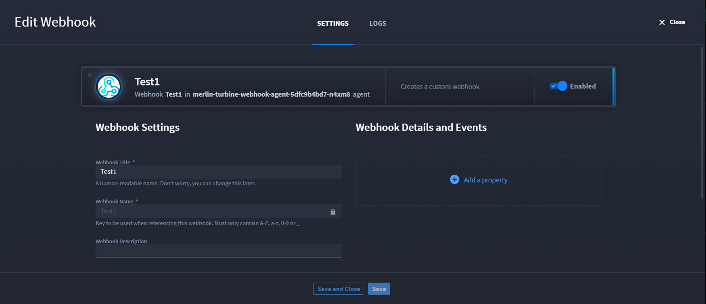
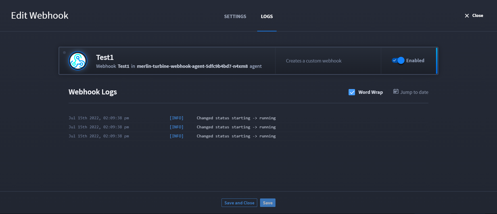
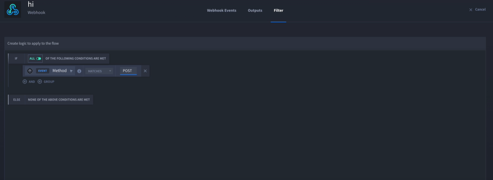

Webhook Triggers
================

Webhooks are a type of event stream that enables products, vendors, or
services to push real-time communication in Turbine. They process and
enrich data to send from third-party services and platforms to Turbine
records.

**Tip:** Click **Save** or **Save and Close** after making changes.

View Existing Webhooks
----------------------

To view existing webhooks:

#. Navigate to **ORCHESTRATION**.

#. Click **Webhooks**.

From here you can toggle the **Enabled** button to enable or disable the
webhook, or click the desired webhook to view settings and log
information.

Create Webhook Triggers
~~~~~~~~~~~~~~~~~~~~~~~

To create a webhook trigger, create a new playbook, upload a playbook,
or search for an existing playbook.

#. On the playbook, click **Add a trigger**.

#. Click **Catch Webhook**.

#. | On TRIGGER, enter a webhook title and click **Generate URL** or the
     webhook will not be created.
   | |image1|

Once the **Generate URL** button has been clicked, the webhook's URL is
generated in the **Webhook URL** field and the **Copy URL** link is
enabled.

Next, you can edit the webhook settings.

Edit Webhook Settings
~~~~~~~~~~~~~~~~~~~~~

To change webhook settings:

#. On TRIGGER, click **Edit Webhook**.

   On the SETTINGS tab, you can update the webhook title, add properties
   to authenticate the webhook requests, copy the URL, and
   enable/disable the webhook.

   |image2|

   On the LOGS tab, you can view the webhook logs, view by date, and
   enable/disable the webhook.

   |image3|

#. Click **Save and Close** to save updates.

   If you do not need to edit your webhook, you can go straight to
   configuring.

Configure Webhooks
------------------

**Important!** Review `Create and Edit Playbook
Inputs <../playbook-inputs/create-and-edit-playbook-inputs.rst>`__
before configuring webhooks for best practices.

You're ready to start the configuration process for your webhook. Click
**Configure** to get started. The webhook configuration window has three
tabs: Webhook Events, Outputs, and Map to Playbook Inputs.

**Webhook Events tab**

This tab shows the Event Type with a drop-down arrow, which shows you
the webhook details, the result, and discovered outputs. Navigate to
`Discovered Outputs and
Testing <../actions/discovered-outputs-and-testing.rst>`__ for details
on how to view and/or add discovered outputs, the agent/host for that
webhook, the time the webhook was last received, and the numbered of
triggered playbooks related to that webhook.

**Outputs tab**

This tab shows you all the outputs from the webhook. These are default
property types. If you added any discovered outputs, then they show up
with the **Delete** hyperlink. Any property types without that Delete
hyperlink are part of the original returned inputs from the webhook.

**Map to Playbook Inputs tab**

Remember the important note on reviewing `Create and Edit Playbook
Inputs <../playbook-inputs/create-and-edit-playbook-inputs.rst>`__ for
best practices? That is because on this tab, if you do not see any
inputs, it's because your playbook currently does not have any inputs.
You can add them, and they will display on this tab. And just like the
action inputs, you can click **Add a property** to see the drop-down
menu. You can add a playbook property or expression. Selecting
**Playbook property** opens the property drawer where you can select the
desired property to map.

**Filter tab**

The **Filter** tab allows you to apply a condition on event triggers
allowing you to prevent the playbook execution unless the criteria is
met. You can select a condition type from the drop-down next to
**MATCHES**.

|image4|

$event.data Properties
~~~~~~~~~~~~~~~~~~~~~~

Here is the list of top-level properties that are defined on the
$event.data object:

-  **url**\ *(object)*: The URL components of the request.

   -  **href**\ *(string)*: The full URL of the request.
   -  **protocol**\ *(string)*: The protocol used for the request.
   -  **hostname**\ *(string)*: The hostname of the request.
   -  **port**\ *(integer)*: The port of the request.
   -  **pathname**\ *(string)*: The pathname of the request.
   -  **query**\ *(object)*: The query parameters of the request as
      key/value pairs.
   -  **hash**\ *(string)*: The hash of the request.

-  **headers**\ *(object)*: The headers of the request as key/value
   pairs.
-  **body**\ *(null|array|boolean|number|object|string)*: The JSON body
   of the request.

Authenticate Webhooks
~~~~~~~~~~~~~~~~~~~~~

To configure webhook authentication settings:

#. On TRIGGER, click **Edit Webhook**.

#. | On the SETTINGS tab, click **Add a property**, then click
     **Authentication**.
   | |image5|

The Authorization property displays with a sub-property option.

3. Click **Add a property**.

4. | Select either **Basic Authentication** or **Shared Secret
     Authentication**.
   | |image6|

   -  Extract the secret (Password) from the request body.

   -  Extract the secret (Password) from the request header.

   -  Extract the secret (Password) from a query parameter.

   To remove the properties, click the vertical ellipsis, then click
   **Remove**.

   .. rubric:: View Webhook Logs
      :name: view-webhook-logs

   #. To view webhook logs on TRIGGER, click **Edit Webhook** and click
      the **Logs** tab.

   You can view the logs, enable or disable the webhook, or filter by
   date by clicking **Jump to date**.

.. |image1| image:: ../../Resources/Images/generate-webhook-url.png

.. |image5| image:: ../../Resources/Images/webhook-add-a-property.png
.. |image6| image:: ../../Resources/Images/webhook-subproperties.png
