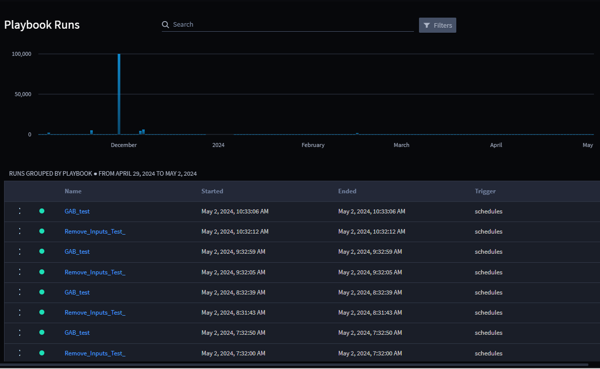

Filtering Playbook Runs
=======================

As a Turbine orchestrator, you can filter the playbooks runs by clicking
the **Filters** option next to **Search** box.

You can filter by:

-  **Time range** - You can specify a time range by selecting the **Time
   range** option.

-  **Playbook** - You can filter by selecting a specific playbook or a
   number of playbooks using the **Playbook** drop-down.

-  **Status** - You can filter by based on the **Success** or
   **Failure** status using the **Status** drop-down.\ |image1|

