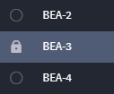

Record Lock
===========

You can lock records while editing and modifying them in order to
prevent your changes being overwritten by another user. In addition,
locked records can not be bulk modified or bulk deleted.

| Once a record is locked, the lock icon appears next to the record's
  Tracking ID in the Record header.
| |image1|
| When a record is locked, only the user who created the lock or an
  administrator can unlock it. To unlock a record, from the Record
  header, access the record menu and select **Unlock Record.**

| Locked records are also indicated in the report-view-of-records
  (Default Report) interface.
| |image2|

To lock a record:

#. | Open a record. From the record taskbar, access the record menu.
   | |image3|

#. From the menu, select **Lock Record**.

   The record is locked immediately. Anyone can access the individual
   record and open it, but only the user who created the lock or an
   administrator can make changes to the record.

.. |image1| image:: ../../Resources/Images/locked_header.png

.. |image3| image:: ../../Resources/Images/record_menu_lock.png

.. toctree::
   :titlesonly:
   

   /Content/records/modify-a-record/restrict-records
   /Content/records/modify-a-record/coedit-records
   /Content/records/modify-a-record/manage-server-conflicts-in-records
   /Content/records/modify-a-record/lookup-and-create-references-in-records

