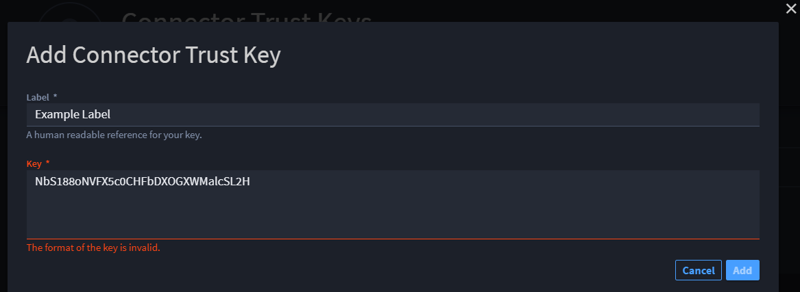
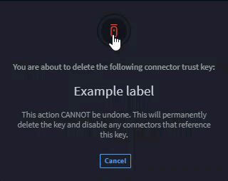

Connector Trust Keys
====================

Turbine provides a list of connector trust keys. Connector trust keys
are used to digitally sign custom built connectors leveraging the
`Turbine SDK <https://swimlane.github.io/turbine-sdk/#/>`__.

To view existing connector trust keys:

#. Navigate to **SETTINGS** > **Tenant-specific**.

#. Click **Connector Key**.

   The page loads, and Turbine makes an API call to display the current
   list of connector trust keys from newest to oldest.

Each connector trust key provides the, title of the key, part of the key
displays if needed; however the entire key is obscured, date it was
created. You can also add or delete a connector from this page.

Add Connector Trust Keys
------------------------

To add a connector trust key, ensure you are on the Connector Trust Keys
page, and then:

#. Click **Add Key**.

   The **Add Connector Trust Key** window opens for you to add a label
   and a key.

   |image1|

   **Important**: Both fields are required.

#. In **Label**, enter a title for the key.

   **Note**: The limit is 50 characters.

#. In **Key**, enter the key that is generated from the connector SDK.

   **Warning!** If the key is invalid, an error message shows.

   |image2|

   If the key you enter is valid, click the enabled **Add** button to
   continue.

   |image3|\ Returning to the Connector Trust Keys page, the new key is
   listed at the top.

Delete Connector Trust Keys
---------------------------

If you want to delete a connector trust key:

#. Click the **Delete** icon next to the key.

2. Click and hold the delete icon.

   **Warning!** This action cannot be undone. It will permanently delete
   the key **and** disable any connectors that reference this key.

   |image4|

   Turbine returns you to the Connector Trust Keys page where you can
   confirm the connector is no longer available.

.. |image1| image:: ../Resources/Images/add-connector-key.png

.. |image3| image:: ../Resources/Images/valid-connector-key.png

