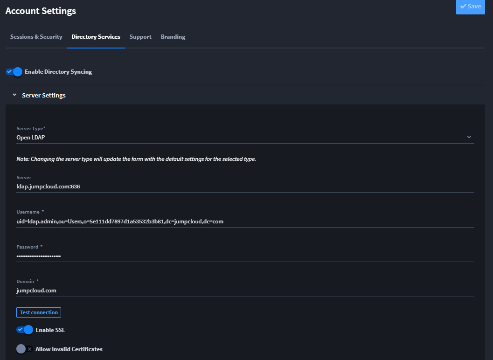
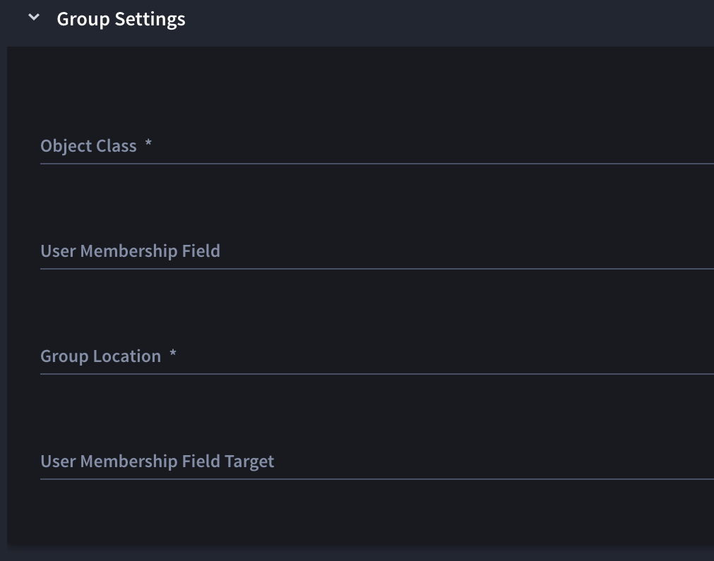

Directory Services
==================

Swimlane Turbine integrates with two Directory Service types,
Microsoft's Active Directory (AD) and Open LDAP.

Many Turbine administrators leverage Turbine's Directory Services to:

-  Allow their SOC Engineers and Analysts to log in to Turbine with
   previously-established directory credentials.
-  Increase the ease of administrative maintenance for groups of users.

**Note:** Users are synced upon each login. Automatic synchronization
occurs every night at midnight, server time.

These settings are at account level and propagate to all the tenants
associated with users through roles or groups

.. _setting-up-open-ldap-services:

Enabling Directory Services
---------------------------

**Important!** Before you begin, verify that your server settings are
correct!

To enable Directory Services:

#. Click on your profile, click **Admin Panel**.

#. From the left navigation, select **Settings** > **Account**.

#. Click **Directory Services** and then select **Enable Directory
   Syncing**.

This expands the selections for the settings that you need to set up.

#. Click **>** to expand **Server Settings**. On **Server Type,** select
   **Open LDAP**.

   |image1|

#. From this field you can either select Open LDAP or Active Directory.
   The available categories and fields for additional setup vary
   according to this selection.

   **Important!** Fields marked with an asterisk are required fields.

#. Input your server settings.

   Make sure that the **Username** must be an LDAP Distinguished Name
   (such as cn=Manager,dc=maxcrc,dc=com).

   **Note:** If you want to test the connection to the server at this
   point in the process, enter placeholder text in all required fields,
   including those in other sections, and then click **Save**. Once your
   initial settings are saved, you can click **Test Connection**.

#. Click **>** to expand **User Settings** and review or update the
   values there.

#. The default values for Open LDAP are often the most appropriate, but
   they may need to be altered to conform to your Directory server’s
   configuration.

   Delete the default value for **Member of Field Target** and make sure
   it is empty.

   -  **User Location** is empty by default. While not required, adding
      a location is recommended.

   -  The **Member of Field Target** attribute refers to an attribute
      associated with group objects that lists the members of that
      group. This attribute provides a way to establish relationships
      between groups and users or other groups within the directory.
      This VALUE should be empty by default and leave to the
      organization to fill if required.

   |image2|

#. Click **>** to expand **Field Mapping** and review or update the
   values there.

These values rarely need to deviate from the defaults provided.

#. Click **>** to expand **Group Settings** and review or update the
   values there.

Delete the default value for **User Membership Field Target** and make
sure it is empty.

A **User Membership Field Target** in directory services refers to a
field or attribute associated with user accounts that denotes the user's
membership in a group or organization. This VALUE should be empty by
default and leave to the organization to fill if required.

The **Group Location** field must contain a Distinguished Name that
provides the complete path to the container in which the targeted groups
are defined.

   **Note:** Use an appropriate Directory Services client to inspect the
   targeted group(s) and make note of how belonging users are affiliated
   to the group(s). Is it done through the groups' property named,
   member, or the users' property named, memberOf, or through some other
   means?

|image3|

#. Click **>** to expand **Groups** and then review or update the values
   there.

This is a list of manually entered groups. To add a group, type the name
in the field and then click **Add Value**. Keep in mind that you have to
add each group individually, and that the values are case sensitive.

Under **Groups to sync**, click **Validate Groups**.

If this fails, troubleshoot by checking spelling and/or confirming that
the group name is defined in the container specified in the Group
Location value (a Distinguished Name) in GROUP SETTINGS.

If you'd like you can save at this point, scroll up to the top of the
Directory Services area of the form, and click **Test Connection**.

#. Click **>** to expand **Membership** and review or update the values
   there.

From this field you can select from one of two values: By User Field or
By Group Field. If the users are affiliated with their groups via the
member property in each group, then choose *By Group*.

#. Click **Save** again and then click **Sync Now**.

#. Ensure that you receive confirmation of a successful sync (a green
   success message displays). Then, from the left-navigation menu,
   navigate to the Turbine Users page and verify that all the members of
   the targeted groups have been created as users.

   If the sync is not successful, review the steps above. If your
   problem persists, contact Swimlane support representative.

   Turbine syncs the users who are members of the groups. Turbine only
   syncs the top-level users in each group; it does not traverse users
   in groups within the selected groups. To sync users in these groups,
   add the groups directly to **Groups to Sync.**

   A user’s display name is only synchronized when the user is initially
   created. If the user name is updated in Active Directory, it is not
   updated in Turbine. This allows for user name customization in
   Turbine so the display name can appear differently in Turbine than it
   does in Active Directory.

   **Note:** Users are synced upon each login. Automatic synchronization
   occurs every night at midnight server time.

.. |image2| image:: ../../Resources/Images/User_settings.png

