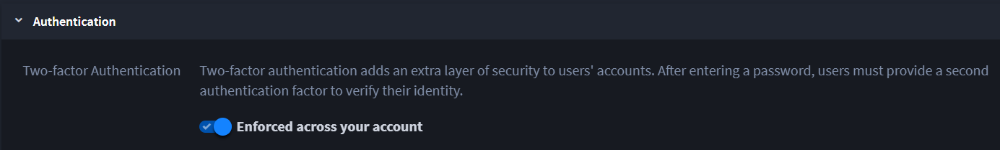

Enable Two-Factor Authentication
================================

Two-Factor Authentication, or 2FA, adds an additional layer of security
to Swimlane Turbine user accounts. Each time users sign in, they will
need a password and a verification code.

You can enforce 2FA across your organization. Users will then be
required to set up 2FA and will not be able to disable the setting.

If you choose not to enforce 2FA globally, then individual users will be
able to enable setting up 2FA.

Globally Enabling Two-Factor Authentication
-------------------------------------------

To globally enable two-factor authentication:

#. From the Turbine Admin panel, click >  to expand \ **Settings**\ ,
   then select Account.

#. Select the Sessions & Security tab and expand **Authentication**.

#. | Toggle **Enforced across your organization** to turn on 2FA for
     everyone accessing Turbine from your organization.
   | |image1|

Additional Administrator Actions for 2FA
----------------------------------------

Administrators can reset the 2FA setup for users as needed. To reset a
user's individually-set 2FA account, log in and access the User page.
Open the user's profile page, and select the Authentication tab. Click
**Reset.**

The user will be prompted to set up a new instance of 2FA for Turbine
once they attempt to log in again.

| Administrators can also exempt specific users from having to use 2FA.
  To do this, access the specific user, and then toggle the **Exempt**
  switch on the User Profile Authentication window.
| |image2|

.. |image2| image:: ../../Resources/Images/2fa-exempt.png
