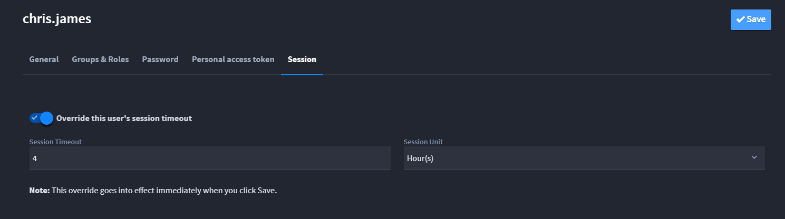

Sessions and Security
=====================

Sessions and Security settings are only available to Turbine
administrators. Use Sessions and Security settings to configure your
user sessions, passwords, and encryption details. This is also where you
specify the length of active user sessions.

**Note:** For detail on setting up the Authentication section of
Sessions and Security see `Enable SAML for
SSO <enable-saml-for-sso.rst>`__ and `Enable Two-Factor
Authentication <enable-two-factor-authentication.rst>`__.

Setting Up Session Timeout Parameters
-------------------------------------

As an administrator, you control the amount of time a Turbine session
can be active before the user is forced to re-authenticate, or log out
and log back in.

To set up session timeout parameters:

#. From the Sessions and Security tab, click **>** to expand the
   **Session** controls.

#. Specify the length and the unit of time to be used to measure the
   user session and click **Save.**

   | Use the drop-down to specify the **Session Unit,** Hour(s) or
     Minute(s).

Overriding a User's Session Timeout
~~~~~~~~~~~~~~~~~~~~~~~~~~~~~~~~~~~

Administrators can override a specific user's session timeout. This is
helpful, for example, when you use one Turbine session as a dashboard
for a work area. The dashboard is useful and visible to many people on
the team, and you do not want that dashboard session to timeout
frequently. It can also be helpful when you need to immediately disable
a user's session. In cases similar to these, you can override the user's
session timeout.

To override a user's session timeout:

#. From the **Admin Panel**, select **Users**.
#. On Users, select the user whose session timeout you want to override.
#. On the user's profile settings, click the **Session** tab.
   |image1|

4. Toggle the **Override this user's session timeout** switch, and then
   specify the time-frame for the override (minutes, or hours).

The minimum you can specify for this override is 1 minute. The maximum
is 5 years (43800 hours or 2628000 minutes).

5. Click **Save**.

The override goes into immediate effect once you click save.

Setting Up Security Parameters
------------------------------

As an administrator, you have control over password reset intervals and
the allowable level of complexity required for user passwords, including
enabling Two-Factor Authorization for accessing Turbine. You also need
to specify an administrator email that will be used to notify the
Turbine administrator for your organization.

To set up security parameters:

#. From the Sessions and Security tab, click **>** to expand the
   **Password** controls.

#. Specify a password expiration length. The amount should be in *Days*.
   The only other option is *Never*.

   Users will need to create a new password when they meet this
   expiration date.

   **Note:** This setting does not apply to users synced from Active
   Directory.

#. Use the drop-down to select the appropriate value for **Minimum
   Password Complexity.** Available values are:

   **0** - Too guessable: risky password

   **1** - Very guessable: protection from throttled online attacks

   **2** - Somewhat guessable: protection from unthrottled online
   attacks

   **3** - Safely unguessable: moderate protection from offline
   slow-hash scenario

   | **4** - Very unguessable: strong protection from offline slow-hash
     scenario
   | |image2|

#. An administrator can set the number of consecutive failed login
   attempts before the user’s account is locked using the **Number of
   Allowed Failed Logins** field. The minimum number of failed logins is
   3 and the maximum number is 10. Choose the number that is best for
   your environment. The user’s account is locked if this number of
   incorrect logins is attempted within the specified range and requires
   an administrator to unlock the user’s account. For example, if the
   Number of allowable failed logins is set to 3 and the user attempts
   to login with their correct email address but an incorrect password 3
   times in a row within the range. the user’s account will be locked as
   soon as the third incorrect password attempt is tried. If the user
   gets their password wrong on the first two attempts but uses the
   correct password on the third attempt they will be logged in and the
   counter of incorrect login attempts will be reset to zero for that
   user.

#. Specify the **Security Notification Email** for your organization.
   This email receives notifications when user profiles are locked.

For information about 2FA, see `Enable Two-Factor
Authentication <enable-two-factor-authentication.rst>`__.

.. |image2| image:: ../../Resources/Images/sessions-and-security3.png

.. toctree::
   :titlesonly:
   

   /Content/settings/sessions-and-security/enable-two-factor-authentication
   /Content/settings/sessions-and-security/enable-saml-for-sso

