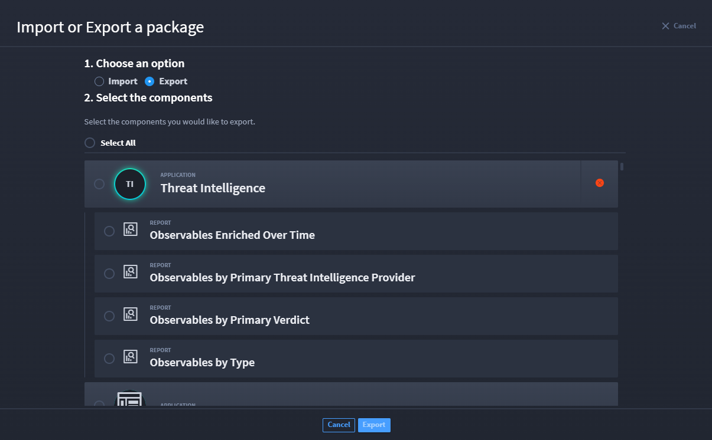
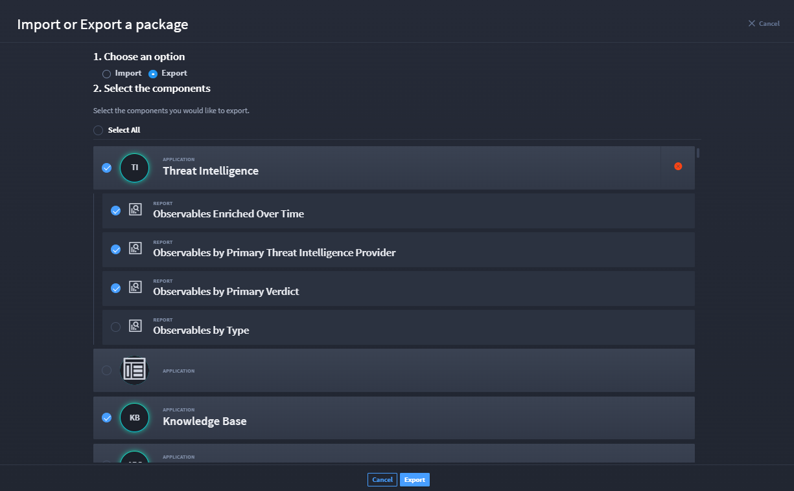
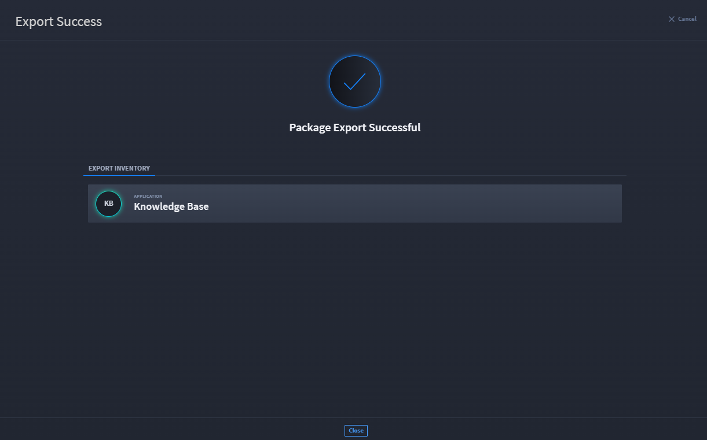
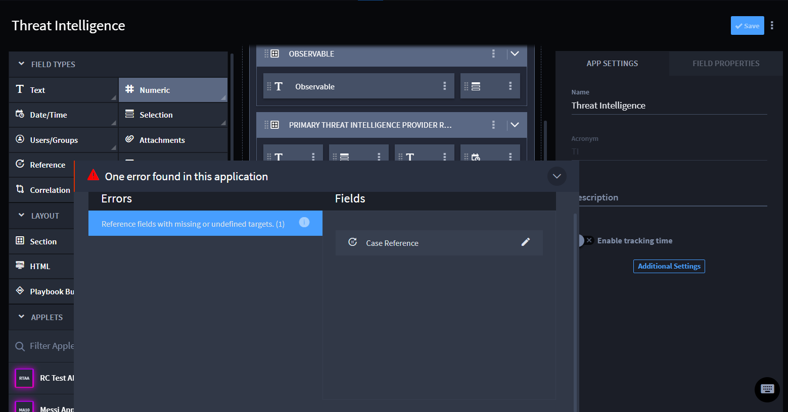
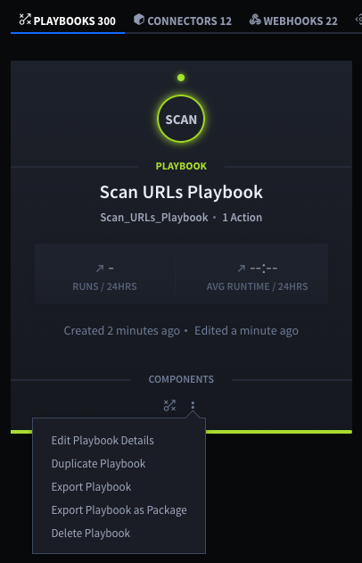

Export Swimlane Solution Packages
=================================

Export Swimlane Solution Packages (SSPs, file extension .ssp) to import
them into another instance of Swimlane Turbine. Any playbooks or
applications or applets you export also contain their associated
workspace, dashboard, workflow, reports, and assets.

If you plan to edit your SSP file after exporting it, see `Repackage an
Unzipped SSP File <repackage-an-unzipped-ssp.rst>`__ to ensure your SSP
imports successfully after you work on it.

**Note:** Exporting and importing SSPs can only be done by system
administrators.

You can export SSPs from applications, applets, or from playbooks.

Export Application SSPs
-----------------------

In Turbine, there are a few ways to export an SSP. First let's look at
how to export from the Applications & Applets main page.

#. Load the Applications & Applets main page, click the plus icon, and
   then select **Import or Export a package**.

On Import or Export a package window, step 1 has Import and Export radio
button options.

#. Click the **Export** radio button.

Turbine loads the available packages and components within those
packages to export. Step 2 allows you to select the components you would
like to export.

|image1|

#. Select the check mark next to components (i.e., reports,
   applications, etc.) that you want to export, then click **Export**.

|image2|

If a component has an error, you may receive the Error Detected
notification with an explanation. This means that component cannot be
exported successfully. Click Close and review the component with the
error to resolve.

|image3|

If you select a component and there are no issues, then your package
exports successfully.

|image4|

Export from an Application
--------------------------

#. | Find the application or applet that you want to export and then,
     from the drop-down menu on the application or applet, select
     **Export**.
   | |image5|
   | You can also export an application from within Application (or
     Applet) Builder. Click the ellipsis icon in the Application (or
     Applet) taskbar menu and select **Export Application** or **Export
     Applet**.

#. Turbine notifies you if there are potential issues that you need to
   be aware of related to your export.

   | |image6|

Playbooks associated with applications are disabled upon export.

You will need to ensure that the connectors that the SSP uses are
installed. Connectors are not included in import/export activities.

4. When ready, click **Continue Export**.

The .ssp is exported to your browser's default location for downloads.

- OR -

Turbine notifies you of errors detected.

|image7|

#. To resolve errors detected, click **Go to Application**.

The application opens. There is a notification at the bottom of the
window that you can expand for error details.

|image8|

Once you resolve the detected errors, try exporting again.

Export Playbook SSPs
--------------------

To export playbook SSPs:

#. Navigate to ORCHESTRATION, then Playbooks.

#. | Find the playbook you want to export. Then, click the ellipsis icon
     and select **Export Playbook as Package**.
   | |image9|

You can also export from within an open playbook. Click the ellipsis
icon in the playbook taskbar and select **Export as Package**.

If the playbook has parent or nested playbooks, they will export as
well.

.. |image3| image:: ../Resources/Images/export-global-export-error-detected.png

.. |image5| image:: ../Resources/Images/export-main.png
.. |image6| image:: ../Resources/Images/export-package-review-potential-issue.png
.. |image7| image:: ../Resources/Images/application-package-export-error-detected.png

